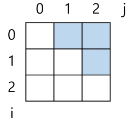
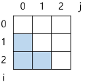
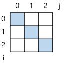
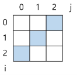

# Array

[Arrray](#array-배열)   
[Array 필요성](#array-필요성)   

[1차원 배열의 선언](#1차원-배열의-선언)   
[1차원 배열의 접근](#1차원-배열의-접근)   

[2차원 배열의 선언](#2차원-배열의-선언)   
[2차원 배열 순회](#2차원-배열-순회)   
[델타를 이용한 2차원 배열 탐색](#델타를-이용한-2차원-배열-탐색)   
[2차원 배열의 활용](#2차원-배열의-활용)   

---
## Array 배열
- 일정한 자료형의 변수들을 하나의 이름으로 열거하여 사용하는 자료 구조

- 배열의 크기를 미리 정해놓고 사용하는 것이 편리

- 배열이 많을 때 `append()`를 사용하면 속도가 느려질 수 있음

## Array 필요성
- 여러 개의 변수가 필요할 때마다 다른 변수명을 이용하여 자료에 접근하는 것은 비효율적

- 배열을 사용하면 하나의 선언을 통해 둘 이상의 변수를 선언

- 다수의 변수로는 하기 힘든 작업을 배열을 활용해 쉽게 할 수 있다.

## 1차원 배열의 선언
- 별도의 선언 방법이 없으면 변수에 처음 값을 할당할 때 생성

```python
Arr1 = list()
Arr2 = []
Arr3 = [1, 2, 3]
Arr4 = [0] * 10
```

## 1차원 배열의 접근
- index를 통하여 배열에 접근할 수 있다.

```python
Arr1[0] = 10 # 배열 Arr1의 0번 원소에 10을 저장
Arr1[idx] - 20 # 배열 Arr2의 idx번 원소에 20을 저장
```

### 연습 문제
- N개의 양의 정수에서 가장 큰 수와 가장 작은 수의 차이를 출력하라.

- 입력
  - 첫 줄에 테스트 케이스의 수 T가 주어진다. ( 1 ≤ T ≤ 50)
  
  - 각 케이스의 첫 줄에 양수의 개수 N이 주어진다. ( 5 ≤ N ≤ 1000)
  
  - 다음 줄에 N개의 양수 ai가 주어진다. ( 1 ≤ ai ≤ 1000000)

- 출력
  - 각 줄마다 “#T” (T는 테스트 케이스 번호)를 출력한 뒤, 답을 출력한다.

```python 
T = int(input()) # 테스트 케이스 수

for tc in range(1,T+1):
    N = int(input())
    arr = list(map(int, input().split()))
    max_v = arr[0]
    min_v = arr[0]
    for i in range(1, N):
        if max_v < arr[i]:
            max_v = arr[i]

        if min_v > arr[i]:
            min_v = arr[i]

    result = max_v - min_v

    print(f'#{tc} {result}')
```

## 2차원 배열의 선언
- 1차원 List를 묶어 놓은 List

- 2차원 이상의 다차원 List는 차원에 따라 Index를 선언

- 2차원 List의 선언 : 세로 길이(행의 개수), 가로 길이(열의 개수)가 필요

- Python에서는 데이터 초기화를 통해 변수 선언과 초기화가 가능함

```python
# 0으로만 이루어진 행렬 생성 잘못된 방법
arr = [[[0]*3]*2]
print(arr) # [ [0, 0, 0], [0, 0, 0] ]
arr[0][0] = 1
print(arr) # [ [1, 0, 0], [1, 0, 0] ]

# 얕은 복사는 아니지만 비슷한 결과가 나오므로 이렇게 행렬 설정 X
```

```python
# 옳은 방법
arr = [ [0]*N for _ in range(M) ]
```

## 2차원 배열 순회
- n x m 배열의 n*m 개의 모든 원소를 빠짐없이 조사하는 방법

### 행 우선 순회
```python
# i 행의 좌표
# j 열의 좌표
for i in range(n):
	for j in range(m):
		f(array[i][j]) # 필요한 연산 수행
```

#### 행 우선 순회 예시
```python
# 모든 원소의 합 구하기

s = 0
for i in range(n):
	for j in range(m):
		s += array[i][j]
```

```python
# 행의 합 중 최댓값 구하기

max_v = 0
for i in range(n):
	s = 0
	for j in range(m):
		s += array[i][j]
	
	if max_v <= s:
		max_v = s
```

### 열 우선 순회
```python
# i 행의 좌표
# j 행의 좌표

for j in range(m):
	for i in range(n):
		f(array[i][j]) # 필요한 연산 수행
```

### 지그재그 순회
```python
# i 행의 좌표
# j 열의 좌표

for i in range(n):
	for j in range(m):
		f(array[i][j + (m-1-2*j) * (i%2)])

# i가 짝수면 (m-1-2*j)*(i%2) 부분이 사라져서 array[i][j]
# i가 홀수면 (m-1-2*j)*(i%2) 부분이 array[i][m-1-j] 
```

```python
for i in range(n):
	if i % 2 == 0:
		for j in range(m,0,-1)
	else:
		for j in range(m)

# 홀수 행에서는 그대로, 짝수 행에서는 반대로 순회
# 잘 사용하지 않는 방법
```

## 델타를 이용한 2차원 배열 탐색
- 2차원 배열의 한 좌표에서 4 방향의 인접 배열 요소를 탐색하는 방법

- 인덱스 (i, j)인 칸에 상하좌우 칸 (ni, nj)

- 3x3 행렬에서 (1, 1)을 인덱스 (i, j)로 설정한다면,   

<div align='center'>

|( i-1 , j-1 )|( i , j-1 )|( i+1 , j+1 )|
|:-:|:-:|:-:|
|( i-1 , j )|( i , j )|( i+1 , j)|
|( i-1 , j+1 )|( i , j+1 )|( i+1 , j+1 )|

</div>

- 2차원 배열의 한 좌표에서 4 방향의 인접 배열 요소를 탐색하는 방법
  ```python
    arr[0...N-1][0...N-1] # NxN 배열

    di[] <- [0, 1, 0, -1] # 방향별로 더할 값 (우하좌상 순서)
    dj[] <- [1, 0, -1, 0] # 방향별로 더할 값 (우하좌상 순서)

    for i in range(N):
      for j in range(N):
        for k in range(4):
            ni = i + di[k]
            nj = j + dj[k]
            if 0 <= ni < N and 0 <= nj < N: 
            # 유효한 인덱스면(가장 자리가 아니라면)
              f(arr[ni][nj])
  ```

## 2차원 배열의 활용
### 전치 행렬
```python
# i : 행의 좌표, len(arr)
# j : 열의 좌표, len(arr[0])
arr = [[1, 2, 3], [4, 5, 6], [7, 8, 9]] # 3x3 행렬

for i in range(3):
	for j in range(3):
		if i < j:
			arr[i][j], arr[j][i] = arr[j][i], arr[i][j]
```
- i, j의 크기에 따라 접근하는 원소 비교
  - i < j
  
    
  
  - i > j
  
    
  
  - i == j
  
    
  
  - 2 - i == j
  
    

### 전치 행렬 연습 문제
- 5x5 2차원 배열에 25개의 숫자를 저장하고, 25개의 각 요소에 대해서 그 요소와 이웃한 요소와의 차의 절대값을 구하시오.

```python
N = int(input())
arr = [list(map(int, input().split())) for _ in range(N)]

di = [0, 1, 0, -1]
dj = [1, 0, -1, 0]

total = 0 # 총 합

for i in range(N):
	for j in range(N): # NxN 배열의 모든 원소에 대해
		s = 0 # 문제에서 원소와 인접 원소의 차의 절대값의 합
		# i, j 원소의 4 방향 원소에 대해
		for k in range(4):
			ni = i + di[k]
			nj = j + dj[k]
			if 0 <= ni < N and 0 <= nj < N: # 실존하는 4방향의 인접원소 ni, nj
				s += abs(arr[i][j] - arr[ni][nj]) # 지금은 편의상 abs(절대값) 사용
			total += s

print(total)
```