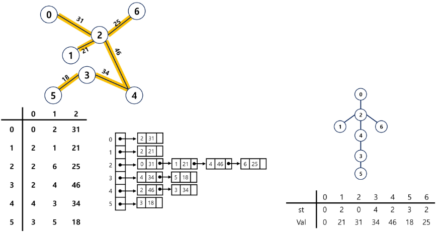
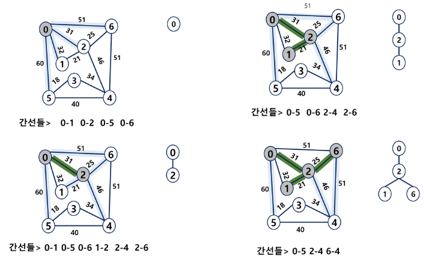
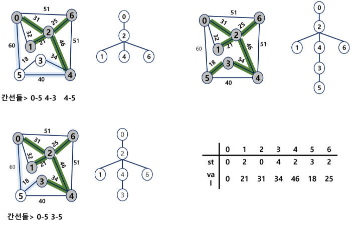
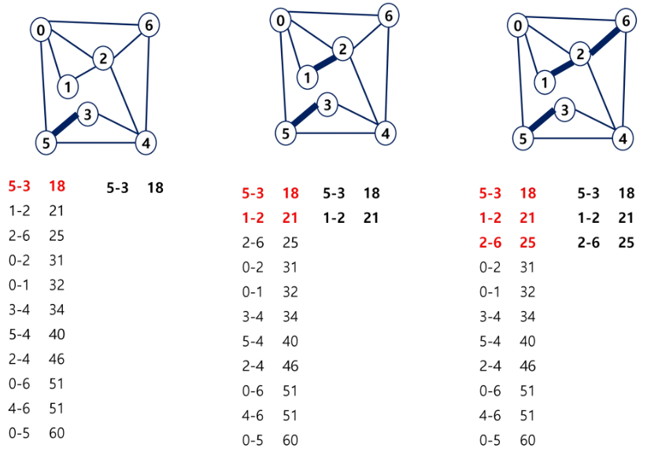
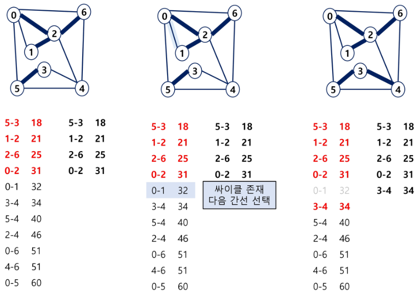
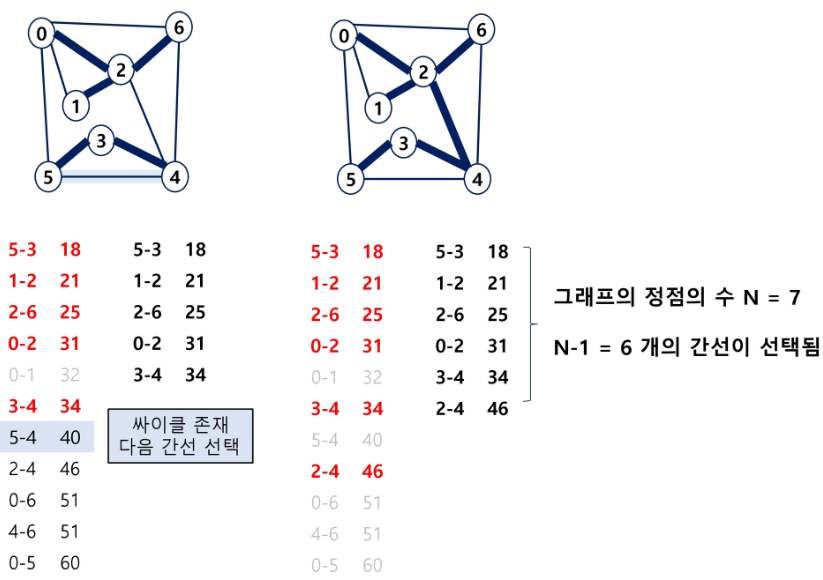

# 그래프의 최소 비용 문제

[최소 비용 신장 트리 MST](#최소-비용-신장-트리-mst)   
[Prim 알고리즘](#prim-알고리즘)   
[Kruskal 알고리즘](#kruskal-알고리즘)   
[최단 경로 Dijkstra](#최단-경로-dijkstra)   

---


## 최소 비용 신장 트리 MST

### 최소 신장 트리 MST

- 그래프에서 최소 비용 문제
    - 모든 정점을 연결하는 간선들의 가중치의 합이 최소가 되는 트리
    
	- 두 정점 사이의 최소 비용의 경로 찾기

- 신장 트리
    - n 개의 정점으로 이루어진 무방향 그래프에서 n개의 정점과 n-1개의 간선으로 이루어진 트리

- 최소 신장 트리 Minimum Spanning Tree, MST
    - 무방향 가중치 그래프에서 신장 트리를 구성하는 간선들의 가중치의 합이 최소인 신장 트리
    
	- 그래프, 간선들의 배열, 인접 리스트, 부모 자식 관계과 가중치에 대한 배열 (트리)로 표현할 수 있다.
        
        
        

### MST 구현 방법

- Prim 알고리즘

- Kruskal 알고리즘

## Prim 알고리즘

### Prim 알고리즘

- 하나의 정점에서 연결된 간선들 중에서 하나씩 선택하면서 MST를 만들어 가는 방식
    - 임의 정점을 하나 선택해서 시작
    
	- 선택한 정점과 인접하는 정점들 중의 최소 비용의 간선이 존재하는 정점을 선택
    
	- 모든 정점이 선택될 때까지 위 과정 반복

- 서로소인 2개의 집합 (2 disjoint-sets) 정보를 유지
    - 트리 정점들(tree vertices) - MST를 만들기 위해 선택된 정점들
    
	- 비트리 정점들 (nontree vertices) - 선택되지 않은 정점들

### Prim 알고리즘





- 임의의 정점에서 시작

- 최소 가중치 쪽으로 이동

```python
MST_PRIM(G, r)                            # G : 그래프, r : 시작 정점
	FOR u in G, V
		u.key <- ∞                            # u.key : u에 연결된 간선 중 최소 가중치
		u.π <- NULL                           # u.π : 트리에서 u의 부모
	r.key <- 0
	Q <- G.V                                # 우선순위 Q에 모든 정점 넣는다.
	WHILE Q != 0                            # 빈 Q가 아닐동안 반복
		u <- Extrack_MIN(Q)                   # key 값이 가장 작은 정점 가져오기
		FOR v in G.Adj[u]                     # u의 인접 정점들
			IF v ∈ Q AND w(u, v) < v.key       # Q에 있는 v의 key값 갱신
				v.π <- u
				v.key <- w(u, v)
```

## Kruskal 알고리즘

### Kruskal 알고리즘

- 간선을 하나씩 선택해서 MST를 찾는 알고리즘
    - 최초, 모든 간선을 가중치에 따라 오름차순으로 정렬
    
	- 가중치가 가장 낮은 간선부터 선택하면서 트리를 증가시킴
        - 사이클이 존재하면 다음으로 가중치가 낮은 간선 선택 (통과)
    
	- n-1 개의 간선이 선택될 때까지 2번 과정 반복

### Kruskal 알고리즘

- 알고리즘
    
    ```python
    MST - KRUSKAL(G, w)
    	A <- 0                          # 0 : 공집합
    	FOR vertex v in G.V             # G.V : 그래프의 정점 집합
    		Make_Set(v)                   # G.E : 그래프의 간선 집합
    	
    	# G.E에 포함된 간선들을 가중치 w에 의해 정렬
    	
    	FOR 가중치가 가장 낮은 간선 (u, v) ∈ G.E 선택(n-1개)
    		IF Find_Set(u) != Find_Set(v)
    			A <- A ∪ {(u, v)}
    			Union(u, v);
    	
    	RETURN A
    ```
    
    

    

    

## 최단 경로 Dijkstra

### 최단 경로

- 최단 경로 정의
    - 간선의 가중치가 있는 그래프에서 두 정점 사이의 경로들 중에 간선의 가중치의 합이 최소인 경로

- 하나의 시작 정점에서 끝 정점까지의 최단 경로
    - 다익스트라 알고리즘 Dijkstra
        - 음의 가중치를 허용하지 않음
    
	- 벨만-포드 알고리즘 Bellman-Ford
        - 음의 가중치 허용

- 모든 정점들에 대한 최단 경로
    - 플로이드-워샬 알고리즘(Floyd-Warshall)

### Dijkstra 알고리즘

- 시작 정점에서 거리가 최소인 정점을 선택해 나가면서 최단 경로를 구하는 방식

- 시작 정점(s)에서 끝 정점(t)까지의 최단 경로에 정점 x가 존재

- 이때 최단경로는 s에서 x까지의 최단 경로와 x에서 t까지의 최단 경로 구성된다.

- 탐욕 기법을 사용한 알고리즘으로 MST의 프림 알고리즘과 유사

### Dijkstra 알고리즘 구현

```python
s : 시작 정점, A : 인접 행렬, D : 거리
V : 정점 집합, U : 선택된 정점 집합

Dijkstra(s, A, D)
	U = {s};
	FOR 모든 정점 v
		D[v] <- A[s][v]
	WHILE U != V
		D[w]가 최소인 정점 w ∈ V-U를 선택
		U <- U ∪ {w}
		FOR w에 인접한 모든 정점 v
			D[v] <- min(D[v], D[w] + A[w][v])
```