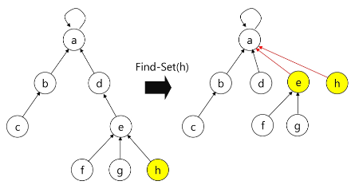

# 그래프의 기본과 탐색

[그래프 기본](#그래프-기본)   
[DFS](#dfs)   
[BFS](#bfs)   
[Union-Find](#union-find-disjoint-set)   

---


## 그래프 기본

### 그래프

- 아이템 (사물 또는 추상적 개념)들과 이들 사이의 연결 관계를 표현한다.

- 그래프는 정점(Vertex)들의 집합과 이들을 연결하는 간선(Edge)들의 집합으로 구성된 자료 구조
    - V : 정점의 개수, E : 그래프의 포함된 간선의 개수
    
    - V개의 정점을 가지는 그래프는 최대 V*(V-1)/2 간선이 가능

- 선형 자료 구조나 트리 자료 구조로 표현하기 어려운 N : N 관계를 가지는 원소들을 표현하기에 용이

### 그래프 유형

- 무향 그래프 (Undirected Graph)

- 유향 그래프 (Directed Graph)

- 가중치 그래프 (Weighted Graph)
    - 무향, 유향 둘 다 가능

- 사이클 없는 방향 그래프 (DAG, Directed Acyclic Graph)
    - 트리도 사이클이 없다

- 완전 그래프
    - 정점들에 대해 가능한 모든 간선들을 가진 그래프

- 부분 그래프
    - 원래 그래프에서 일부의 정점이나 간선을 제외한 그래프

### 인접 정점

- 인접 Adjacency
    - 두 개의 정점에 간선이 존재(연결됨)하면 서로 인접해 있다고 한다.
    
    - 완전 그래프에 속한 임의의 두 정점들은 모두 인접해 있다.

### 그래프 경로

- 경로 : 간선들을 순서대로 나열한 것

- 경로 중 한 정점을 최대한 한번만 지나는 경로를 **단순경로**라 한다.

- 시작한 정점에서 끝나는 경로를 **사이클(Cycle)**이라고 한다.

### 그래프 표현

- 간선의 정보를 저장하는 방식, 메모리나 성능을 고려해서 결정

- 인접 행렬 (Adjacent Matrix)
    - V * V 크기의 2차원 배열을 이용해서 간선 정보를 저장
    
    - 배열의 배열 (포인터 배열)
    
    - ‘연결이 안되어있다’ 라는 정보도 함께 저장
    
    - 인접 행렬의 장점
        - 연결 여부를 한 번에 탐색할 수 있다.
        
        - 직관적이다.
    
    - 인접 행렬의 단점
        - 메모리 낭비가 심하다.

- 인접 리스트 Adjacent List
    - 각 정점마다 해당 정점으로 나가는 간선의 정보를 저장
    
    - 각 정점에 대한 인접 정점들을 순차적으로 표현
    
    - 하나의 정점에 대한 인접 정점들을 각각 노드로 하는 연결 리스트로 저장
    
    - 연결된 정보만 저장
    
    - 코딩 테스트에서는 추천
    
    - 장점
        - 메모리 활용이 효율적이다.
    
    - 단점
        - 연결 정보 확인이 어렵다.

- 간선의 배열
    - 간선(시작 정점, 끝 정점)을 배열에 연속적으로 저장

### 인접 행렬

- 두 정점을 연결하는 간선의 유무를 행렬로 표현
    - V * V 정방 행렬
    
    - 행 번호와 열 번호는 그래프의 정점에 대응
    
    - 두 정점이 인접되어 있으면 1, 그렇지 않으면 0으로 표현
    
    - 무향 그래프
        - i 번째 행의 합 = i 번째 열의 합 = V_i 의 차수
    
    - 유향 그래프
        - 행 i의 합 = V_i 진출 차수
        
        - 열 i의 합 = V_i 진입 차수

## DFS

### 그래프 순회(탐색)

- 그래프 순회는 비선형구조인 그래프로 표현된 모든 자료(정점)를 빠짐없이 탐색하는 것을 의미

- 두 가지 방법
    - 깊이 우선 탐색 Depth First Search DFS
    
    - 너비 우선 탐색 Breadth First Search BFS

### DFS 깊이 우선 탐색

- 시작 정점의 한 방향으로 갈 수 있는 경로가 있는 곳까지 깊이 탐색해 가다가 더 이상 갈 곳이 없게 되면, 가장 마지막에 갈림길 간선이 있는 정점으로 되돌아와서 다른 방향의 정점으로 탐색을 계속 반복하여 결국 모든 정점을 방문하는 순회방법

- 가장 마지막에 만났던 갈림길의 정점으로 되돌아가서 다시 깊이 우선 탐색을 반복해야 하므로 후입선출 구조의 스택 사용

### DFS 알고리즘

- 재귀
    
    ```python
    **DFS_Recursive(G, v)**
    	
    	visited[v] <- **TRUE**  # v 방문 설정
    	
    	**FOR** each all w **in** adjacency(G, v)
    		**IF** visited[w] != **TRUE**
    				**DFS_Recursive(G, w)**
    ```
    
- 반복
    
    ```python
    STACK s
    visited[]
    DFS(v)
    	push(s, v)
    	visited[v] = True
    	WHILE NOT isEmpty(s)
    		v <- pop(s)
    		visit(v)
    		FOR each w in adjacency(v)
    			IF NOT visited[w]
    				push(s, w)
    				visited[v] = True
    ```
    

## BFS

### BFS Breadth First Search

- 너비우선탐색은 탐색 시작점의 인접한 정점들을 먼저 모두 차례로 방문한 후에, 방문했던 정점을 시작점으로 하여 다시 인접한 정점들을 차례로 방문하는 방식

- 인접한 정점들에 대해 탐색을 한 후, 차례로 다시 너비우선탐색을 진행해야 하므로, 선입선출 형태의 자료 구조인 큐를 활용함

### BFS 알고리즘

- 입력 파라미터 : 그래프 G와 탐색 시작점 v
    
    ```python
    BFS(G, v)  # 그래프 G, 탐색 시작점 v
    	큐 생성
    	시작점 v를 큐에 삽입
    	점 v를 방문한 것으로 표시
    	WHILE 큐가 비어있지 않은 경우
    		t <- 큐의 첫번재 원소 반환
    		FOR t와 연결된 모든 선에 대해
    			u <- t의 이웃점
    			u가 방문되지 않은 곳이면,
    			u를 큐에 넣고, 방문한 것으로 표시
    ```
    

## Union-Find (Disjoint set)

### 서로소 집합 (Disjoint-sets)

- 서로소 또는 상호배타 집합들은 서로 중복 포함된 원소가 없는 집합이다.

- 교집합이 없다.

- 집합에 속한 하나의 특정 멤버를 통해 각 집합들을 구분한다.
    - 대표자(representative)

- 상호배타 집합을 표현하는 방법
    - 연결 리스트
    
    - 트리

- 상호배타 집합 연산
    - Make-Set(x) : 초기 설정
    
    - Find-Set(x) : 대표자를 찾는 역할
    
    - Union(x, y) : 각 대표자가 다르다면 같은 그룹으로 묶어주는 역할

### 상호 배타 집합 표현 - 연결리스트

- 같은 집합의 원소들은 하나의 연결리스트로 관리

- 연결리스트의 맨 앞의 원소를 집합의 대표 원소로 삼는다.

- 각 원소는 집합의 대표 원소를 가리키는 링크를 갖는다.

### 상호 배타 집합 표현 - 트리

- 하나의 집합(a disjoint set)을 하나의 트리로 표현

- 자식 노드가 부모 노드를 가리키며 루트 노드가 대표자가 된다.

### 상호 배타 집합에 대한 연산

- Make-Set(x) : 유일한 멤버 x를 포함하는 새로운 집합을 생성하는 연산
    
    ```python
    Make-Set(x)
    	p[x] <- x
    ```
    
    - 자기 자신을 대표자로 선정

- Find-Set(x) : x를 포함하는 집합을 찾는 연산
    
    ```python
    Find-Set(x)
    	IF x == p[x] : RETURN x
    	ELSE:
    		RETURN Find_Set(p[x])
    ```
    
    - 자기 자신이 대표

- Union(x, y) : x와 y를 포함하는 두 집합을 통합하는 연산
    
    ```python
    Union(x, y)
    	p[Find-Set(y)] <- Find-Set(x)
    ```
    
    - y의 대표자 = x의 대표자

- Find_Set(x) : x를 포함하는 집합을 찾는 연산(반복)
    
    ```python
    Find_Set(x)
    	while x != p[x]:
    		x = p[x]
    	return x
    ```
    
- 문제점
    - 편향된 트리라고 생각할 경우, 대표자를 찾으려면 밑에서부터 맨 위까지 올라와야 하기 때문에 시간이 오래 걸린다.

- 연산의 효율을 높이는 방법
    - Rank를 이용한 Union
        - 각 노드는 자신을 루트로 하는 subtree의 높이를 랭크 Rank라는 이름으로 저장한다.
        
        - 두 집합을 합칠 때 rank가 낮은 집합을 rank가 높은 집합에 붙인다.
        
        
        
    - Path Compression
        - Find-Set을 행하는 과정에서 만나는 모든 노드들이 직접 root를 가리키도록 포인터를 바꾸어 준다.
        
        
        
    
    ### Rank를 이용한 Union 연산
    
    - Make_Set 연산
        - Make_Set(x) : 유일한 멤버 x를 포함하는 새로운 집합을 생성하는 연산
        
        ```python
        # p[x] : 노드 x의 부모 저장
        # rank[k] : 루트 노드가 x인 트리의 랭크
        
        Make_Set(x)
        	p[x] <- x
        	rank[x] <- 0
        ```
        
    - Find_Set 연산
        - Find_Set(x) : x를 포함하는 집합을 찾는 오퍼레이션
        
        ```python
        Find_Set(x)
        	IF x != p[x]  # x가 루트가 아닌 경우
        		p[x] <- Find_Set(p[x])
        	RETURN p[x]
        ```
        
        - Find_Set 연산은 특정 노드에서 루트까지의 경로를 찾아가면서 노드의 부모 정보를 갱신
    
    - Union 연산
        - Union(x, y) : x와 y를 포함하는 두 집합을 통합하는 오퍼레이션
        
        ```python
        Union(x, y)
        	Link(Find_Set(x), Find_Set(y))
        ```
        
        ```python
        Link(x, y)
        	IF rank[x] > rank[y]  # rank는 트리의 높이
        		p[y] <- x
        	ELSE
        		p[x] <- y
        		IF rank[x] == rank[y]
        			rank[y]++
        ```