# Queue

[Queue](#queue-1)   
[선형 큐](#선형-큐)   
[원형 큐](#원형-큐)   
[연결 큐](#연결-큐)   
[Deque](#deque)   
[우선순위 큐](#우선순위-큐)   
[버퍼](#버퍼)   
[BFS](#bfs)
---

## Queue

### Queue 큐의 특성
- 스택과 마찬가지로 삽입과 삭제의 위치가 제한적인 자료 구조
    - 큐의 뒤에서는 삽입만 하고, 큐의 앞에서는 삭제만 이루어지는 구조

- **선입선출구조**
    - 큐에 삽입한 순서대로 원소가 저장되어, 가장 먼저 삽입(First In)된 원소는 가장 먼저 삭제(First Out)된다.

### Queue의 구조 및 기본 연산
- 큐의 선입선출 구조
    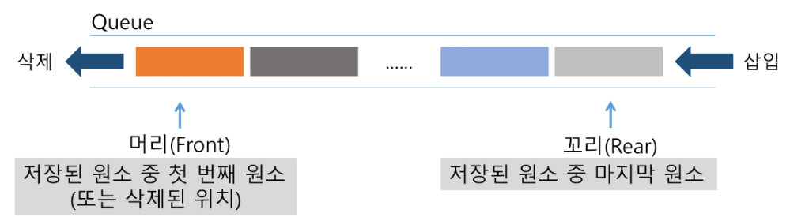

- 큐의 기본 연산
  - 삽입 : enQueue
  
  - 삭제 : deQueue

### 큐의 주요 연산
- 큐의 사용을 위해 필요한 주요 연산   

  | 연산 | 기능 |
  | : ---- : | : ---- : |
  |`enQueue(item)`|큐의 뒤쪽(rear 다음)에 원소를 삽입하는 연산|
  |`deQueue()`|큐의 앞쪽(front)에서 원소를 삭제하고 반환하는 연산|
  |`createQueue()`|공백 상태의 큐를 생성하는 연산|
  |`isEmpty()`|큐가 공백상태인지를 확인하는 연산|
  |`isFull()`|큐가 포화상태인지를 확인하는 연산|
  |`Qpeek()`|큐의 앞쪽(front)에서 원소를 삭제없이 반환하는 연산|

### 큐의 연산 과정
1. 공백 큐 생성 : `createQueue()`   
    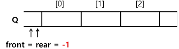

2. 원소 A 삽입 : `enQueue(A)`   
    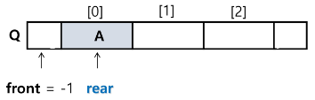

3. 원소 B 삽입 : `enQueue(B)`   
    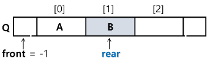

4. 원소 반환 / 삭제 : `deQueue()`   
    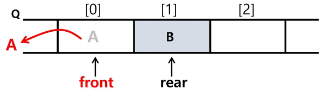

5. 원소 C 삽입 : `enQueue(C)`   
    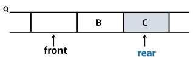

6. 원소 반환 / 삭제 : `deQueue()`   
    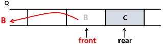
   
## 선형 큐
- 1차원 배열을 이용한 큐

- 큐의 크기 = 배열의 크기

- front : 저장된 첫 번째 원소의 인덱스

- rear : 저장된 마지막 원소의 인덱스

- 상태 표현
  - 초기 상태 : front = rear = -1
  
  - 공백 상태 : front == rear
  
  - 포화 상태 : rear == n-1 (n: 배열의 크기, n-1: 배열의 마지막 인덱스)

- 초기 공백 큐 생성
  - 크기 n인 1차원 배열 생성
  
  - front와 rear을 -1로 초기화

- 삽입 : `enQueue(item)`
  - 마지막 원소 뒤에 새로운 원소를 삽입하기 위해
    
    1. rear 값을 하나 증가시켜 새로운 원소를 삽입할 자리를 마련
    
    2. 그 인덱스에 해당하는 배열 원소 Q[rear]에 item을 저장
    
    ```python
      def enQueue(item):
        global rear
        if isFull():
            print("Queue_Full")
        else:
            rear += 1
            Q[rear] = item
    ```

- 삭제 : `deQueue()`
  - 가장 앞에 있는 원소를 삭제하기 위해
    
    1. front 값을 하나 증가시켜 큐에 남아있는 첫 번째 원소 이동
    
    2. 새로운 첫 번째 원소를 리턴함으로써 삭제와 동일한 기능을 함
    
    ```python
        def deQueue():
        if isEmpty():  # 삭제하려 하는데 이미 비어있을 때 (디버깅용)
            print('Queue_Empty')
        else:
            front += front
            return Q[front]
    ```

- 공백 상태 및 포화 상태 검사 : `isEmpty()`, `isFull()`
  - 공백 상태 : front == rear
  
  - 포화 상태 : rear == n-1 (n: 배열의 크기, n-1: 배열의 마지막 인덱스)
  
  ```python
    def isEmpty():
	        return front == rear
  ```
  
  ```python
    def isFull():
	        return rear == len(Q) -1
  ```

- 검색 : `Qpeek()`
  - 가장 앞에 있는 원소를 검색하여 반환하는 연산
  
  - 현재 front의 한 자리 뒤(front +1)에 있는 원소, 즉 큐의 첫 번째에 있는 원소를 반환
  
  ```python
  def Qpeek():
    if isEmpty():  # 검색하려 하는데 비어있는지 먼저 확인
      print("Queue_Empty")
    else:
      return Q[front + 1]
  ```

## 원형 큐

### 선형 큐 이용시의 문제점

- 잘못된 포화상태 인식
  - 선형 큐를 이용하여 원소의 삽입과 삭제를 계속할 경우, 배열의 앞부분에 활용할 수 있는 공간이 있음에도 불구하고, rear = n-1인 상태
  
  - 포화 상태로 인식하여 더 이상의 삽입을 수행하지 않게 됨

- 해결 방법 1
  - 매 연산이 이루어질 때마다 저장된 원소들을 배열의 앞부분으로 모두 이동시킴
  
  - 원소 이동에 많은 시간이 소요되어 큐의 효율성이 급격히 떨어짐

- 해결 방법 2
  - 1차원 배열을 사용하되, 논리적으로는 배열의 처음과 끝이 연결되어 원형 형태의 큐를 이룬다고 가정하고 사용

### 원형 큐의 구조
- 초기 공백 상태
  - front = rear = 0

- Index의 순환
  - front와 rear의 위치가 배열의 마지막 인덱스인 n-1를 가리킨 후, 그 다음에는 논리적 순환을 이루어 배열의 처음 인덱스인 0으로 이동해야 함
  
  - 이를 위해 나머지 연산자 mod를 사용함

- front 변수
  - 공백 상태와 포화 상태 구분을 쉽게 하기 위해 front가 있는 자리는 사용하지 않고 항상 빈자리로 둠

- 삽입 위치 및 삭제 위치   

  | |삽입 위치|삭제 위치|   
  |:-:|:-:|:-:|
  |선형 큐|rear += 1|front += 1|   
  |원형 큐|rear = (rear+1) mod n | front = (front+1) mod n|   

### 원형 큐의 연산 과정

1. Create Queue (실제로는 list, 개념 이해가 쉽게 원형이라고 가정)   
  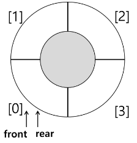

1. `enQueue(A)`   
  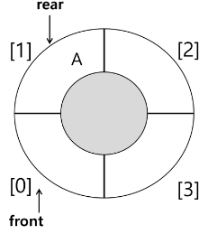

1. `enQueue(B)`   
  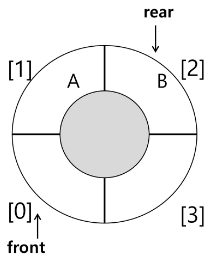

2. `deQueue()`   
    -  실제로는 A 데이터는 남아있으나 후에 돌고돌면서 데이터가 덮어쓰여질 것   

   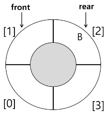

1. `enQueue(C)`   
  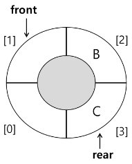

1. `enQueue(D)`   
    -  원형큐에서 Full이 나타나지 않는 것은 아니다.
       -  사이즈가 너무 작았거나
       
       -  enQueue량만큼 deQueue가 안되었거나.
    
    - 보통 Full이 되었을 때
      - 데이터를 덮어쓰거나 (문제 풀 때는 거의 안 씀)
      
      - Full이 되면 다른 곳에 저장해서 데이터를 백업하거나   

   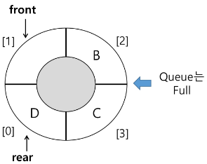

### 원형 큐의 구현
- 초기 공백 큐 생성
    - 크기 n인 1차원 배열 생성
    
    - front와 rear를 0으로 초기화

- 공백 상태 및 포화 상태 검사 : `isEmpty()`, `isFull()`
    - 공백 상태 : front == rear
    
    - 포화 상태 : 삽입할 rear의 다음 위치 == 현재 front
    
    - (rear + 1) mod n == front
  
  ```python
  def isEmpty():
    return front == rear
  ```

  ```python
  def isFull():
    return (rear + 1) % len(cQ) == front
  ```

- 삽입 : `enQueue(item)`
  - 마지막 원소 뒤에 새로운 원소를 삽입하기 위해
  
  1. rear 값을 조정하여 새로운 원소를 삽입할 자리를 마련함
      
      ```python
      rear = (rear + 1) mod n
      ```
      
  2. 그 인덱스에 해당하는 배열원소 cQ[rear]에 item을 저장
      
      ```python
      def enQueue(item):
      	global rear
      	if isFull():
      		print('Queue_Full')
      	else:
      		rear = (rear + 1) % len(cQ)
      		cQ[rear] = item
      ```

- 삭제 : `deQueue()` , `delete()`
    - 가장 앞에 있는 원소를 삭제하기 위해
    
    1. front 값을 조정하여 삭제할 자리를 준비함
    
    2. 새로운 front 원소를 리턴 함으로써 삭제와 동일한 기능함
    
    ```python
    def deQueue():
    	global front
    	if isEmpty():
    		print('Queue_Empty')
    	else:
    		front = (front + 1) % len(cQ)
    		return cQ[front]
    ```
    
    ```python
    def isEmpty():
    	return front == rear
    ```
    
    ```python
    def isFull():
    	return (rear + 1) % len(cQ) == front
    ```

## 연결 큐

### 연결 큐의 구조

- 단순 연결 리스트 (Linked List)를 이용한 큐
    - 큐의 원소 : 단순 연결 리스트의 노드
    
    - 큐의 원소 순서 : 노드의 연결 순서, 링크로 연결되어 있음
    
    - front : 첫 번째 노드를 가르키는 링크
    
    - rear : 마지막 노드를 가리키는 링크

- 상태 표현
    - 초기 상태 : front = rear = null
    
    - 공백 상태 : front = rear = null

### 연결 큐의 연산 과정

1. 공백 큐 생성 : `createLinkedQueue()`
    
    
    
2. 원소 A 삽입 : `enQueue(A)`
    
    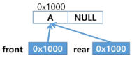
    
3. 원소 B 삽입 : `enQueue(B)`
    
    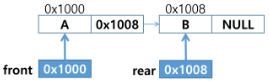
    
4. 원소 삭제 : `deQueue()`
    
    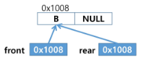
    
5. 원소 C 삽입 : `enQueue(C)`
    
    
    
6. 원소 삭제 : `deQueue()`
    
    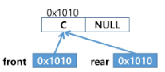
    
7. 원소 삭제 : `deQueue()`
    
    

## Deque
- 컨테이너 자료형 중 하나

- deque 객체
    - 양쪽 끝에서 빠르게 추가와 삭제를 할 수 있는 리스트류 컨테이너

- 연산
    - append(x) : 오른쪽에 x 추가
    
    - popleft() : 왼쪽에서 요소를 제거하고 반환, 요소가 없으면 IndexError
    
    ```python
    from collections import deque
    
    q = deque()
    q.append(1)  # enqueue()
    t = q.popleft()  # dequeue()
    ```

## 우선순위 큐
- 우선순위 큐의 특성
    - 우선순위를 가진 항목들을 저장하는 큐
    
    - FIFO 순서가 아니라 우선순위가 높은 순서대로 먼저 나가게 된다.

- 우선순위 큐의 적용 분야
    - 시뮬레이션 시스템
    
    - 네트워크 트래픽 제어
    
    - 운영체제의 테스트 스케쥴링

- 우선순위 큐의 구현
    - 배열을 이용한 우선순위 큐
    
    - 리스트를 이용한 우선순위 큐

- 우선순위 큐의 기본 연산
    - 삽입 : enQueue
    
    - 삭제 : deQueue

- 배열을 이용하여 우선순위 큐 구현
    - 배열을 이용하여 자료 저장
    
    - 원소를 삽입하는 과정에서 우선순위를 비교하여 적절한 위치에 삽입하는 구조
    
    - 가장 앞에 최고 우선순위의 원소가 위치하게 됨

- 문제점
    - 배열을 사용하므로, 삽입이나 삭제 연산이 일어날 때 원소의 재배치가 발생함
    
    - 이에 소요되는 시간이나 메모리 낭비가 큼

## 버퍼
### 큐의 활용 : 버퍼(Buffer)

- 버퍼
    - 데이터를 한 곳에서 다른 한 곳으로 전송하는 동안 일시적으로 그 데이터를 보관하는 메모리의 영역
    
    - 버퍼링 : 버퍼를 활용하는 방식 또는 버퍼를 채우는 동작을 의미

- 버퍼의 자료 구조
    - 버퍼는 일반적으로 입출력 및 네트워크와 관련된 기능에서 이용
    
    - 순서대로 입력 / 출력 / 전달되어야 하므로 FIFO 방식의 자료구조인 큐가 활용

## BFS
### BFS Breadth First Search 너비 우선 탐색
- 그래프를 탐색하는 방법에는 크게 두 가지가 있음
  - 깊이 우선 탐색 Depth First Search DFS
  
  - 너비 우선 탐색 Breadth First Search BFS

- 너비 우선 탐색은 탐색 시작점의 인접한 정점들을 먼저 모두 차례로 방문한 후에, 방문했던 정점을 시작점으로 하여 다시 인접한 정점들을 차례로 방문하는 방식

- 인접한 정점들에 대해 탐색을 한 후, 차례로 다시 너비우선탐색을 진행해야 하므로, 선입선출 형태의 자료구조인 큐를 활용함

- BFS는 아래 순서로 탐색함   
  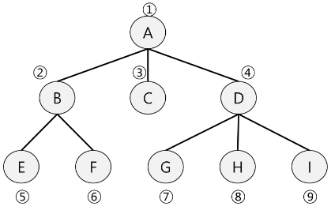

- 입력 파라미터 : 그래프 G와 탐색 시작점 v
    - 방문할 노드 : dequeue한 노드
    
    ```python
    def BFS(G, v):             # 그래프 G, 탐색 시작점 v
    	visited = [0] * (n+1)    # n : 정점의 개수, 방문 기록
    	queue = []               # 큐 생성
    	queue.append(v)          # 시작점 v를 큐에 삽입
    	                         # 위에는 준비 과정
    	                         # 아래는 탐색 과정
    	while queue:             # 큐가 비어있지 않은 경우
    		t = queue.pop(0)       # 큐의 첫 번째 원소 반환
    		if not visited[t]:     # 방문되지 않은 곳이라면
    			visited[t] = True    # 방문한 것으로 표시
    			visited(t)           # 정점 t에서 할 일
    			for i in G[t]:       # t와 연결된 모든 정점에 대해
    				if not visited[i]: # 방문되지 않은 곳이라면
    					queue.append(i)  # 큐에 넣기
    ```

### BFS 기본 과정 


- 초기 상태
    - Visited 배열 초기화
    
    - Q 생성
    
    - 시작점 enqueue
    
    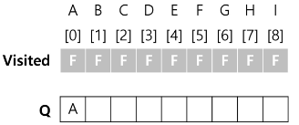

- A점 부터 시작
    - dequeue : A
    
    - A 방문한 것으로 표시
    
    - A의 인접점 enqueue
    
    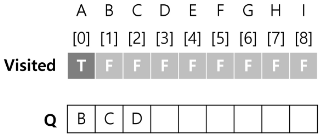

- 탐색 진행
    - dequeue: B
    
    - B 방문한 것으로 표시
    
    - B의 인접점 enqueue
    
    - 원래는 A도 B인접이라서 Q에 A도 추가해야하지만 visited에 표시해놓았기 때문에 생략
    
    - A도 넣어놓고 나중에 뺄 수 있지만, 단점은 Q 사이즈 예측이 어렵다. Q의 원소의 개수를 정확히 모른다.
    
    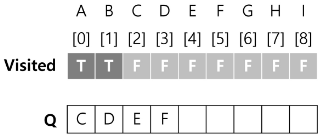

- 탐색 진행
    - dequeue: C
    
    - C 방문한 것으로 표시
    
    - C의 인접점 enqueue
    
    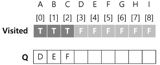

- 탐색 진행
    - dequeue: D
    
    - D 방문한 것으로 표시
    
    - D의 인접점 enqueue
    
    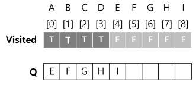

- 탐색 진행
    - dequeue: E
    
    - E 방문한 것으로 표시
    
    - E의 인접점 enqueue
    
    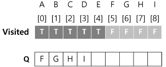

- 탐색 진행
    - dequeue: F
    
    - F 방문한 것으로 표시
    
    - F의 인접점 enqueue
    
    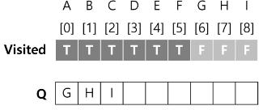

- 탐색 진행
    - dequeue: G
    
    - G 방문한 것으로 표시
    
    - G의 인접점 enqueue
    
    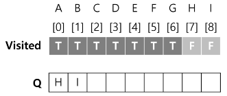

- 탐색 진행
    - dequeue: H
    
    - H 방문한 것으로 표시
    
    - H의 인접점 enqueue
        
    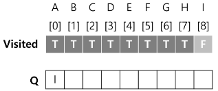

- 탐색 진행
    - dequeue: I
    
    - I 방문한 것으로 표시
    
    - I의 인접점 enqueue
    
    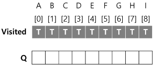

### BFS 예제

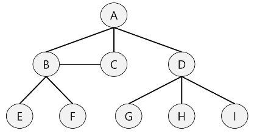

- 입력 파라미터 : 그래프 G와 탐색 시작점 v
    
    ```python
    def BFS(G, v, n):          # 그래프 G, 탐색 시작점 v
    	visited = [0] * (n+1)    # n : 정점의 개수, 방문 기록
    	queue = []               # 큐 생성
    	queue.append(v)          # 시작점 v를 큐에 삽입
    	visited[v] = 1
    	                         # 위에는 준비 과정
    	                         # 아래는 탐색 과정
    	while queue:             # 큐가 비어있지 않은 경우
    		t = queue.pop(0)       # 큐의 첫 번째 원소 반환
    		visited(t)             # 방문한 것으로 표시
    
    		for i in G[t]:         # t와 연결된 모든 정점에 대해
    			if not visited[i]:   # 방문되지 않은 곳이라면
    				queue.append(i)    # 큐에 넣기
    				visited[i] = visited[t] + 1   # n으로부터 1만큼 이동
    ```
    
    - enqueue할 때 visit을 표시하면 중복될 수 있다.
    
    - 따라서 넣을 때도 visit, 뺄 때도 visit을 표시하거나 아예 넣을때만 visit에 표시해야한다.

### BFS 연습 문제

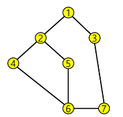

- 다음 그래프에서 너비 우선 탐색 정점 경로
  - 1 - 2 - 3 - 4 - 5 - 7 - 6