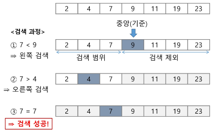
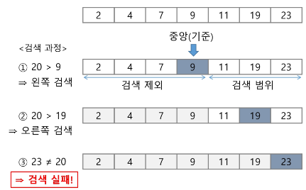

# Search

[Search](#search-검색)   
[순차 검색](#순차-검색-sequential-search)   
[이진 검색](#이진-검색-binary-search)   
[셀렉션 알고리즘](#셀렉션-알고리즘-selection-algorighm)   

---
## Search 검색
- 저장되어 있는 자료 중에서 원하는 항목을 찾는 작업

- 목적하는 탐색 키를 가진 항목을 찾는 것
  - 탐색 키 (Search Key) : 자료를 구별하여 인식할 수 있는 키

- 검색의 종류
  - 순차 검색
  
  - 이진 검색
  
  - 해쉬

## 순차 검색 Sequential Search
- 일렬로 되어 있는 자료를 순서대로 검색하는 방법

- 배열이나 연결 리스트 등 순차구조로 구현된 자료구조에서 원하는 항목을 찾을 때 유용함

- 알고리즘이 단순하여 구현이 쉽지만, 검색 대상의 수가 많은 경우에는 수행시간이 급격히 증가하여 비효율적임

- 2가지 경우
  - 정렬되어 있지 않은 경우
  
  - 정렬되어 있는 경우

### 정렬되어 있지 않은 경우
- 검색 과정
  - 첫 번재 원소부터 순서대로 검색 대상과 키 값이 같은 원소가 있는지 비교하며 찾는다.
  
  - 키 값이 동일한 원소를 찾으면 그 원소의 인덱스를 반환한다.
  
  - 자료구조의 마지막에 이를 때까지 검색 대상을 찾지 못하면 검색 실패

- 찾고자 하는 원소의 순서에 따라 비교 횟수가 결정됨
  - 첫 번째 원소를 찾을 때는 1번 비교, 두번째 원소를 찾을 때는 2번 비교 …
  
  - 정렬되지 않은 자료에서의 순차 검색의 평균 비교 횟수
    - (1/n) * ( 1+2+3+4+…+n) = (n+1) / 2

- 시간 복잡도
  - O(n)

#### 알고리즘 구현 예시
```python
def nonsorted_sequential_search(a,n,key):
	i = 0
	while i < n and a[i] != key: # 키가 같거나 배열이 끝날 때까지 반복
	# while a[i] != key and i < n: 하면 단축평가 때문에 안됨
	# i가 n을 넘어 갔을 때, 인덱스 out of range 오류가 나서 멈춤 
		i += 1 # 다음 원소로 넘어감
	
	if i < n: # 중단 됐을 때, i가 배열의 끝이 아님 = 키 값을 찾음
		return i # 현재 인덱스 값을 반환
	else: # 중단 됐을 때, i가 배열의 끝이라서 중단 = 키 값이 없음
		return -1 # -1 반환
```

### 정렬되어 있는 경우
- 검색 과정
  - 자료가 오름차순으로 정렬된 상태에서 검색을 실시한다고 가정
  
  - 자료를 순차적으로 검색하면서 키 값을 비교하여, 원소의 키 값이 검색 대상의 키 값보다 크면 찾는 원소가 없다는 것이므로 더 이상 검색하지 않고 검색을 종료한다.

- 찾고자 하는 원소의 순서에 따라 비교 횟수가 결정됨
  - 정렬이 되어있으므로, 검색 실패를 반환하는 경우 평균 비교 횟수가 반으로 줄어듦

- 시간 복잡도
  - O(n)

#### 알고리즘 구현 예시
```python
def sorted_sequential_search(a,n,key)
	i = 0
	while i < n and a[i] < key:
	# while a[i] < key and i < n: 하면 단축평가 때문에 안됨
	# i가 n을 넘어 갔을 때, 인덱스 out of range 오류가 나서 멈춤 
		i += 1
	if i < n and a[i] == key:
		return i
	else:
		return -1
```

## 이진 검색 Binary Search
- 자료의 가운데에 있는 항목의 키 값과 비교하여 다음 검색의 위치를 결정하고 검색을 계속 진행하는 방법

- 목적 키를 찾을 때까지 이진 검색을 순환적으로 반복 수행함으로써 검색 범위를 반으로 줄여가면서 보다 빠르게 검색을 수행함

- 이진 검색을 하기 위해서는 자료가 **정렬된 상태**여야 한다.

### 이진 검색 과정
- 이진 검색으로 7을 찾는 경우   
   
   
   - 가운데 값 9보다 작으므로 왼쪽에서 다시 검색
   
   - 가운데 값 4보다 더 크므로 4~9 사이에서 검색
 
 - 이진 검색으로 20을 찾는 경우   
   
   - 가운데 값 9보다 크므로 오른쪽에서 다시 검색
   
   - 가운데 값 19보다 크므로 오른쪽에서 다시 검색

### 이진 검색 알고리즘
- 구현
    - 검색 범위의 시작점과 종료점을 이용하여 검색을 반복 수행한다.
    
    - 이진 검색의 경우, 자료에 삽입이나 삭제가 발생했을 때, 배열의 상태를 항상 정렬 상태로 유지하는 추가 작업이 필요
    
    ```python
    def binary_search(a,N,key):

	    start = 0 # 시작 원소 인덱스
	    end = N-1 # 마지막 원소 인덱스
	    while start <= end: # 남은 구간이 있으면
		    middle = (start + end) // 2 # 가운데 찾기
		    if a[middle] == key: # 검색 성공
		    	return true
		    elif a[middle] > key: # 가운데 값이 찾는 값보다 크면
		    	end = middle-1
		    else: # 가운데 값이 찾는 값보다 작으면
		    	start = middle+1
	    return false # 검색 실패
    ```

- 재귀 함수 이용
    ```python
    def binary_search_recursion_func(a,low,high,key):
	    if low > high:
	    	return False
	    else:
	    	middle = (low + high) // 2
	    	if key == a[middle]:
		    	return True
	    	elif key < a[middle]:
	    		return binary_search_recursion_func(a,low,middle-1,key)
	    	elif a[middle] < key:
	    		return binary_search_recursion_func(a,middle+1,high,key)
    ```

### 인덱스 Index
- Database에서 유래, 테이블에 대한 동작 속도를 높여주는 자료 구조

- 인덱스를 저장하는데 필요한 디스크 공간은 보통 테이블을 저장하는데 필요한 디스크 공간보다 작다. 왜냐하면 보통 인덱스는 키-필드만 갖고 있고, 테이블의 다른 세부 항목들은 갖고 있지 않기 때문이다.

- 대량의 데이터를 매번 정렬하면 프로그램은 느려짐

- 이러한 대량 데이터의 성능 저하 문제를 해결하기 위해 배열 인덱스를 사용
원본 데이터에 데이터가 삽입될 경우 상대적으로 크기가 작은 인덱스 배열을 정렬하기 때문에 속도가 빠르다.

- 데이터베이스 인덱스는 **이진 탐색 트리** 구조로 되어있다.

## 셀렉션 알고리즘 Selection Algorighm
- 저장되어 있는 자료로부터 k번째로 큰 혹은 작은 원소를 찾는 방법

- 최솟값, 최댓값, 중간값을 찾는 알고리즘

- 선택과정
  - 정렬 알고리즘을 이용하여 자료 정렬하기
  
  - 원하는 순서에 있는 원소 가져오기

### 셀렉션 알고리즘 구현
- 1번부터 k번째까지 작은 원소들을 찾아 배열의 앞쪽으로 이동시키고, 배열의 k번째 반환

- k가 비교적 작을 때 유용하며 O(kn)의 수행시간을 필요로 한다.

```python
def select(arr, k):
	for i in range(0,k):
		min_index = i
		for j in range(i+1,len(arr)):
			if arr[min_index] > arr[j]:
				min_index = j
		arr[i], arr[min_idx] = arr[min_index], arr[i]
	return arr[k-1]
```