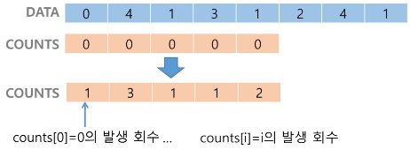
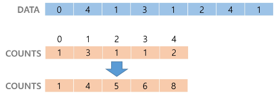
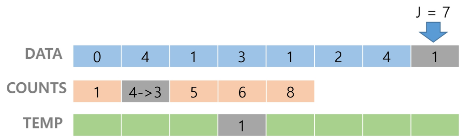
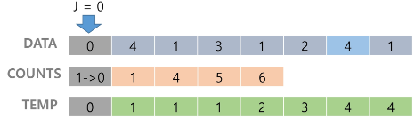

# Sort

[]()
---
## Sort 정렬
- 2개 이상의 자료를 특정 기준에 의해 작은 값부터 큰 값(오름차순), 혹은 그 반대의 순서대로(내림차순) 재배열하는 것
- 키
  - 자료를 정렬하는 기준이 되는 특정 값

## 대표적인 정렬 방식의 종류
- 버블 정렬 Bubble Sort
- 카운팅 정렬 Counting Sort
- 선택 정렬 Selection Sort
- 퀵 정렬 Quick Sort
- 삽입 정렬 Insertion Sort
- 병합 정렬 Merge Sort

## 버블 정렬
- 인접한 두 개의 원소를 비교하며 자리를 계속 교환하는 방식
- 정렬 과정
  - 첫 번째 원소부터 인접한 원소기리 계속 자리를 교환하면서 맨 마지막 자리까지 이동한다.
  - **한 단계가 끝나면 가장 큰 원소가 마지막 자리로 정렬된다. (오름차순 기준)**
- 시간 복잡도
  - O(n**2)

## 버블 정렬 과정 예시
### [55, 7, 78, 12, 42]을 버블 정렬하는 과정
- 첫 번째 패스   
    

- 두 번째 패스   
    

- 세 번째 패스   
    

- 네 번째 패스   
    

- 정렬 끝   
    

```python
def BubbleSort(a, N): # 정렬할 list, N(원소 수)
	for i in range(N-1, 0, -1): # 범위의 끝 위치
		for j in range(0,i): # 비교할 왼쪽 원소
			if a[j] > a[j+1]:
				a[j], a[j+1] = a[j+1], a[j] # 왼쪽 값이 오른쪽 값보다 더 크면 둘의 자리 변경
											# 파이썬에서는 이렇게 값 교환이 가능하다.
```

## 카운팅 정렬
- 항목들의 순서를 결정하기 위해 집합에 각 항목이 몇 개씩 있는지 세는 작업을 하며 선형 시간에 정렬하는 효율적인 알고리즘
- 제한사항
  - 정수나 정수로 표현할 수 있는 자료에 대해서만 적용 가능
    - 각 항목의 발생 횟수를 기록하기 위해, 정수 항목으로 인덱스되는 카운트들의 배열을 사용하기 때문
  - 정수의 범위가 너무 크면 사용하기 힘듦
  - 카운트들을 위한 충분한 공간을 할당하려면 집합 내의 가장 큰 정수를 알아야한다.
- 시간 복잡도
  - O(n+k)
  - n은 리스트 길이, k는 정수의 최댓값

## 카운팅 정렬 과정 예시
### [0, 4, 1, 3, 1, 2, 4, 1]을 카운팅 정렬하는 과정
- DATA에서 각 항목들의 발생 횟수를 세고, 정수 항목들로 직접 인덱스되는 카운트 배열 COUNTS에 저장한다.
  - 순회하면서 0이면 index 0에 카운트+1, 4면 index 4에 카운트+1 ...
  - 0이 1개, 1이 3개, 2가 1개, 3이 1개, 4가 2개
  - 
- 정렬된 집합에서 각 항목의 앞에 위치할 항목의 개수를 반영하기 위해 COUNTS의 원소를 조정
  - 0은 1번째, 1은 4번째까지, 2는 5번째, 3은 6번째, 4는 8번째까지
  - 
- DATA[-1]이 1이므로 COUNTS[1]을 감소시키고 TEMP에 1을 삽입한다.
  - 
- ...
- COUNTS[0]를 감소시키고 TEMP에 0을 삽입한다.
  - 
- TEMP 업데이트를 완료하고 정렬 작업을 종료한다.

- DATA[-1]부터 거꾸로 순회하는 이유는 DATA의 뒤에 나오는 숫자가 TEMP에서도 뒤에 나오게 하기 위해서이다.
  - 지금은 숫자라 똑같아 보이지만, 좌표라고 생각하면 순서가 중요해진다.
## 카운팅 정렬 알고리즘
```python
DATA = [0, 4, 1, 3, 1, 2, 4, 1]
COUNTS = [0] * 5                    # DATA가 0~4까지의 정수

N = len(DATA)                       # DATA의 크기
TEMP = [0] * N                      # 정렬 결과 저장

# 1단계 : DATA 원소 별 개수 세기
for x in DATA:                      # DATA의 원소 x를 가져와서 COUNTS[x]에 개수 기록
    COUNTS[x] += 1

# 2단계 : 각 숫자까지의 누적 개수 구하기
for i in range(1,5):                # COUNT[1]~COUNT[4]까지 누적개수
    COUNTS[i] += COUNTS[i-1]

# 3단계 : DATA의 맨 뒤부터 TEMP에 자리 잡기
for i in range(N-1, -1, -1):
    COUNTS[DATA[i]] -= 1            # 누적개수 1개 감소
    TEMP[COUNTS[DATA[i]]] = DATA[i]
```

## 학습한 정렬 알고리즘의 특성 비교
|알고리즘|평균 수행시간|최악 수행시간|알고리즘 기법|비고|
|:-:|:-:|:-:|:-:|:-:|
|버블 정렬|O(n**2)|O(n**2)|비교와 교환|코딩이 가장 손쉽다|
|카운팅 정렬|O(n+k)|O(n+k)|비교환 방식|n이 비교적 작을 때만 가능하다.|
|선택 정렬|O(n**2)|O