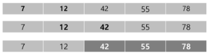

# Sort

[]()
---
## Sort 정렬
- 2개 이상의 자료를 특정 기준에 의해 작은 값부터 큰 값(오름차순), 혹은 그 반대의 순서대로(내림차순) 재배열하는 것
- 키
  - 자료를 정렬하는 기준이 되는 특정 값

## 대표적인 정렬 방식의 종류
- 버블 정렬 Bubble Sort
- 카운팅 정렬 Counting Sort
- 선택 정렬 Selection Sort
- 퀵 정렬 Quick Sort
- 삽입 정렬 Insertion Sort
- 병합 정렬 Merge Sort

## 버블 정렬
- 인접한 두 개의 원소를 비교하며 자리를 계속 교환하는 방식
- 정렬 과정
  - 첫 번째 원소부터 인접한 원소기리 계속 자리를 교환하면서 맨 마지막 자리까지 이동한다.
  - **한 단계가 끝나면 가장 큰 원소가 마지막 자리로 정렬된다. (오름차순 기준)**
- 시간 복잡도
  - O(n**2)

### 버블 정렬 과정 예시
- 첫 번째 패스   
    

- 두 번째 패스   
    

- 세 번째 패스   
    

- 네 번째 패스   
    

- 정렬 끝   
    

```python
def BubbleSort(a, N): # 정렬할 list, N(원소 수)
	for i in range(N-1, 0, -1): # 범위의 끝 위치
		for j in range(0,i): # 비교할 왼쪽 원소
			if a[j] > a[j+1]:
				a[j], a[j+1] = a[j+1], a[j] # 왼쪽 값이 오른쪽 값보다 더 크면 둘의 자리 변경
											# 파이썬에서는 이렇게 값 교환이 가능하다.
```