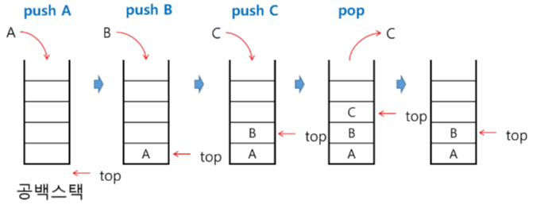
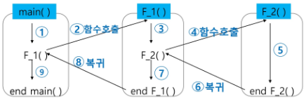
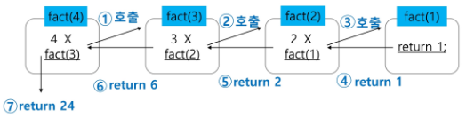
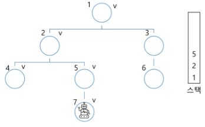
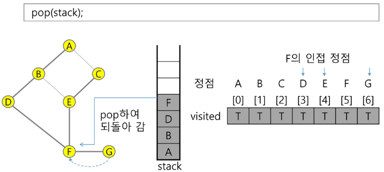

# Stack

[Stack](#stack-1)   
[Stack의 구현](#stack의-구현)   
[Stack의 응용](#stack의-응용)   

[재귀 호출](#재귀-호출)   
[Memoization](#memoization)   
[DP(Dynamic Programming)](#dp-dynamic-programming)   
[DFS(깊이 우선 탐색)](#dfs-깊이-우선-탐색)   

[Stack을 이용한 계산기](#stack을-이용한-계산기)   
[Backtracking](#backtracking-백트래킹)   

---
## Stack
### Stack의 특성
- 물건을 쌓아 올리듯 자료를 쌓아 올린 형태의 자료 구조

- 스택에 저장된 자료는 **선형 구조**를 갖는다.
  - 선형 구조 : 자료 간의 관계가 1대1 관계를 갖는다.
  
  - 비선형 구조 : 자료 간의 관계가 1대N 관계를 갖는다.

- 스택에 자료를 삽입하거나 스택에서 자료를 꺼낼 수 있다.

- 마지막에 삽입한 자료를 가장 먼저 꺼낸다.

- **후입선출**(LIFO, Last In First Out)이라고 부른다.
  - 예를 들어 스택에 1, 2, 3 순으로 자료를 삽입한 후 꺼내면 역순으로 <br/>즉, 3, 2, 1 순으로 꺼낼 수 있다.

## Stack의 구현
### Stack을 프로그램에서 구현하기 위해서 필요한 자료 구조와 연산
- 자료 구조 : 자료를 선형으로 저장할 저장소
  - 배열을 사용할 수 있다.
  
  - 저장소 자체를 스택이라 부르기도 한다.
  
  
  - 스택에서 마지막 삽입(저장)된 원소의 위치를 top이라 부른다.

- 연산
  - 삽입 : 저장소에 자료를 저장한다. 보통 push라고 부른다.
  
  - 삭제 : 저장소에 자료를 꺼낸다. 꺼낸 자료는 삽입한 자료의 역순으로 꺼낸다. <br />보통 pop이라고 부른다.
  
  - 스택이 공백인지 아닌지를 확인하는 연산 : isEmpty
  
  - 스택의 top에 있는 item(원소)을 반환하는 연산 : peek

### Stack의 삽입 / 삭제 과정
- 빈 스택에 원소 A, B, C를 차례로 삽입 후 한번 삭제하는 연산 과정

  

### Stack의 push 알고리즘
- 스택을 활용한 복잡한 알고리즘은 전체 구조 파악이 우선

- `append`메소드를 통해 리스트의 마지막에 데이터를 삽입

```python
def push(item):
  s.append(item)
```

```python
def push(item, size):
	global top
	top += 1
	if top == size:  # 디버깅용 코드 느낌이 강함
		print('overflow!')  # 데이터 입력이 사이즈를 초과함
	else:
		stack[top] = item

size = 10
stack = [0] * size
top = -1

push(10, size)
top += 1         # push(20)
stack[top] = 20  # 
```

### Stack의 pop 알고리즘

```python
def my_pop():
	if len(s) == 0:
		# underflow, 데이터가 없는데 꺼내려 함
		return
	else:
		return s.pop()
```

```python
def pop():
	global top
	if top == -1:
		print('underflow')
		return 0
	else:
		top -= 1  # 지우는 건 의미 없음
		return stack[top+1]
		
print(pop())
```

```python
if top > -1: # pop()   데이터가 남아있다면 꺼냄
	top -= 1
	print(stack[top+1])
```

```python
while top > -1:
	v = stack[pop]
	top -= 1
```

## Stack의 응용
### Stack 구현 고려 사항
- 1차원 배열을 사용하여 구현할 경우 구현이 용이하다는 장점이 있지만, 스택의 크기를 변경하기가 어렵다는 단점이 있음

- 해결 방법
  - 저장소를 동적으로 할당하여 스택을 구현하는 방법
  
  - 동적 연결 리스트를 이용하여 구현하는 방법
  
  - 스택의 동적 구현은 생략함
  
  - 장점 : 메모리를 효율적으로 사용한다.
  
  - 단점 : 구현이 복잡하다.

### 괄호 검사
- 괄호의 종류
  - 대괄호 [ ]
  
  - 중괄호 { }
  
  - 소괄호 ( )

- 조건
  - 왼쪽 괄호의 개수와 오른쪽 괄호의 개수가 같아야 한다.
  
  - 같은 괄호에서 왼쪽 괄호는 오른쪽 괄호보다 먼저 나와야 한다.
  
  - 괄호 사이에 포함 관계만 존재한다.

- 잘못된 괄호 사용의 예시
  - (a(b)
  
  - a(b)c)
  
  - a{b(c[d]e}f)

- 스택을 이용한 괄호 검사
  - 여는 괄호를 만나면 push, 닫는 괄호를 만나면 pop
  
  - 짝이 맞는지 (개수가 맞는지) 확인
  
  

- 괄호를 조사하는 알고리즘 개요
  - 문자열에 있는 괄호를 차례대로 조사하면서 여는 괄호를 만나면 스택에 삽입(push)
  
  - 이 때 스택이 비어 있으면 <조건 1> 또는 <조건 2>에 위배되고, 괄호의 짝이 맞지 않으면 <조건 3>에 위배
  
  - 마지막 괄호까지를 조사한 후에도 스택에 괄호가 남아 있으면 <조건 1>에 위배된다.

### function call
- 프로그램에서의 함수 호출과 복귀에 따른 수행 순서를 관리
  - 가장 마지막에 호출된 함수가 가장 먼저 실행을 완료하고 복귀하는 후입선출 구조
  
  - 후입선출 구조의 스택을 이용하여 수행 순서를 관리
  
  
  
  - 함수 호출이 발생하면 호출한 함수 수행에 필요한 지역변수, 매개변수 및 수행 후 복귀할 주소 등의 정보를 스택 프레임(Stack Frame)에 저장하여 시스템 스택에 삽입
  
  
  
  - 함수의 실행이 끝나면 시스템 스택의 top 원소(스택 프레임, Stack Frame)를 삭제(pop)하면서 프레임에 저장되어 있던 복귀 주소를 확인하고 복귀
  
  - 함수 호출과 복귀에 따라 이 과정을 반복하여 전체 프로그램 수행이 종료되면 시스템 스택은 공백 스택이 됨

## 재귀 호출
### 재귀 호출
- 필요한 함수가 자신과 같은 경우 자신을 다시 호출하는 구조

- 함수에서 실행해야 하는 작업의 특성에 따라 일반적인 호출 방식보다 재귀 호출 방식을 사용하여 함수를 만들면 프로그램의 크기를 줄이고 간단하게 작성

- 재귀 호출의 예시
  - factorial
  
  - 피보나치 수열

### factorial 함수
- n에 대한 factorial : 1부터 n까지의 모든 자연수를 곱하여 구하는 연산
  ```python
  n! = n * (n-1)!
	  (n-1)! = (n-1) * (n-2)!
		  (n-2)! = (n-2) * (n-3)!
		  	...
		  		2! = 2 * 1!
			  		1! = 1
  ```

- factorial 함수에서 n = 4인 경우의 실행
  

### 피보나치 수열
- 0과 1로 시작하고 이전의 두 수 합을 다음 항으로 하는 수열을 피보나치라 한다.
  - 0, 1, 1, 2, 3, 5, 8, 13, ...

- 피보나치 수열의 i번째 값을 계산하는 함수 F를 정의하면 다음과 같다.
  $$ F_0\,=\,0,\,F_1\,=\,1 $$
  $$ F_i\,=\,F_(i-1)\,+\,F_(i-2)\,for\,i\,\geq\,2 $$

- 위의 정의로부터 피보나치 수열의 i번째 항을 반환하는 함수를 재귀 함수로 구현할 수 있다.

- 피보나치 수를 구하는 재귀함수

```python
def fibo(n):  # f(0) = 0, f(1) = 1
  if n < 2:
    return n
  else:
    return fibo(n-1) + fibo(n-2)
```

### 재귀 호출 연습

- 모든 배열 원소에 접근하기

  ```python
  def f(i, N):  # i는 접근할 원소 인덱스, N은 크기
   if i == N:
     return
   else:  # else 없어도 상관 없음
     print(arr[i])
     f(i+1, N)
      return
  arr = [1, 2, 3]
  N = 3
  f(0, 3)
  ```
  
  - 아래 사진과 같이 데이터를 왼쪽 화살표처럼 한 칸씩 내려가면서 받고 저장
    
  - 다 저장되면 다시 올라오면서 위 쪽 데이터 공간에 저장
   
    <div align='center'>

    

    </div>
   
- 배열에 v가 있으면 1, 없으면 0을 리턴
  
  - v = 3인 경우
  ```python
  def f(i, N, v):  # v는 찾는 값
    if i == N:
      return 0
    elif arr[i] == v:
      return 1
    else:
      return j(i+1, N)
  ```

    <div align='center'>

    

    </div>

## Memoization
- 앞선 피보나치 수를 구하는 함수를 재귀함수로 표현하는 알고리즘은 많은 중복 호출이 존재한다는 문제점이 있다.

- 복잡도 : Θ(2**n)

<div align='center'>


</div>

- 메모이제이션(memoization)은 컴퓨터 프로그램을 실행할 때 이전에 계산한 값을 메모리에 저장해서 매번 다시 계산하지 않도록 하여 전체적인 실행속도를 빠르게 하는 기술

- 동적 계획법의 핵심이 되는 기술

- 직역하면 '메모리 넣기'라는 의미

- 피보나치 수를 구하는 알고리즘에서 fibo(n)의 값을 계산하자마자 저장(memoize)하면 실행시간을 Θ(n)으로 줄일 수 있다.

### Memoization 방법을 적용한 피보나치 알고리즘
```python
# memo를 위한 배열을 할당하고, 모두 0으로 초기화한다.
# memo[0]을 0으로 memo[1]는 1로 초기화한다.
def fibo1(n):
	global memo
	if n >= 2 and memo[n] == 0:
		memo[n] = fibo1(n-1) + fibo1(n-2)
	return memo[n]

memo = [0] * (n+1)
memo[0] = 0
memo[1] = 1
```

## DP (Dynamic Programming)
- 동적 계획 (Dynamic Programming) 알고리즘은 그리디 알고리즘과 같이 **최적화 문제**를 해결하는 알고리즘

- 동적 계획 알고리즘은 먼저 입력 크기가 작은 부분 문제들을 모두 해결한 후에 그 해들을 이용하여 보다 큰 크기의 부분 문제들을 해결하여, 최종적으로 원래 주어진 입력의 문제를 해결하는 알고리즘

### 피보나치 수 DP 적용
- 피보나치 수는 부분 문제의 답으로부터 본 문제의 답을 얻을 수 있으므로 최적 부분 구조로 이루어져 있다.

1. 문제를 부분 문제로 분할한다.
    - Fibonacci(n) 함수는 Fibonacci(n-1)과 Fibonacci(n-2)의 합
    
    - Fibonacci(n-1)은 Fibonacci(n-2)와 Fibonacci(n-3)의 합
    
    - Fibonacci(2)는 Fibonacci(1)과 Fibonacci(0)의 합
    
    - Fibonacci(n)은 Fibonacci(n-1), Fibonacci(n-2), … , Fibonacci(2), Fibonacci(1), Fibonacci(0)의 부분집합으로 나뉜다.

2. 부분 문제로 나누는 일을 끝냈으면 가장 작은 부분 문제부터 해를 구한다.

3. 그 결과는 테이블에 저장하고, 테이블에 저장된 부분 문제의 해를 이용하여 상위 문제의 해를 구한다.

<div align='center'>

|테이블 인덱스|저장되어 있는 값|
|:-:|:-:|
|[0]|0|
|[1]|1|
|[2]|1|
|[3]|2|
|[4]|3|
|...|...|
|[n]|fibo(n)|

</div>

### 피보나치 수 DP 적용 알고리즘
```python
def fibo2(n):
	f = [0] * (n+1)
	f[0] = 0
	f[1] = 1
	for i in range(2, n+1):
		f[i] = f[i-1] + f[i-2]
	
	return f[n]
```

### DP의 구현 방식
- recursive 방식 : fib1()

- iterative 방식 : fib2()

- memoization을 재귀적 구조에 사용하는 것보다 반복적 구조로 DP를 구현한 것이 성능 면에서 보다 효율적이다.

- 재귀적 구조는 내부에 시스템 호출 스택을 사용하는 오버헤드가 발생하기 때문이다.

## DFS (깊이 우선 탐색)
- 비선형구조인 그래프 구조는 그래프로 표현된 모든 자료를 빠짐없이 검색하는 것이 중요함

- 두 가지 방법
  - **깊이 우선 탐색** (Depth First Search, **DFS**)
  
  - **너비 우선 탐색** (Breadth First Search, **BFS**)

- 시작 정점의 한 방향으로 갈 수 있는 경로가 있는 곳까지 깊이 탐색해 가다가 더 이상 갈 곳이 없게 되면, 가장 마지막에 만났던 갈림길 간선이 있는 정점으로 되돌아와서 다른 방향의 정점으로 탐색을 계속 반복하여 결국 모든 정점을 방문하는 순회 방법

- **가장 마지막에 만났던 갈림길의 정점으로 되돌아가서 다시 깊이 우선 탐색을 반복해야 하므로 후입선출 구조의 스택 사용**

### DFS 예시 1 - 로봇이 선을 따라 모든 칸을 탐색하는 방법

<div align='center'>





</div>

1. 시작 정점 v를 결정하여 방문

2. 정점 v에 인접한 정점 중에서
   1. 방문하지 않은 정점 w가 있으면, 정점 v를 스택에 push하고 정점 w를 방문한다.<br />그리고 w를 v로 하여 다시 2를 반복한다.
   
   2. 방문하지 않은 정점이 없으면, 탐색의 방향을 바꾸기 위해서 스택을 pop하여 받은 가장 마지막 방문 정점을 v로 하여 다시 2를 반복한다.

3. 스택이 공백이 될 때까지 2를 반복한다.

```python
visited = []  # 초기화
stack = []  # 초기화

DFS(v):
	시작점 v 방문
	visited[v] <- true
	while true:
		if v의 인접 정점 중 방문 안 한 정점 w가 있으면:
			push(v)
			v = w (w에 방문)
			visited[w] = true
		else:
			if 스택이 비어 있지 않으면:
				v <- pop(stack)
			else:
				break
	
end DFS()
```

### DFS 예시 2
- 초기상태 : 배열 visited를 False로 초기화하고, 공백 스택을 생성
  - 연결되어 있는 선을 ‘간선’ 혹은 ‘edge’라고 부른다.

<div align='center'>

  

</div>

1. 정점 A를 시작으로 깊이 우선 탐색을 시작 ( 알파벳 순으로 이동하기로 설정)

<div align='center'>


</div>

2. 정점 A에 방문하지 않은 정점 B, C가 있으므로 A를 스택에 push하고, 인접정점 B와 C 중에서 오름차순에 따라 B를 선택하여 탐색을 계속한다.

<div align='center'>


</div>

3. 정점 B에 방문하지 않은 정점 D, E가 있으므로 B를 스택에 push하고, 인접정점 D와 E 중에서 오름차순에 따라 D를 선택하여 탐색을 계속한다.

<div align='center'>


</div>

4. 정점 D에 방문하지 않은 정점 F가 있으므로 D를 스택에 push하고, 인접정점 F를 선택하여 탐색을 계속한다.

<div align='center'>


</div>

5. 정점 F에 방문하지 않은 정점 E, G가 있으므로 F를 스택에 push하고, 인접정점 E와 G 중에서 오름차순에 따라 E를 선택하여 탐색을 계속한다.

<div align='center'>


</div>

6. 정점 E에 방문하지 않은 정점 C가 있으므로 E를 스택에 push하고, 인접정점 C를 선택하여 탐색을 계속한다.

<div align='center'>


</div>

7. 정점 C에서 방문하지 않은 인접정점이 없으므로, 마지막 정점으로 돌아가기 위해 스택을 pop하여 받은 정점 E에 대해서 방문하지 않은 인접정점이 있는지 확인한다.

<div align='center'>


</div>

8. 정점 E에서 방문하지 않은 인접정점이 없으므로, 다시 스택을 pop하여 받은 정점 F에 대해서 방문하지 않은 인접정점이 있는지 확인한다.

<div align='center'>


</div>

9.  정점 F에 방문하지 않은 정점 G가 있으므로 F를 스택에 push하고, 인접정점 G를 선택하여 탐색을 계속한다.

<div align='center'>


</div>

10. 정점 G에서 방문하지 않은 인접정점이 없으므로, 마지막 정점으로 돌아가기 위해 스택을 pop하여 받은 정점 F에 대해서 방문하지 않은 인접정점이 있는지 확인한다.

<div align='center'>



</div>

11. 정점 F에서 방문하지 않은 인접정점이 없으므로, 다시 마지막 정점으로 돌아가기 위해 스택을 pop하여 받은 정점 D에 대해서 방문하지 않은 인접정점이 있는지 확인한다.

<div align='center'>


</div>

12. 정점 D에서 방문하지 않은 인접정점이 없으므로, 다시 마지막 정점으로 돌아가기 위해 스택을 pop하여 받은 정점 B에 대해서 방문하지 않은 인접정점이 있는지 확인한다.

<div align='center'>


</div>

13. 정점 B에서 방문하지 않은 인접정점이 없으므로, 다시 마지막 정점으로 돌아가기 위해 스택을 pop하여 받은 정점 A에 대해서 방문하지 않은 인접정점이 있는지 확인한다.

<div align='center'>


</div>

14. 현재 정점 A에서 방문하지 않은 인접 정점이 없으므로 마지막 정점으로 돌아가기 위해 스택을 pop하는데, 스택이 공백이므로 깊이 우선 탐색을 종료한다.

- 깊이 우선 탐색 경로 : A - B - D - F - E - C - G

### DFS 다른 방식
- 내가 갈 수 있는 길을 stack에 저장해서 pop하는 방법도 있다.

- 아래와 같은 경우라고 생각해보자

<div align='center'>


</div>

1. 지금 로봇이 갈 수 있는 곳이 2, 3이므로 스택에 2, 3을 저장

    ```python
   stack = [2, 3]
   ```

2. 그럼 로봇이 스택의 마지막 원소(위에서는 3)으로 이동한다.

    ```python
    v = stack.pop
    # stack = [2]
    ```

3. 다음 로봇이 갈 수 있는 곳이 6이므로 stack에 6 저장

    ```python
    stack = [2, 6]
    ```

- ... 반복

## Stack을 이용한 계산기
- 문자열로 된 계산식이 주어질 때, Stack을 이용하여 계산
- 문자열로 된 수식 표기법
  - 중위 표기법 (Infix Notation)
    - 연산자를 피연산자의 가운데 표기하는 방법
    - ex ) A+B
  - 후위 표기법 (Postfix Notation)
    - 연산자를 피연산자 뒤에 표기하는 방법
    - ex ) AB+
- 문자열 수식 계산의 일반적인 방법
  1. 중위 표기법의 수식을 후위 표기법으로 변경한다. (스택 이용) 
  2. 후위 표기법의 수식을 스택을 이용하여 계산
### 중위 표기법에서 후기 표기법으로 변환
- 수식의 각 연산자에 대해서 우선순위에 따라 괄호를 사용하여 다시 표현한다.
- 각 연산자를 그에 대응하는 오른쪽 괄호의 뒤로 이동시킨다.
- 괄호를 제거한다.
> 예) A*B-C/D   
> 1단계 : ( (A*B) - (C/D) )   
> 2단계 : ( AB* - CD/ )   
> 3단계 : AB*CD/-   
### 중위 표기법에서 후기 표기법으로의 변환 알고리즘 (Stack 이용)
1. 입력 받은 중위 표기식에서 토큰을 읽는다.
2. 토큰이 피연산자이면 토큰을 출력한다.
3. 토큰이 연산자(괄호 포함)일 때, 이 토큰이 stack의 top에 저장되어 있는 연산자보다 우선순위가 높으면 stack에 push하고, 그렇지 않다면 stack top의 연산자의 우선순위가 토큰의 우선순위보다 작을 때까지 stack에서 pop한 후 토큰의 연산자를 push한다. <br />만약 top에 연산자가 없으면 push한다.
4. 토큰이 오른쪽 괄호 ')'이면 stack top에 왼쪽 괄호 '('가 올 때까지 stack에 pop 연산을 수행하고 pop한 연산자를 출력한다. 왼쪽 괄호를 만나면 pop만 하고 출력하지는 않는다.
5. 중위 표기식에 더 읽을 것이 없다면 중지하고, 더 읽을 것이 있다면 1부터 다시 반복한다.
6. stack에 남아 있는 연산자를 모두 pop하여 출력한다.
  - stack 밖의 왼쪽 괄호는 우선 순위가 가장 높으며, stack 안의 왼쪽 괄호는 우선 순위가 가장 낮다.
### 후기 표기법의 수식을 Stack을 이용하여 계산

## Backtracking 백트래킹