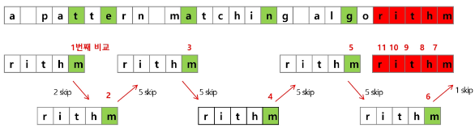

# String

[문자의 표현](#문자의-표현)   
[python에서의 문자열 처리](#python에서의-문자열-처리)   

[패턴 매칭](#패턴-매칭)   
[고지식한 패턴 검색 알고리즘](#고지식한-패턴-검색-알고리즘)   
[KMP 알고리즘](#kmp-알고리즘)   
[보이어-무어 알고리즘](#보이어---무어-알고리즘)   

[문자열]

---

## 문자의 표현
### 컴퓨터에서의 문자 표현
- 메모리는 숫자만을 저장할 수 있기 때문에 A라는 글자의 모양 그대로 비트맵으로 저장하는 방법을 사용하지 않는 한 각 문자에 대해서 대응되는 숫자를 정해 놓고 이것을 메모리에 저장하는 방법이 사용됨

- 영어가 대소문자 합쳐서 52자 이므로 6비트(64)면 모두 표현할 수 있다.

- 이를 코드체계라고 한다.

- 네트워크가 발전되지 전, 미국의 각 지역 별로 코드체계를 정해놓고 사용했지만 네트워크가 발전하면서 서로간에 정보를 주고 받을 때 문제 발생

- 혼동을 피하기 위한 표준안 : ASCII 코드

## Python에서의 문자열 처리
- char 타입 없음

- 텍스트 데이터의 취급 방법이 통일

- 문자열 기호

- `'`, `"`, `'''`, `"""`
  - + 연결 (Concatenation)
    - 문자열 + 문자열
    
    - 이어 붙여주는 역할
  
  - 반복
    - 문자열 * 수 : 수만큼 문자열이 반복

- 문자열은 시퀀스 자료형으로 분류

- 시퀀스 자료형에서 사용할 수 있는 인덱싱, 슬라이싱 연산들을 사용할 수 있음

- 문자열은 튜플과 같이 요소값을 변경할 수 없음(immutable)

- 문자열 클래스에서 제공되는 메소드
  - replace()
  
  - split()
  
  - isalpha()
  
  - find()
  
  - ...

- str을 list로 변환하여 저장하면 중간 글자를 바꿀 수 있다.

## 패턴 매칭
### 패턴매칭 종류
- 고지식한 패턴 검색 알고리즘

- 카프 - 라빈 알고리즘

- KMP 알고리즘

- 보이어 - 무어 알고리즘

## 고지식한 패턴 검색 알고리즘
- 문자열을 처음부터 끝까지 차례대로 순회하면서 패턴 내의 문자들을 일일이 비교하는 방식으로 동작

- 텍스트의 인덱스 i와 패턴의 인덱스 j를 이동시키면서 찾는다.
  - 1\) i = 0, j = 0
  
  - 2\) i = 1, j = 0
  
  - ...
  
  - n\) i = n-1, j= n-1

- 불일치하다면 i는 1로, j는 0으로 돌아가서 다시 순회
  - 1\) i = 0, j = 0 불일치
  
  - 2\) i = 1, j = 0
  
  - 3\) i = 2, j = 1
  
  - ...

- 반복해서 i 가 n-1까지

### 고지식한 패턴 검색 알고리즘 구현
```python
i = 0
j = 0
while i < N and j < M:
	if t[i] == t[j]  # 일치
		i += 1
		j += 1
	else:  # 불일치
		i = i - j +1
		j = 0
```

```python
i = 0
j = 0
while j < M and i < N:
	if t[i] != p[j]:
		i = i - j
		j = -1
	i += 1
	j += 1
if j == M:
	return i - M  # 검색 성공
else:
	return -1  # 검색 실패
```

## KMP 알고리즘
- 불일치가 발생한 텍스트 스트링의 앞 부분에 어떤 문자가 있는지를 미리 알고있으므로, 불일치가 발생한 앞 부분에 대하여 다시 비교하지 않고 매칭을 수행

- 패턴을 전처리하여 배열 next[M]을 구해서 잘못된 시작을 최소화함
  - next[M] : 불일치가 발생했을 경우 이동할 다음 위치

- 시간 복잡도
  - O(m+n)

### KMP 알고리즘 구현
- 텍스트가 'abcdabcdabcef...'이고 패턴이 'abcdabcef...'라면, 'abc'까지는 똑같으므로 패턴의 시작을 텍스트의 두 번째 'abc'부터 시작한다.

```python
def kmp(t, p):
    n = len(t)
    m = len(p)

    lps = [0] * (m+1)

    # preprocessing
    j = 0  # 일치한 개수 == 비교할 패턴 위치
    lps[0] = -1
    for i in range(1, m):
        lps[i] = j
        if p[i] == p[j]:
            j += 1
        else:
            j = 0
    lps[m] = j

    # search
    i = 0
    j = 0
    while i < n and j <= m:
        if j == -1 or t[i] == p[j]:
            i += 1
            j += 1
        else:
            j = lps[j]

        if j == m:
            print(i-m, end=' ')
            j = lps[j]
    print()
    pass
```

- 이 외에도 다른 구현 방식이 많으므로 검색하여 참고

## 보이어 - 무어 알고리즘
- 오른쪽에서 왼쪽으로 비교

- 대부분의 상용 소프트웨어에서 채택하고 있는 알고리즘

- 보이어 - 무어 알고리즘은 패턴에 오른쪽 끝에 있는 문자가 불일치하고 이 문자가 패턴 내에 존재하지 않는 경우, 이동 거리는 패턴의 길이만큼이 된다.

### 보이어 - 무어 알고리즘 과정



- 패턴 비교 중 같은 글자가 있다면 그 같은 글자를 기준으로 패턴을 배열

- 패턴 비교 중 같은 글자가 없다면 패턴 비교한 다음부터 다시 배치
  - 위 rithm 문자열의 skip 배열
  
    |m|h|t|i|r|다른 모든 문자|
    |:-:|:-:|:-:|:-:|:-:|:-:|
    |0|1|2|3|4|5|

## 문자열 매칭 알고리즘 비교
- 찾고자 하는 문자열 패턴의 길이 m, 총 문자열 길이 n

- 고지식한 패턴 검색 알고리즘 : 수행시간 O(mn)

- 카프 - 라빈 알고리즘 : 수행시간 θ(n)

- KMP 알고리즘 : 수행시간 θ(n)

- 보이어 - 무어 알고리즘
  - 앞의 두 매칭 알고리즘들의 공통점 텍스트 문자열의 문자를 적어도 한번씩 훑는다는 것이다. 따라서 최선의 경우에도 Ω(n)
  
  - 보이어 - 무어 알고리즘은 텍스트 문자를 다 보지 않아도 된다.
  
  - 발상의 전환 : 패턴의 오른쪽부터 비교한다.
  
  - 최악의 경우 수행시간 : θ(mn)
  
  - 입력에 따라 다르지만 일반적으로 θ(n)보다 시간이 덜 든다.