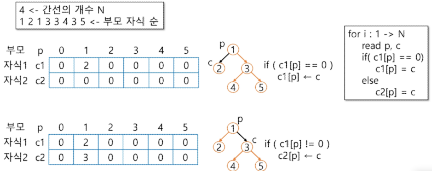

# Tree

[트리](#트리)   
[이진 트리](#이진-트리)    
[이진 트리 순회 Traversal](#이진트리-순회-traversal)    
[이진 트리 표현](#이진-트리-표현)   
[이진 탐색 트리](#이진-탐색-트리)   
[Heap 힙](#heap-힙)   

-----

## 트리

### 트리의 개념

- 비선형 구조
- 원소들 간에 1:n 관계를 가지는 자료구조
- 원소들 간에 계층 관계를 가지는 계층형 자료 구조
- 상위 원소에서 하위 원소로 내려가면서 확장되는 트리(나무)모양의 구조

### 트리의 정의

- 한 개 이상의 노드로 이루어진 유한 집합이며 다음 조건을 만족한다.
    - 노드 중 최상위 노드를 루트(root)라 한다.
    - 나머지 노드들은 n(n≥0)개의 분리 집합 T1, … , TN으로 분리될 수 있다.
- 이들 T1, … , TN은 각각 하나의 트리가 되며 (재귀적 정의) 루트의 부 트리(subtree)라 한다.
    
    
    

### 트리의 용어 정리

- 노드(node) - 트리의 원소
    - 트리 T의 노드 - A, B, C, D, E, F, G, H, I, J, K
- 간선(edge) - 노드를 연결하는 선. 부모 노드와 자식 노드를 연결
- 루트 노드(root node) - 트리의 시작 노드
    - 트리 T의 루트 노드 A
- 형제 노드(sibling node) - 같은 부모 노드의 자식 노드들
    - B, C, D는 형제 노드
- 조상 노드 - 간선을 따라 루트 노드까지 이르는 경로에 있는 모든 노드들
    - K의 조상 노드 : F, B, A
- 서브 트리(subtree) - 부모 노드와 연결된 간선을 끊었을 때 생성되는 트리
- 자손 노드 - 서브 트리에 있는 하위 레벨의 노드들
    - B의 자손 노드 - E, F, K
- 차수(degree)
    - 노드의 차수 : 노드에 연결된 자식 노드의 수
        - B의 차수 = 2, C의 차수 = 1
    - 트리의 차수 : 트리에 있는 노드의 차수 중에서 가장 큰 값
        - 트리 T의 차수 = 3
    - 단말 노드(리프 노드) : 차수가 0인 노드. 자식 노드가 없는 노드
- 높이
    - 노드의 높이 : 루트에서 노드에 이르는 간선의 수. 노드의 레벨
        - B의 높이 = 1, F의 높이 = 2
    - 트리의 높이 : 트리에 있는 노드의 높이 중에서 가장 큰 값. 최대 레벨
        - 트리 T의 높이 = 3
    - 형제 노드끼리는 연결을 할 수 없다.
        - 무조건 아래 단계로만 연결되어야 한다.
        - 따라서 트리는 사이클이 없다.

## 이진 트리

### 이진 트리

- 모든 노드들이 2개의 서브트리를 갖는 특별한 형태의 트리
- 각 노드가 자식 노드를 최대한 2개 까지만 가질 수 있는 트리
    - 왼쪽 자식 노드(left child node)
    - 오른쪽 자식 노드(right child node)

### 이진 트리의 특성

- 레벨 i에서의 노드의 최대 개수는 2**i개
- 높이가 h인 이진 트리가 가질 수 있는 노드의 최소 개수는 (h+1)개가 되며, 
최대 개수는 2**(h+1) -1개가 된다.

### 이진 트리의 종류

- 포화 이진 트리 (Full Binary Tree)
    - 모든 레벨에 노드가 포화상태로 차 있는 이진 트리
    - 높이가 h일 때, 최대의 노드 개수인 2**(h+1)-1의 노드를 가진 이진 트리
        - 높이 3일 때 2**4-1 = 15개의 노드
    - 루트를 1번으로 하여 2*(h+1)-1까지 정해진 위치에 대한 노드 번호를 가짐
    
    
    
- 완전 이진 트리(Complete Binary Tree)
    - 높이가 h이고 노드 수가 n개일 때(단, 2*h ≤ n ≤ 2**(h+1)-1 ), 포화 이진 트리의 노드 번호 1번부터 n번까지 **빈 자리가 없는** 이진 트리
    - 예시) 노드가 10개인 완전 이진 트리
        
    
        
- 편향 이진 트리(Skewed Binary Tree)
    - 높이 h에 대한 최소 개수의 노드를 가지면서 한 쪽 방향의 자식 노드만을 가진 이진 트리
        - 왼쪽 편향 이진 트리
        - 오른쪽 편향 이진 트리
        
    
        

## 이진트리 순회 Traversal

### 순회 Traversal

- 트리의 각 노드를 중복되지 않게 전부 방문(visit)하는 것
- 트리의 노드들을 체계적으로 방문하는 것
- 트리는 비 선형 구조이기 때문에 선형구조에서와 같이 선후 연결 관계를 알 수 없다.

### 3가지의 기본적인 순회 방법

- 전위순회 Preorder Traversal : VLR
    - 부모노드 방문 후, 자식노드를 좌, 우 순서로 방문한다.
- 중위순회 Inorder Traversal : LVR
    - 왼쪽 자식노드, 부모노드, 오른쪽 자식노드 순으로 방문한다.
- 후위순회 Postorder Traversal : LRV
    - 자식 노드를 좌우 순서로 방문한 후, 부모 노드로 방문한다.

### 전위 순회 Preorder Traversal

- 수행 방법
    1. 현재 노드 n을 방문하여 처리한다 → V
    2. 현재 노드 n의 왼쪽 서브트리로 이동하다 → L
    3. 현재 노드 n의 오른쪽 서브트리로 이동한다 → R
- 전위 순회 알고리즘
    
    ```python
    def preorder_traverse(T):  # 전위순회
    	if T:                    # T is not None
    		visit(T)               # print(T.item)
    		preorder_traverse(T.left)
    		preorder_traverse(T.right)
    ```
    
- 전위순회 예시
    
    
    

### 중위 순회 Inorder Traversal

- 수행 방법
    1. 현재 노드 n의 왼쪽 서브트리로 이동한다 → L
    2. 현재 노드 n을 방문하여 처리한다 → V
    3. 현재 노드 n의 오른쪽 서브트리로 이동한다 → R
- 중위 순회 알고리즘
    
    ```python
    def inorder_traverse(T):       # 중위 순회
    	if T:                        # T is not None
    		inorder_traverse(T.left)
    		visit(T)                   # print(T.item)
    		inorder_traverse(T.right)
    ```
    
- 중위 순회 예시
    
    
    

### 후위 순회 Postorder Traversal

- 수행 방법
    1. 현재 노드 n의 왼쪽 서브트리로 이동한다 → L
    2. 현재 노드 n의 오른쪽 서브트리로 이동한다 → R
    3. 현재 노드 n을 방문하여 처리한다 → V
- 후위 순회 알고리즘
    
    ```python
    def postorder_traverse(T):       # 후위 순회
    	if T:                          # T is not None
    		postorder_traverse(T.left)
    		postorder_traverse(T.right)
    		visit(T)                     # print(T.item)
    ```
    
- 후위 순회 예시
    
    
    

## 이진 트리 표현

### 배열을 이용한 이진 트리 표현

- 이진 트리에 각 노드 번호를 다음과 같이 부여
- 루트의 번호를 1로 함
- 레벨 n에 있는 노드에 대하여 왼쪽부터 오른쪽으로 2**n부터 2**(n+1)-1까지 번호를 차례로 부여
- 낭비가 많아서 거의 쓰이지 않는다.
- 노드 번호의 성질
    - 노드 번호가 i인 노드의 부모 노드 번호 =
    - 노드 번호가 i인 노드의 왼쪽 자식 노드 번호 = 2*i
    - 노드 번호가 i인 노드의 오른쪽 자식 노드 번호 = 2*i +1
    - 레벨 n의 노드 번호 시작 번호 = 2**n
- 노드 번호를 배열의 인덱스로 사용
- 높이가 h인 이진 트리를 위한 배열의 크기
    - 레벨 i의 최대 노드 수 = 2**i
    - 따라서 1 + 2 + 4 + 8 + … + 2**i = 2**(h+1)-1
- 예시
    
    
    
    
    

### 이진 트리의 저장

- 부모 번호를 인덱스로 자식 번호를 저장
    - 주로 많이 사용
    
    
    
- 자식 번호를 인덱스로 부모 번호를 저장
    - root를 모르기 때문에 부모 번호를 저장
    
    
    
- 루트 찾기, 조상 찾기
    
    
    
- 배열을 이용한 이진 트리의 표현의 단점
    - 편향 이진 트리의 경우에 사용하지 않는 배열 원소에 대한 메모리 공간 낭비 발생
    - 트리의 중간에 새로운 노드를 삽입하거나 기존의 노드를 삭제할 경우 배열의 크기 변경이 어려워 비효율적

### 연결 리스트를 이용한 이진 트리의 표현

- 배열을 이용한 이진 트리 표현의 단점을 보완하기 위해 연결 리스트를 이용하여 트리를 표현할 수 있다.
- 연결 자료 구조를 이용한 이진트리의 표현
    - 이진 트리의 모든 노드는 최대 2개의 자식 노드를 가지므로 일정한 구조의 단순 연결 리스트 노드를 사용하여 구현

### 수식 트리

- 수식을 표현하는 이진 트리
- 수식 이진 트리 (Expression Binary Tree)라고 부르기도 함
- 연산자는 루트 노드이거나 가지 노드
- 피연산자는 모두 잎 노드

## 이진 탐색 트리

### BST Binary Search Tree 자료구조

- Data들을 빠르게 검색할 수 있도록 **체계적으로 저장**을 해 두고, 최대 **O(log n)의 빠른 속도로 값을 검색**할 수 있는 자료구조

- 빠르게 검색될 수 있도록, 특정 규칙을 갖는 이진트리 형태로 값을 저장해둔다.

- BST는 리스트보다 더 빠른 삽입 / 삭제 / 탐색이 가능하다.

- 리스트 성능
    - 삽입 : O(n), 단 맨 끝 삽입은 O(1)
    
    - 삭제 : O(n), 단 맨 끝 삭제는 O(1)
    
    - 탐색 : O(n)

- BST 성능
    - 삽입 : 평균 O(log N)
    
    - 삭제 : 평균 O(log N)
 
    - 탐색 : 평균 O(log N)

### BST 삽입 동작 원리

- 비교할 노드 값보다 target 값이 더 큰 경우 우측 자식 노드로 배정되고, 그렇지 않으면 왼쪽 자식 노드로 배정된다.

- BST는 이진 트리로 저장된다.

- Insert(3)
    - 처음 등장하는 값은 root에 저장된다.

- Insert(5)
    - 5는 3(root)보다 크므로 우측 자식 노드로 배정

- Insert(1)
    - 1은 3(root)보다 작으므로 좌측 자식 노드로 배정

- Insert(2)
    - root부터 시작하여, 자기 자리를 찾아 배치된다.
    
    - 2는 3(root)보다는 작고, 1보다는 크다.
    
    - 1의 우측 자식 노드로 배정

- Insert(7)
    - root부터 시작하여, 자기 자리를 찾아 배치된다.
    
    - 7은 3(root)보다 크고, 5보다 크다.
    
    - 5의 우측 자식 노드로 배정
- Insert(4)
    - root부터 시작하여, 자기 자리를 찾아 배치된다.
    
    - 4은 3(root)보다 크고, 5보다 작다.
    
    - 5의 좌측 자식 노드로 배정

- Insert(-5)
    - root부터 시작하여, 자기 자리를 찾아 배치된다.
    
    - -5은 3(root)보다 크고, 1보다 작다.
    
    - 1의 좌측 자식 노드로 배정

- 결과
    
    
    

### BST 삽입 시간복잡도

- O(log N)

- 삽입을 위해, root부터 바닥 노드까지 탐색을 하며 자기 위치를 찾는다.

- 트리의 높이(h)만큼 탐색 시간이 걸린다.

- 2**h - 1 = N  → 2** h = N (-1은 2**h에 비해 작으므로 생략) → h = log_2

- 완벽하게 균형 잡힌 이진트리인 경우, 삽입 시간복잡도는 O(logN)이다.

### BST 탐색 방법

- 탐색 연산

- root 노드부터 시작하여 찾고자하는 수가 노드 값보다 크면 우측, 작으면 좌측으로 이동하면서 검색

- 완벽하게 균형 잡힌 이진트리인 경우, 탐색 시간복잡도는 O(logN)이다.
    - 높이만큼 시간이 걸리기 때문이다.

### BST 순회 동작 원리

- BST에서 DFS 중위 순회를 하게 되면 Key 값이 작은 순서대로 탐색이 가능

### 이진 탐색 트리의 성능

- 탐색(Searching), 삽입(Insertion), 삭제(Deletion) 시간은 트리의 높이만큼 시간이 걸린다.
    - O(h)
    
    - h는 BST의 깊이(height)

- 평균의 경우
    - 이진 트리가 균형적으로 생성되어 있는 경우
    
    - O(log n)

- 최악의 경우
    - 한 쪽으로 치우친 경사 이진트리의 경우
    
    - O(n)
    
    - 순차탐색과 시간복잡도가 같다.

### 이진 탐색 트리 삭제 연산

- 자식 노드가 없는 노드를 삭제하는 경우
    - 단순 삭제

- 자식 노드가 2개 있는 노드를 삭제하는 경우
    - 좌측 서브트리의 가장 큰 값 혹은 우측 서브트리의 가장 작은 값을 삭제한 자리에 삽입

- 자식 노드가 1개 있는 노드를 삭제하는 경우
    - 자식 노드를 삭제한 자리에 삽입

### 이진 탐색 트리

- 탐색 작업을 효율적으로 하기 위한 자료 구조

- 모든 원소는 서로 다른 유일한 키를 갖는다.
    - 일반적으로는 다른 키를 가지고 있다.

- key(왼쪽 서브트리) < key(루트 노드) < key(오른쪽 서브트리)

- 왼쪽 서브트리와 오른쪽 서브트리도 이진 탐색 트리다.

- 중위 순회하면 오름차순으로 정렬된 값을 얻을 수 있다.

## Heap 힙

### 힙 Heap

- 완전 이진 트리에 있는 노드 중에서 키 값이 가장 큰 노드나 키 값이 가장 작은 노드를 찾기 위해서 만든 자료 구조

- 최대 힙 max heap
    - 키 값이 가장 큰 노드를 찾기 위한 **완전 이진 트리**
    
    - 부모 노드의 키 값 > 자식 노드의 키 값
    
    - 루트 노드 : 키 값이 가장 큰 노드

- 최소 힙 min heap
    - 키 값이 가장 작은 노드를 찾기 위한 완전 이진 트리
    
    - 부모 노드의 키 값 < 자식 노드의 키 값
    
    - 루트 노드 : 키 값이 가장 작은 노드

### 힙 삽입 연산

- 삽입할 자리 확장

- 확장한 자리에 삽입할 원소 저장

- max heap일 경우
    - 삽입 노드의 키 값이 부모 노드의 키 값보다 클 경우 비교하여 자리 바꾸기
    
    - 부모 노드의 키 값보다 작거나, 비교할 부모 노드가 없으면 자리 확정

### 힙 삭제 연산

- 힙에서는 루트 노드의 원소만을 삭제할 수 있다.

- 힙의 종류에 따라 최대값 또는 최소값을 구할 수 있다.

- 루트 노드의 원소를 삭제하여 반환한다.

- 마지막 노드를 삭제하고 반환하여 루트 노드로 삽입

- max heap일 경우
    - 삽입 노드와 자식 노드를 비교하여 자리 바꾸기
    
    - 자리를 바꿀 때에는 자식 노드 중 더 큰 값과 바꾼다.

- min heap일 경우
    - 삽입 노드와 자식 노드를 비교하여 자리 바꾸기
    
    - 자리를 바꿀 때에는 자식 노드 중 더 작은 값과 바꾼다

- 대소 비교하여 조건이 맞거나, 비교할 자식 노드가 없으면 자리 확정

### 힙을 이용한 우선순위 큐

- 완전 이진 트리로 구현된 자료 구조로서, 키 값이 가장 큰 노드나 가장 작은 노드를 찾기에 적합한 자료 구조

- 아래의 예는 최소 힙(min heap)으로서, 가장 작은 키 값을 가진 노드가 항상 루트에 위치힌다.

- 힙의 키를 우선순위로 활용하여 우선순위 큐를 구현할 수 있다.