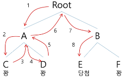

# 백트래킹 & 그래프(트리)

[백트래킹 응용](#백트래킹-응용)   
[트리 개요](#트리-개요)   
[이진 트리](#이진-트리)   
[이진 탐색 트리(BST)](#이진-탐색-트리-bst)   
[힙 트리(Heap)](#힙-트리-heap)   

---

## 백트래킹 응용

### 백트래킹 Backtracking 개념

- 여러 가지 선택지 (옵션) 들이 존재하는 상황에서 한 가지를 선택한다.

- 선택이 이루어지면 새로운 선택지들의 집합이 생성된다.

- 이런 선택을 반복하면서 최종 상태 도달한다.
    - 올바른 선택을 계속하면 목표 상태 Goal State에 도달한다.
    
    - 트리 형태일 뿐이지, 자료 구조가 트리는 아니다.

- 루트 노드에서 리프(leaf) 노드까지의 경로는 해답 후보(Candidate Solution)가 되는데, 깊이 우선 검색을 하여 그 해답후보 중에서 해답을 찾을 수 없다.

- 그러나 이 방법을 사용하면 해답이 될 가능성이 전혀 없는 노드의 후손 노드(descendant)들도 모두 검색해야하므로 비효율적이다.

### 당첨 리프 노드 찾기

- 루트에서 갈 수 있는 노드를 선택한다.

- 꽝 노드까지 도달하면 최근의 선택으로 되돌아와서 다시 시작한다.

- 더 이상의 선택지가 없다면 이전의 선택지로 돌아가서 다른 선택을 한다.

- 루트까지 돌아갔을 경우 더 이상 선택지가 없다면 찾는 답이 없다.
    
    
    

### 백트래킹과 깊이 우선 탐색과의 차이

- 어떤 노드에서 출발하는 경로가 해결책으로 이어질 것 같지 않으면 더 이상 그 경로를 따라가지 않음으로써 시도 횟수를 줄임 ( **Prunning** 가지치기)

- 깊이 우선 탐색이 모든 경로를 추적하는데 비해 백트래킹은 불필요한 경로를 조기에 차단

- 깊이 우선 탐색을 가하기에는 경우의 수가 너무나 많음. 즉 **N!** 가지 경우의 수를 가진 문제에 대해 깊이 우선 탐색을 가하면 당연히 처리 불가능한 문제

- 백트래킹 알고리즘을 적용하면 일반적으로 경우의 수가 줄어들지만 이 역시 최악의 경우에는 여전히 지수함수 시간 Exponential Time을 요하므로 처리 불가능

### 백트래킹 기법

- 모든 후보 검사 X

- 어떤 노드의 유망성을 점검한 후에 유망(promising)하지 않다고 결정되면 그 노드의 부모로 되돌아가 (backtracking) 다음 자식 노드로 감

- 어떤 노드를 방문하였을 때 그 노드를 포함한 경로가 해답이 될 수 없으면 그 노드는 유망하지 않다고 하며, 반대로 해답의 가능성이 있으면 유망하다고 판단

- 가지치기 (Prunning) : 유망하지 않는 노드가 포함되는 경로는 더 이상 고려하지 않는다.

### 백트래킹 알고리즘

- 진행 순서
    1. 상태 공간 트리의 깊이 우선 탐색을 실시한다.
    
    2. 각 노드가 유망한지를 점검한다.
    
    3. 만일 그 노드가 유망하지 않으면, 그 노드의 부모 노드로 돌아가서 검색을 계속한다.

- 일반 백트래킹 알고리즘
    
    ```python
    checknode (node v)
    	if promising(v):
    		if solution at V:
    			print(solution)
    		else:
    			for u in V:
    				checknode (u)
    ```
    

## 트리 개요

### 트리

- 트리는 싸이클이 없는 무향(방향이 없는, 양방향) 연결 그래프이다.

- 트리는 그래프의 확장 단계

- 두 노드(or 정점) 사이에는 유일한 경로가 존재 (사이클이 없다)

- 각 노드는 최대 하나의 부모 노드가 존재할 수 있음

- 각 노드는 자식 노드가 없거나 하나 이상이 존재할 수 있음

- 한 개 이상의 노드로 이루어진 유한 집합

- 노드 중 부모가 없는 노드를 루트(root)라 한다.

- 나머지 노드들은 n (n ≥ 0)개의 분리 집합으로 분리될 수 있다.

- 분리 집합들은 각각 하나의 트리가 되며 (재귀적 정의) 루트의 서브 트리 (subtree)라 한다.

- 자식이 없는 노드를 리프 노드라고 한다.

### 비선형 구조

- 원소들 간에 1:n 관계를 가지는 자료 구조

- 원소들 간에 계층 관계를 가지는 계층형 자료 구조

### 트리 용어

- 노드 (node) : 트리의 원소이고, 정점(vertex)라고도 한다.

- 간선(edge) : 노드를 연결하는 선
    - 부모 노드와 자식 노드를 연결

- 루트 노드 (root node) : 트리의 시작 노드

- 형제 노드 (sibling node) : 같은 부모 노드의 자식 노드들

- 조상 노드 : 간선에 따라 루트 노드까지 이르는 경로에 있는 모든 노드들

- 서브 트리 (subtree) : 부모 노드와 연결된 간선을 끊었을 때 생성되는 트리

- 자손 노드 : 서브 트리에 있는 하위 레벨의 노드들

- 단말 노드, 리프 노드 (leaf node) : 자식이 없는 노드

- 치수 (degree)
    - 노드의 차수 : 노드에 연결된 자식 노드의 수
    
    - 트리의 차수 : 트리에 있는 노드의 차수 중에서 가장 큰 값\

- 높이
    - 노드의 높이 : 루트에서 노드에 이르는 간선의 수. 노드의 레벨
    
    - 트리의 높이 : 트리에 있는 노드의 높이 중에서 가장 큰 값. 최대 레벨

## 이진 트리

### 이진 트리 Binary Tree

- 모든 노드들이 최대 2개의 서브 트리를 갖는 특별한 형태의 트리

- 각 노드가 자식 노드를 최대한 2개까지만 가질 수 있는 트리
    - 왼쪽 자식 노드 Left Child Node
    
    - 오른쪽 자식 노드 Right Child Node

### 이진 트리의 특징

- 레벨 i에서의 노드의 최대 개수는 2 ** i 개

- 높이가 h인 이진 트리가 가질 수  있는 노드의 최소 개수는 h+1개, 최대 개수는 2**(h+1) -1개

### 이진 트리의 종류

- 포화 이진 트리 Full Binary Tree
    - 모든 레벨에 노드가 포화상태로 채워져 있는 이진 트리
    
    - 높이가 h일때, 최대의 노드 개수인 2**(h+1)-1의 노드를 가진 이진트리
    
    - 루트를 1번으로 하여 2**(h+1)-1까지 정해진 위치에 대한 노드 번호를 가짐

- 완전 이진 트리 Complete Binary Tree
    - 높이가 h이고, 노드 수가 n개 일 때 (단, 2**h ≤ n ≤ 2**(h+1)-1)
    
    - 포화 이진 트리의 노드 번호 1번부터 n번까지 빈 자리가 없는 이진 트리

- 편향 이진 트리 Skewed Binary Tree
    - 높이 h에 대한 최소 개수의 노드를 가지면서 한 쪽 방향의 자식 노드만을 가진 이진트리
    
    - 왼쪽 편향 이진 트리
    
    - 오른쪽 편향 이진 트리

### 순회 Traversal

- 트리의 각 노드를 중복되지 않게 전부 방문(visit)하는 것

- 트리는 비선형 구조이기 때문에 선형 구조에서와 같이 선후 연결 관계를 알 수 없다.

- 3가지의 기본적인 순회 방법
    - 전위 순회 Preorder Traversal : VLR
        - 자손 노드보다 현재 노드를 먼저 방문
    
    - 중위 순회 Inorder Traversal : LVR
        - 왼쪽 자손노드, 현재 노드, 오른쪽 자손 노드 순으로 방문
    
    - 후위 순회 Postorder Traversal : LRV
        - 현재 노드보다 자손 노드를 먼저 방문한다.

### 트리의 표현 - 배열

- 배열을 이용한 이진 트리 표현
    - 루트의 번호를 1로 부여하고, 레벨 n에 있는 노드에 대하여 왼쪽부터 오른쪽으로 2**n부터 2**(n+1) -1까지 번호를 차례로 부여
    
    - 노드 번호를 배열의 인덱스로 사용

- 배열을 이용한 이진 트리의 표현 단점
    - 삭제가 포함되어 있다면 리스트 절대 사용 X
    
    - 편향 이진 트리의 경우에 사용하지 않는 배열 원소에 대한 메모리 공간 낭비 발생
    
    - 트리의 중간에 새로운 노드를 삽입하거나 기존의 노드를 삭제할 경우 배열의 크기 변경이 어려워 비효율적

### 트리의 표현 - 연결 리스트

- 배열을 이용한 이진 트리의 표현의 단점을 보완하기 위해 연결 리스트를 이용하여 트리를 표현할 수 있다.

- 연결 리스트를 이용한 이진 트리의 표현
    - 이진 트리의 모든 노드는 최대 2개의 자식 노드를 가지므로 일정한 구조의 단순 연결 리스트 노드를 사용하여 구현

## 이진 탐색 트리 (BST)

### 이진 탐색 트리

- 탐색 작업을 효율적으로 하기 위한 자료 구조

- 모든 원소는 서로 다른 유일한 키를 갖는다.

- key(왼쪽 서브 트리) < key(루트 노드) < key(오른쪽 서브 트리)

- 왼쪽 서브 트리와 오른쪽 서브 트리도 이진 탐색 트리다.

- 중위 순회하면 오름차순으로 정렬된 값을 얻을 수 있다.

- 작으면 왼쪽, 크면 오른쪽

- 탐색 속도 : log N

### 이진 탐색 트리 탐색 연산

- 루트에서 탐색 시작

- 탐색할 키 값 x를 루드 노드의 키 값 k와 비교
    - x == k : 탐색 성공
    
    - x < k : 루트 노드의 왼쪽 서브 트리에 대해서 탐색 연산 수행
    
    - x > k : 루트 노드의 오른쪽 서브 트리에 대해서 탐색 연산 수행

- 서브 트리에 대해서 순환전으로 탐색 연산 반복

- 탐색 수행할 서브 트릭가 없으면 탐색 실패

### 이진 탐색 트리 삽입 연산

- 먼저 탐색 연산 수행
    - 삽입할 원소와 같은 원소가 트리에 있으면 삽입할 수 없으므로, 같은 원소가 트리에 있는지 탐색하여 확인
    
    - 탐색에서 탐색 실패가 결정되는 위치가 삽입 위치가 된다.

- 탐색 실패한 위치에 원소를 삽입

### 이진 탐색 트리 - 성능

- 탐색 Searching, 삽입 Insertion, 삭제 Deletion 시간은 트리의 높이만큼 시간이 걸린다.
    - O(h), h : BST의 깊이 (height)

- 평균의 경우
    - 이진 트리가 균형적으로 생성되어 있는 경우
    
    - O(log n)

- 최악의 경우
    - 한 쪽으로 치우친 편향 이진 트리의 경우
    
    - O(n)
    
    - 순차 탐색과 시간복잡도가 같다.

## 힙 트리 (Heap)

### 힙 Heap

- 완전 이진 트리 형태로 저장

- 완전 이진 트리에 있는 노드 중에서 키 값이 가장 큰 노드나 키 값이 가장 작은 노드를 찾기 위해서 만든 자료 구조

- 형제 노드끼리는 보장 X

- 디버깅 : index로 부모 - 자식을 추적해야 한다.

- 최대 힙 Max Heap
    - 키 값이 가장 큰 노드를 찾기 위한 **완전 이진 트리**
    
    - 부모 노드의 키 값 > 자식 노드의 키 값
    
    - 루트 노드 : 키 값이 가장 큰 노드

- 최소 힙 Min Heap
    - 키 값이 가장 작은 노드를 찾기 위한 **완전 이진 트리**
    
    - 부모 노드의 키 값 < 자식 노드의 키 값
    
    - 루트 노드 : 키 값이 가장 작은 노드

### 힙 연산 - 삽입

- 삽입할 자리 확장

- 확장한 자리에 삽입할 원소 저장

- 탐색 후 자리 교환 반복

- 비교할 부모 노드가 없거나 자기 자리를 찾으면 자리 확정

- 일단 넣고 자기 자리를 찾아가자

### 힙 연산 - 삭제

- 힙에서는 루트 노드의 원소만을 삭제 가능

- 루트 노드의 원소를 삭제하여 반환

- 힙의 종류에 따라 최대값 또는 최소값을 구할 수 있다.
    - 우선순위 큐와 비교

### 힙의 활용

- 힙을 활용하는 대표적인 예시는 **특별한 큐의 구현**과 **정렬**

- 우선순위 큐를 구현하는 가장 효율적인 방법이 힙을 이용하는 것
    - 노드 하나의 추가 / 삭제가 시간 복잡도가 O(log N)이고 최대값 / 최소값을 O(1)에 구할 수 있다.
    
    - 완전 정렬보다 관리 비용이 적다.

- 배열을 통해 트리 형태를 쉽게 구현할 수 있다.
    - 부모나 자식 노드를 O(1) 연산으로 쉽게 찾을 수 있다.
    
    - n 위치에 있는 노드의 자식은 2*n 과 2*n+1에 위치한다.
    
    - 완전 이진 트리의 특성에 의해 추가 / 삭제의 위치는 자료의 시작과 끝 인덱스로 쉽게 판단

- 힙 정렬은 힙 자료구조를 이용해서 이진 탐색과 유사한 방법으로 수행된다.

- 정렬을 위한 2단계
    - 하나의 값을 힘에 삽입한다. (반복) 
    
    - 힙에서 순차적 (오름차순)으로 값을 하나씩 제거한다.

- 힙 정렬의 시간 복잡도
    - N개의 노드 삽입 연산 + N개의 노드 삭제 연산
    
    - 삽입과 삭제 연산은 각각 O(log N) 이다.
    
    - 따라서, 전체 정렬은 O(N log N)이다.

- 힙 정렬은 배열에 저장된 자료를 정렬하기에 유용하다.