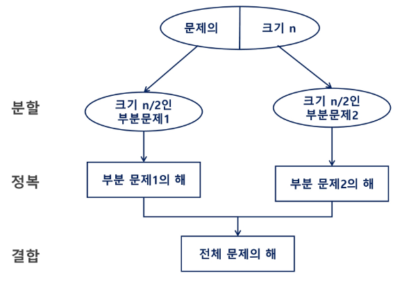
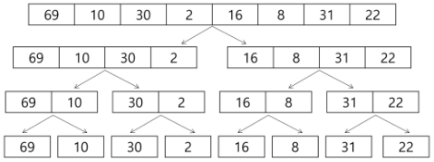
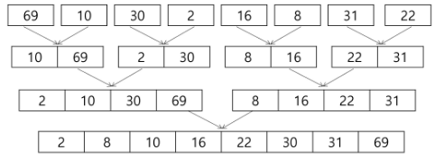
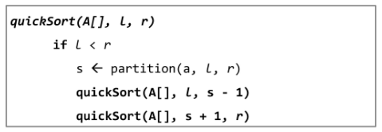
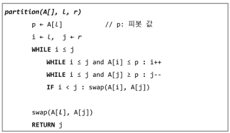
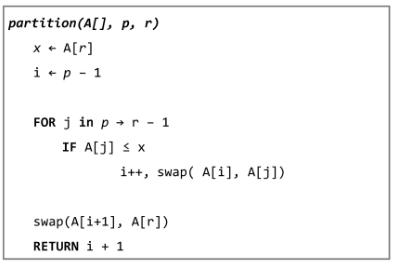
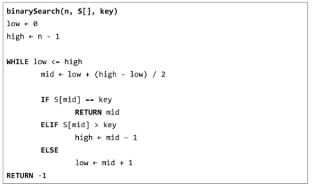
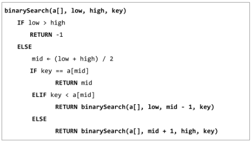

# 분할 정복

[분할 정복 Divide and Conquer](#분할-정복-divide-and-conquer)   
[병합 정렬](#병합-정렬)   
[퀵 정렬](#퀵-정렬)   
[이진 검색](#이진-검색)   

---

## 분할 정복 Divide and Conquer

### 설계 전략

- 분할 Divide : 해결할 문제를 여러 개의 작은 부분으로 나눈다.

- 정복 Conquer : 나눈 작은 문제를 각각 해결한다.

- 통합 Combine : (필요하다면) 해결된 해답을 모은다.

### Top-Down Approach 예시

- 더 이상 분할할 수 없을 때까지

    

### 분할 정복 기법 예시 - 거듭 제곱

- 반복 Iterative 알고리즘 : O(n)

- 분할 정복 기반의 알고리즘 : O( log_2 n )

## 병합 정렬

### 병합 정렬 Merge Sort

- 여러 개의 정렬된 자료의 집합을 병합하여 한 개의 정렬된 집합으로 만드는 방식

- 일반적으로 속도는 sort가 더 빠르다.

- 분할 정복 알고리즘 활용
    - 자료를 최소 단위의 문제까지 나눈 후에 차례대로 정렬하여 최종 결과를 얻어냄.
    
    - Top - Down 방식

- 시간 복잡도
    - O(n log n)

### 병합 정렬 과정

- {69, 10, 30, 2, 16, 8, 31, 22}를 병합 정렬하는 과정

- 분할 단계 : 전체 자료 집합에 대하여, **최소 크기의 부분집합이 될 때까지** 분할 작업을 계속한다.
    
    
    
- 병합 단계 : 2개의 부분 집합을 정렬하면서 하나의 집합으로 병함

- 8개의 부분집합이 1개로 병합될 때까지 반복함
    
    
    
- 알고리즘 : 분할 과정
    
    ```python
    def merge_sort(m):
        # 리스트의 길이가 1이면 이미 정렬된 상태이므로 그대로 반환
        if len(m) == 1:
            return m
    
        # 리스트를 절반으로 나누기 위해 중간 인덱스를 계산
        mid = len(m) // 2
        left = m[:mid]  # 리스트의 앞쪽 절반
        right = m[mid:]  # 리스트의 뒤쪽 절반
    
        # 재귀적으로 왼쪽 부분과 오른쪽 부분을 정렬
        left = merge_sort(left)
        right = merge_sort(right)
    
        # 두 개의 정렬된 리스트를 병합하여 반환
        return merge(left, right)
    
    def merge(left, right):
        # 두 리스트를 병합할 결과 리스트를 초기화
        result = [0] * (len(left) + len(right))
        l = r = 0  # 왼쪽 리스트와 오른쪽 리스트의 인덱스
    
        # 두 리스트를 순차적으로 비교하여 작은 값을 결과 리스트에 추가
        while l < len(left) and r < len(right):
            if left[l] < right[r]:
                result[l + r] = left[l]
                l += 1
            else:
                result[l + r] = right[r]
                r += 1
    
        # 왼쪽 리스트에 남은 요소들을 결과 리스트에 추가
        while l < len(left):
            result[l + r] = left[l]
            l += 1
    
        # 오른쪽 리스트에 남은 요소들을 결과 리스트에 추가
        while r < len(right):
            result[l + r] = right[r]
            r += 1
    
        # 병합된 결과 리스트를 반환
        return result
    
    arr = [69, 10, 30, 2, 16, 8, 31, 22]
    arr = merge_sort(arr)
    print(arr)
    ```
    

## 퀵 정렬

### 퀵 정렬

- 주어진 배열을 두 개로 분할하고, 각각을 정렬한다.

- 퀵 정렬과 병합 정렬의 차이점
    - 병합 정렬은 그냥 두 부분으로 나누는 반면에, 퀵 정렬은 분할할 때, **기준 아이템(pivot item) 중심으로 분할**한다.
        - 기준보다 작은 것은 왼편, 큰 것은 오른편에 위치시킨다.
    
    - 각 부분 정렬이 끝난 후, 병합 정렬은 “병합”이란 후처리 작업이 필요하나, 퀵 정렬은 필요로 하지 않는다.

- Quick Sort는 **Partitioning** 이라는 과정을 반복하면서, 평균 시간 복잡도 O(n log n) 속도라는 빠른 속도로 정렬이 되는 Sort이다.

- 평균적으로 매우 빠르다.

- 데이터가 크면 클수록 많이 사용된다.

- 평균적으로 O ( n log n)

- 최악의 경우가 O(n**2) - 역순정렬된 데이터
 

### 퀵 정렬 과정

1. 작업 영역을 정한다.

2. 작업 영역 중 가장 왼쪽에 있는 수를 Pivot 이라고 하자.
    - Pivot을 **기준**으로 해석한다.
    
    - Pivot은 중간값, 우측 끝 값으로 설정해도 상관없지만, 우리는 왼쪽 끝 값을 기준으로 한다.

3. Pivot을 기준으로 왼쪽에는 Pivot보다 작은 수를 배치한다. (정렬 안됨)

4. 오른쪽에는 Pivot보다 큰 수를 배치시킨다. (정렬 안됨)

- 파티셔닝이 끝나고 Pivot의 위치는 확정(Fix)된다.

- 정렬이 다 되었을 때에도 Pivot의 위치는 지금 위치 그대로 배정된다.

### 퀵 정렬 알고리즘

- 알고리즘
    
    
    
- Hoare-Partition 알고리즘
    
    
    
- Lomuto Partition 알고리즘
    
    
    

## 이진 검색

### 이진 검색

- 자료의 가운데에 있는 항목의 키 값과 비교하여 다음 검색의 위치를 결정하고 검색을 계속 진행하는 방법

- 목적 키를 찾을 때까지 이진 검색을 순환적으로 반복 수행함으로써 검색 범위를 반으로 줄여가면서 보다 빠르게 검색을 수행함

- **이진 검색을 하기 위해서는 자료가 정렬된 상태여야 한다.**

### 이진 검색 과정

1. 자료의 중앙에 있는 원소를 고른다.

2. 중앙 원소의 값과 찾고자 하는 목표 값을 비교한다.

3. 목표 값이 중앙 원소의 값보다 작으면 자료의 왼쪽 반에 대해서 새로 검색을 수행하고, 크다면 자료의 오른쪽 반에 대해서 새로 검색을 수행한다.

4. 찾고자 하는 값을 찾을 때까지 위 과정을 반복한다.

### 이진 검색 알고리즘

- 반복 구조
    
    
    
- 재귀 구조
    
    
    

### 분할 정복 알고리즘 정리

- 병합 정렬
    - 외부 정렬 External Sort의 기본이 되는 정렬 알고리즘
    
    - 멀티코어 Multi-Core CPU나 다수의 프로세서에서 정렬 알고리즘을 병렬화하기 위해 병합 정렬된 알고리즘이 활용

- 퀵 정렬
    - 매우 큰 입력 데이터에 대해서 좋은 성능을 보이는 알고리즘

- 이진 검색
    - 정렬된 데이터를 기준으로 특정 값이나 범위를 검색하는 데 사용
    
    - Lower Bound, Upper Bound (Parametric Search)
        - 정렬된 배열에서 특정 값 이상(이하)가 처음으로 나타나는 위치를 찾는 알고리즘
        
        - 특정 데이터의 범위 검색 등에서 활용