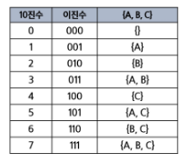

# 완전 검색

[반복 Iteration과 재귀 Recursion](#반복-iteration과-재귀-recursion)   
[순열](#순열)   
[완전 탐색](#완전-탐색)   
[부분 집합](#부분-집합)   
[조합](#조합)   
[탐욕 Greedy 알고리즘](#탐욕-greedy-알고리즘)   

---

## 반복 Iteration과 재귀 Recursion

### 반복 Iteration과 재귀 Recursion

- 반복과 재귀는 유사한 작업을 수행

- 반복은 수행하는 작업이 완료될 때까지 계속 반복
    - 루프 (for, while 구조)
    
    - **반복문은 코드를 n 번 반복시킬 수 있다.**

- 재귀는 주어진 문제의 해를 구하기 위해 동일하면서 더 작은 문제의 해를 이용하는 방법
    - 하나의 큰 문제를 해결할 수 있는(해결하기 쉬운) 더 작은 문제로 쪼개고 결과들을 결합한다.
    
    - **재귀 호출은  n 중 반복문을 만들어낼 수 있다.**

- 반복문으로는 n 번 반복을 구현할 수 있고, 재귀호출로는 n 중 for문을 구현할 수 있다.

### 함수의 특징

- 함수를 호출할 때, int 타입 객체를 전달하면 **값만 복사**된다.

- 함수가 끝나면, 되돌아 오는 것이 아니라, **해당 함수를 호출했던 곳으로 돌아온다.**

### 기저 조건 Base Case

- 무한 재귀 호출을 막아주는 역할

- 해당 조건에 성립하면 함수를 return 시켜준다.

### Level과 Branch

- Level
    - 재귀 함수가 반복되는 횟수
    
    - 깊이를 의미

- Branch
    - 나뭇가지를 의미
    
    - 재귀함수에서 옆으로 뻗어가는 횟수

## 순열

### 순열

- 서로 다른 N개에서 R개를 중복없이 순서를 고려하여 나열하는 것

- 순열은 중복을 취급하지 않는다.

### 중복 순열

- 서로 다른 N개에서 R개를 **중복 허용**하고 순서를 고려하여 나열하는 것

### 중복 순열 구현 원리

- **재귀호출할 때 마다, 이동 경로를 흔적으로 남긴다.**

- 가장 마지막 레벨에 도착했을 때 이동 경로를 출력한다.

### 순열 구현 원리

- 재귀 호출할 때 마다, 이동 경로를 흔적으로 남긴다.

- 가장 마지막 레벨에 도착했을 때, 이동 경로를 출력한다.

- 순서
    - 기저 조건 : 2개를 뽑았을 때 종료
    
    - 후보군 3개
    
    - 이전 것을 없애고 다음 것을 뽑자

### 순열 구현 순서

- path라는 전역 리스트 준비

- 재귀 코드 구현

- **재귀호출을 하기 직전에** 이동할 곳의 위치를 path 리스트에 기록

- 기저 조건에 달성

- 함수 return

- path에 적은 마지막 기록 삭제

### 순열 구현 예시

- 중복 순열 [1, 1, 1] ~ [6, 6, 6]까지 출력하는 코드
    
    ```python
    def recur(level):
    
        if level == 3:
            print(*path)
            return
        else:
            for i in range(1, 7):
                if i in path:  # 중복 순열을 방지하는 구간
                    continue   # 없애면 중복 순열, 있으면 순열
                path.append(i)
                recur(level + 1)
                path.pop()
    
    path = []
    recur(0)
    ```
    

### 중복을 취급하지 않는 순열 구현 방법

- 중복 순열 코드를 작성한다.

- **중복을 제거하는 코드**를 추가하면 순열 코드가 된다.

### 중복을 제거하는 원리

- **전역 리스트**를 사용하면 이미 선택했던 숫자인지 아닌지 구분할 수 있다.

- 이를 used 배열 또는 visited 배열이라고 한다.
    - DFS, BFS에서 사용되는 것과 같다.

### 중복 제거 예시

- 0을 선택하고 재귀호출 한 후에는, **또 다시 0을 선택하지 못하도록 막아야한다.**

- **재귀 호출을 하기 직전**, 이미 선택했던 숫자인지 아닌지 검사하는 코드가 필요하다.

- 이미 사용한 숫자인지 아닌지 구분하는 list 준비하기

- **이미 사용한 숫자인지 아닌지 소스코드 추가**

- 처음 사용하는 숫자라면 **used에 기록**

- 모든 처리가 끝나고 돌아왔다면, **used에 기록 삭제**

## 완전 탐색

### 완전 탐색

- Brute - Force, 부르트 포스 알고리즘이라고 한다.

- 모든 가능한 경우를 모두 시도를 해보다, 정답을 찾아내는 알고리즘

- 가지치기
    - 답이 아닌 것에 대해 즉시 되돌아간다.
    
    - 조건에 충족되어 더이상 탐색할 가치가 없다면 빠른 성능인 return을 사용
    
    - 백트래킹과 같이 나온다. 거의 유사함

## 부분 집합

### 부분 집합

- **집합에 포함된 원소들을 선택**하는 것

- 부분 집합에는 **아무것도 선택하지 않은 경우**도 집합에 포함된다. (= 공집합)

### 집합에서 부분 집합을 찾아내는 구현 방법

- 완전 탐색
    - 재귀 호출을 이용한 완전 탐색으로, 부분 집합을 구할 수 있다.

- Binary Counting
    - 2진수 & 비트 연산을 이용하여, 부분 집합을 구할 수 있다.
    
    - **부분 집합이 필요할 때 사용하는 추천 방법**

### 완전 탐색으로 부분 집합 구하기

- 각각의 원소를 넣을지 말지 결정하여서 구현

### 바이너리 카운팅 Binary Counting

- 원소 수에 해당하는 N개의 비트열을 이용

    

- 집합의 총 개수
    - 만들 수 있는 집합의 총 개수는 2**n개이다.
    
    - 2**n 은 1 << n 공식을 이용하여 빠르게 구할 수 있음

- 0b110 이 주어지면, BC 출력하는 함수
    - 6 (0b110)에서 비트 연산을 이용하여 마지막 한 자리가 1인지 0인지 검사
    
    
    
    - 검사한 한 자리를 제거

- 완성된 부분집합 코드
    
    ```python
    arr = ['A', 'B', 'C']
    n = len(arr)
    
    def get_sub(tar):
        for i in range(n):
            if tar & 0x1:
                print(arr[i], end='')
            tar >>= 1
            
    
    for tar in range(0, 1 << n):  # range(0, 8)
        print('{', end='')
        get_sub(tar)
        print('}')
    ```
    
- 5개 원소 중에서 원소가 최소 2개 이상의 부분 집합을 구하는 코드
    
    ```python
    n = 5
    
    def get_sub(tar):
        cnt = 0
        for i in range(n):
            if tar & 0x1:
                cnt += 1
            tar >>= 1
        return cnt
    
    result = 0
    for tar in range(0, 1 << n):  # range(0, 8)
        if get_sub(tar) >= 2:
            result += 1
    print(result)
    ```

## 조합

### 조합

- 서로 다른 n개의 원소 중 r 개를 순서 없이 골라낸 것을 **조합**(Combination)이라고 부른다.

### 순열과 조합 차이

- 순열 : 5개 중에서 3개 뽑아서 배열하기

- 조합 : 5개 중에서 3개 뽑기

### For 문으로 조합 구현하기

- 5명 중 3명 뽑는 조합은 3중 for문으로 구현이 가능하다.
    
    ```python
    arr = ['A', 'B', 'C', 'D', 'E']
    
    for a in range(5):
        start1 = a + 1
        for b in range(start1, 5):
            start2 = b + 1
            for c in range(start2, 5):
                print(arr[a], arr[b], arr[c])
    ```
    
- 조합은 b는 a+1부터 시작하고, c는 b+1부터 시작하는 규칙이 존재

- 만약 5명 중 n명을 뽑은 코드는 n중 for문 으로 구현이 가능하다.
    - 재귀 호출 구현이 필요
    
    - Branch : 최대 5개
    
    - Level : n개
    
    ```python
    arr = ['A', 'B', 'C', 'D', 'E']
    path = []
    n = 3
    
    def run(level, start):
        if level == n:
            print(path)
            return
    
        for i in range(start, 5):
            path.append(arr[i])
            run(level+1, i+1)
            path.pop()
    
    run(0, 0)
    ```
    
    - 코드에 start 파라미터를 추가하여 조합 소스코드를 완성한다.
    
    - 처음 run 함수의 start 값은 0이다.
    
    - 따라서 0 ~ 5 까지 반복하면서 재귀호출을 한다.
    
    - 만약 i가 3이 선택되는 경우는 재귀 호출할 때 start는 4가 된다.
    
    - 다음 for 문은 4부터 수행한다.

- 주사위 눈금 N개를 던져서 나올 수 있는 모든 조합 출력
    - N = 3
    
    ```python
    arr = [1, 2, 3, 4, 5, 6]
    path = []
    n = 3
    
    def run(level, start):
        if level == n:
            print(path)
            return
    
        for i in range(start, 6):
            path.append(arr[i])
            run(level+1, i)
            path.pop()
    
    run(0, 0)
    ```

## 탐욕 Greedy 알고리즘

### Greedy 알고리즘

- 욕심쟁이기법

- 결정이 필요할 때, **현재** 기준으로 **가장 좋아 보이는 선택지**로 결정하여 답을 도출하는 알고리즘

### 대표적인 문제 해결 기법

1. 완전 탐색 (Brute - Force)
    - 답이 될 수 있는 모든 경우를 시도해보는 알고리즘
    
    - 시간 초과, 메모리 초과가 발생할 확률이 크다.

2. **Greedy**
    - 결정이 필요할 때 **가장 좋아보이는 선택지**로 결정하는 알고리즘

3. DP
    - 현재에서 가장 좋아 보이는 것을 선택하는 것이 아니라, 과거의 데이터를 이용하여 현재의 데이터를 만들어내는 문제 해결 기법

4. 분할 정복
    - 큰 문제를 작은 문제로 나누어 해결하는 문제 해결 기법

### 동전 교환 문제

- 1730원을 거슬러주기 위해 사용할 수 있는 최소 동전 수는 몇개인가.

- 큰 동전부터 최대한 거슬러주면 된다.

- 이처럼, 좋아 보이는 값을 먼저 선택하는 것을 **그리디(Greedy), 욕심장이 알고리즘**이라고 한다.
    
    ```python
    coin_list = [500, 100, 50, 10]
    tar = 1730
    
    cnt = 0
    for coin in coin_list:
        possible_cnt = tar // coin
        cnt += possible_cnt
        tar -= coin * possible_cnt
    
    print(cnt)  # 8
    ```
    

### 그리디의 핵심 조건

- 탐욕적 선택 조건(Greedy Choice Property) : 각 단계의 선택이 이후 선택에 영향을 주지 않는다.

- 최적 부분 구조 (Optimal Substructure) : 각 단계의 최선의 선택이 전체 문제의 최선의 해가 된다.

### 그리디 과정

- 각 단계에서 최적 해를 찾아야 한다.

- 각 단계의 결과들을 합하는 방법을 찾아야 한다.

- 각 단계의 합 == 전체 문제의 합 이라는 것을 증명해야 한다.
    - 반례를 생각해야 한다.