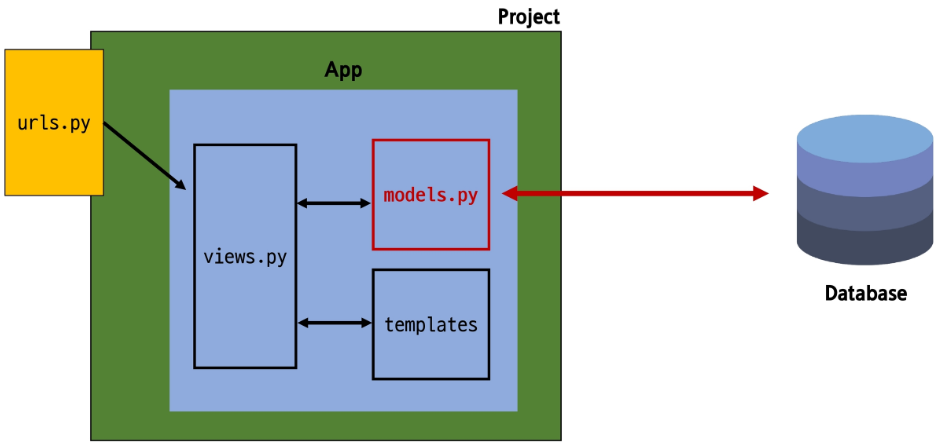
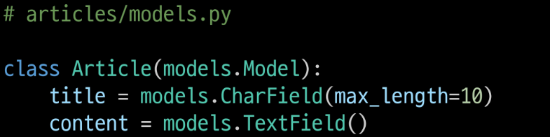
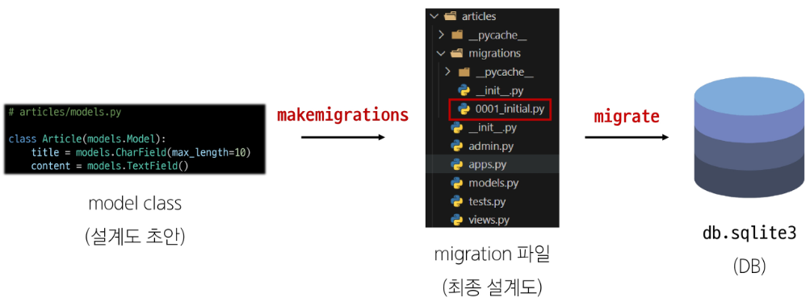
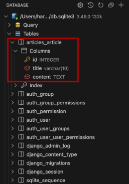
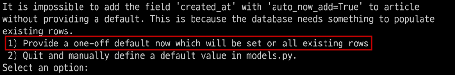
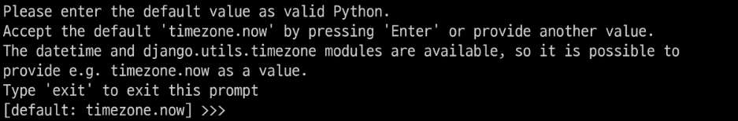
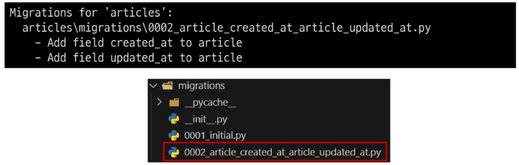
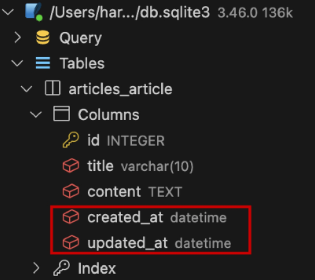

# Model

[](#model-1)   
[](#model-field)   
[](#migrations)   
[](#admin-site)   
[](#참고)   

---

## Model

### Model을 통한 데이터베이스 DB 관리



### Django Model

- DB의 테이블을 정의하고 데이터를 조작할 수 있는 기능들을 제공

- 테이블 구조를 설계하는 청사진

### Model class 클래스



- 작성한 모델 클래스는 최종적으로 DB에 다음과 같은 테이블 구조를 만듦

- id 필드는 Django가 자동 생성

- 모델 클래스 = 테이블 설계도

- django.db.models 모듈의 Model이라는 부모 클래스를 상속받음

- ‘Model’은 model에 관련된 모든 코드가 이미 작성되어있는 클래스

- 개발자는 가장 중요한 **테이블 구조를 어떻게 설계할지에 대한 코드만 작성**하도록 하기 위한 것

- 상속을 활용한 프레임워크의 기능 제공

- 클래스 변수명
    - 테이블의 각 “필드(열) 이름”

- Model Field
    - 데이터베이스 테이블의 열(Column)을 나타내는 중요한 구성 요소
    
    - “데이터 유형”과 “제약 조건”을 정의

## Model Field

### Model Field

- DB 테이블의 **필드(열)**을 정의하며, 해당 필드에 저장되는 **데이터 타입(Field Types)**과 **제약 조건(Field Options)**을 정의

### Model Field 구성

1. Field Types 필드 유형
    - 데이터베이스에 저장될 “데이터의 종류”를 정의

2. Field Options 필드 옵션
    - 필드의 “동작”과 “제약 조건”을 정의

### Field Types


- 데이터베이스에 저장될 “데이터의 종류”를 정의

- models 모듈의 클래스로 정의되어 있음

### 주요 필드 유형

- 문자열 필드
    - CharField
        - 제한된 길이의 문자열을 저장
        
        - 필드의 최대 길이를 결정하는 max_length는 필수 옵션
    
    - TextField
        - 길이 제한이 없는 대용량 텍스트를 저장
        
        - 무한대는 아니며 사용하는 시스템에 따라 달라짐

- 숫자 필드
    - IntegerField, FloatField

- 날짜 / 시간 필드
    - DateField, TimeField, DateTimeField

- 파일 관련 필드
    - FileField, ImageField

### Field Options

- 필드의 “동작”과 “제약 조건”을 정의

- 여기서 필드는 열(Column)을 의미

```python
class Article(models.Model):
	title = models.CharField(max_length=10)

# max_length=10 이 제약조건
```

### 주요 필드 옵션

- null
    - 데이터베이스에서 NULL 값을 허용할지 여부를 결정
    
    - 기본값은 False

- blank
    - form에서 빈 값을 허용할지 여부를 결정
    
    - 기본값은 False

- default
    - 필드의 기본값을 설정

- 더 많은 필드 옵션은 django 공식 문서에서 검색하여 사용

### 제약 조건 Constraint

- 특정 규칙을 강제하기 위해 테이블의 열이나 행에 적용되는 규칙이나 제한사항

- 예시
    - 숫자만 저장되도록
    
    - 문자가 100자까지만 저장되도록

## Migrations

### Migrations

- model 클래스의 변경사항(필드 생성, 수정, 삭제 등)을 DB에 최종 반영하는 방법

- 서버를 한 번 키면 `db.sqlite3` 파일이 생기는데 이 파일이 DB다.

### Migrations 과정

- DB가 알 수 있게 하는 것이 migration 파일

- 하지만 사람은 model class만 작성하고, 알아서 migration 파일에서 DB로 전달된다.



### Migrations 핵심 명령어 2가지

- `python manage.py makemigrations`
    - model class를 기반으로 최종 설계도(migration) 작성

- `python manage.py migrate`
    - 최종 설계도를 DB에 전달하여 반영

### migrate 후 DB 내에 생성된 테이블 확인

- Article 모델 클래스로 만들어진 articles_article 테이블
    
    
    

### DateTimeField의 필드 옵션

- auto_now
    - 데이터가 **저장될 때마다** 자동으로 현재 날짜시간을 저장

- auto_now_add
    - 데이터가 **처음 생성될 때만** 자동으로 현재 날짜시간을 저장

### 추가 모델 필드 작성

- 이미 기존 테이블이 존재하기 때문에 필드를 추가할 때 필드의 기본 값 설정이 필요

- `python manage.py makemigrations` 를 입력하게 되면 아래와 같이 출력한다.
    
    
    
    - 1번은 현재 대화를 유지하면서 직접 기본 값을 입력하는 방법
    
    - 2번은 현재 대화에서 나간 후 models.py에 기본 값 관련 설정을 하는 방법

- 추가하는 필드의 기본 값을 입력해야 하는 상황

- 날짜 데이터이기 때문에 직접 입력하기보다 Django가 제안하는 기본 값을 사용하는 것을 권장

- 아무것도 입력하지 않고 enter 키를 누르면 Django가 제안하는 기본 값을 설정
    
    
    
- migrations 과정 종류 후 2번째 migration 파일이 생성됨을 확인

- 이처럼 Django는 설계도를 쌓아가면서 추후 문제가 생겼을 시 복구하거나 되돌릴 수 있도록 함 (’git commit’과 유사)
    
    
    
- migrate 후 테이블 필드 변화 확인
    - `python manage.py migrate` 입력
        
        
        

### model class 변경 사항 발생 시 순서

1. 변경사항이 생겼다면
    - model class 변경

2. 반드시 새로운 설계도를 생성한 후
    - `makemigrations`

3. 이를 DB에 반영
    - `migrate`

## Admin Site

### Automatic Admin Interface

- Django가 추가 설치 및 설정 없이 자동으로 제공하는 관리자 인터페이스

- 데이터 확인 및 테스트 등을 진행하는데 매우 유용

### Admin Site 순서

1. admin 계정 생성
    - `python manege.py createsuperuser`
    
    - email은 선택사항이기 때문에 입력하지 않고 진행 가능
    
    - 비밀번호 입력 시 보안상 터미널에 출력되지 않으니 무시하고 입력 이어가기

2. DB에 생성된 admin 계정 확인

3. admin에 모델 클래스 등록
    - admin.py에 작성한 모델 클래스를 등록해야만 admin site에서 확인 가능
    
    ```python
    from django.contrib import admin
    from .model import Article
    
    admin.site.register(Article)
    ```
    
4. admin site 로그인 후 등록된 모델 클래스 확인

5. 데이터 생성, 수정, 삭제 테스트

6. 테이블 확인

## 참고

### 데이터베이스 초기화

1. migration 파일 삭제

2. db.sqlite3 파일 삭제
- `__init__.py`, `migration` 폴더는 지우지 않도록 주의

### Migrations 기타 명령어

- `python manage.py showmigrations`
    - migrations 파일들이 migrate 됐는지 안됐는지 여부를 확인하는 명령어
    
    - [X] 표시가 있으면 migrate가 완료되었음을 의미

- `python manage.py sqlmigrate articles 0001`
    - 해당 migrations 파일이 SQL 언어(DB에서 사용하는 언어)로 어떻게 번역되어 DB에 전달되는지 확인하는 명령어

### 첫 migrate시 출력 내용이 많은 이유

- Django 프로젝트가 동작하기 위해 미리 작성되어있는 기본 내장 app들에 대한 migration 파일들이 함께 migrate되기 때문

### SQLite

- 데이터베이스 관리 시스템 중 하나이며 Django의 기본 데이터베이스로 사용됨

- 파일로 존재

- 가볍고 호환성이 좋음

- 모바일에 많이 활용