# ORM

[ORM](#orm)   
[QuerySet API](#queryset-api)   
[QuerySet API 실습](#queryset-api-실습)   

---

## ORM

### ORM Object Relational Mapping

- 객체 지향 프로그래밍 언어를 사용하여 호환되지 않는 유형의 시스템 간에 데이터를 변환하는 기술

### ORM의 역할

- Django와 DB간에 사용하는 언어가 다르기 때문에 소통 불가

- Django에 내장된 ORM이 중간에서 이를 해석

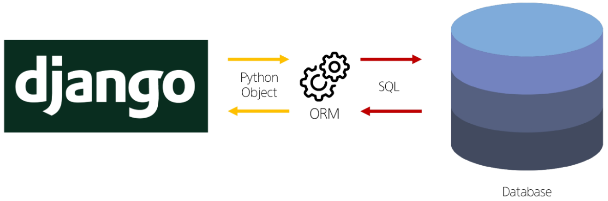

## QuerySet API

- ORM에서 데이터를 검색, 필터링, 정렬 및 그룹화하는 데 사용하는 도구

- API를 사용하여 SQL이 아닌 Python 코드로 데이터를 처리

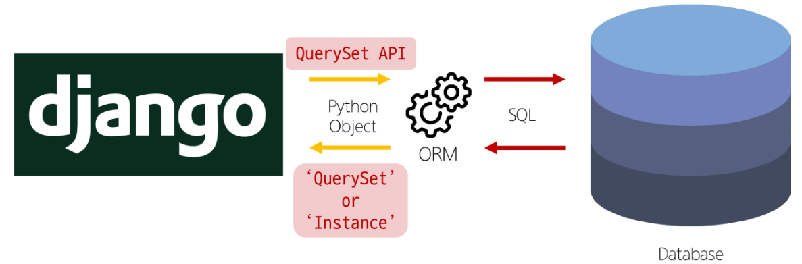

### QuerySet API 구문

- `Article.objects.all()`

- Article 전체 조회 코드

- `Article` : Model class

- `objects` : Manager

- `all()` : QuerySet API

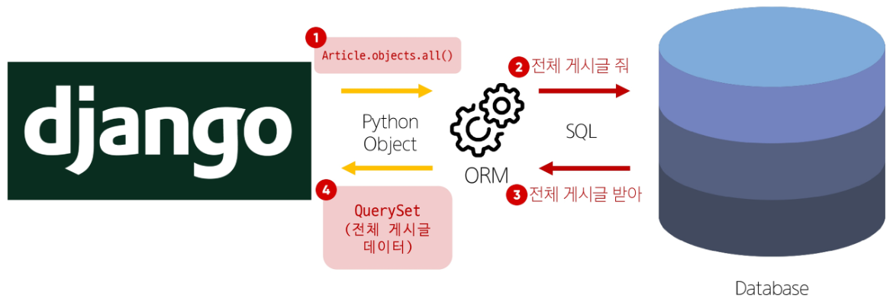

### Query

- 데이터베이스에 특정한 데이터를 보여 달라는 요청

- “ 쿼리문을 작성한다”
    - 원하는 데이터를 얻기 위해 데이터베이스에 요청을 보낼 코드를 작성한다.

- 파이썬으로 작성한 코드가 ORM에 의해 SQL로 변환되어 데이터베이스에 전달되며, 데이터베이스의 응답 데이터를 ORM이 QuerySet이라는 자료 형태로 변환하여 우리에게 전달

### QuerySet

- 데이터베이스에게서 전달 받은 객체 목록 (데이터 모음)

- 순회 가능한 데이터로써 1개 이상의 데이터를 불러와 사용할 수 있음

- Django ORM을 통해 만들어진 자료형

- 단, 데이터베이스가 단일한 객체를 반환할 때는 QuerySet이 아닌 모델(Class)의 인스턴스로 반환됨

- **QuerySet API는 python의 모델 클래스와 인스턴스를 활용해 DB에 데이터를 저장, 조회, 수정, 삭제하는 것**

### CRUD

- 소프트웨어가 가지는 기본적인 데이터 처리 기능

- Create (저장)

- Read (조회)

- Update (갱신)

- Delete (삭제)

## QuerySet API 실습

### 실습 사전 준비

- 가상 환경 생성과 같은 기본적인 작업 후 실행

- 외부 라이브러리 설치 및 설정

```html
$ pip install ipython
$ pip install django-extensions
```

```html
# settings.py

INSTALLED_APPS = [
	'articles',
	'django_extensions',
	...,
]
```

```html
$ pip freeze > requirements.txt

# 설치한 파일을 'requirements.txt로 전송 (업데이트)
```

- Django shell 실행

```html
$ python manage.py shell_plus
```

- Django shell
    - Django 환경 안에서 실행되는 python shell
    
    - 입력하는 QuerySet API 구문이 Django 프로젝트에 영향을 미침

### Create

- 데이터 객체를 만드는 (생성하는) 3가지 방법
    1. 첫 번째 방법
        
        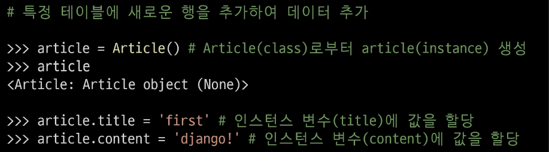
        
    - 할당만 하고 저장을 하지 않은 상태
    
    - 저장을 해야 DB에 저장된다.
        
        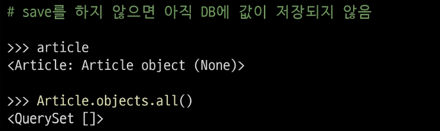
        
    - 저장을 하는 방법
    
    - 저장을 하면 pk(primary key)가 저장된다.
        
        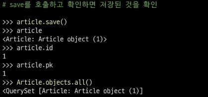
        
        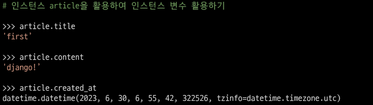
        
    1. 두 번째 방법
    
    - save 메서드를 호출해야 비로소 DB에 데이터가 저장됨
    
    - 테이블에 한 행(레코드)이 쓰여진 것
    
    - save를 해야 id(pk)가 생성된다.
        
        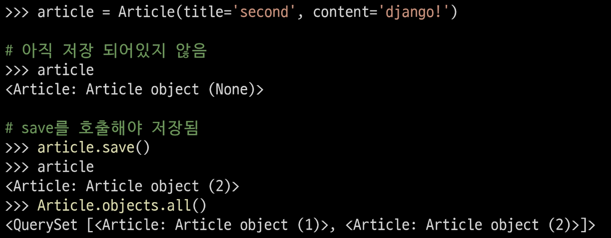
        
        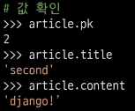
        
    1. 세 번째 방법
    
    - QuerySet API 중 create() 메서드 활용
        
        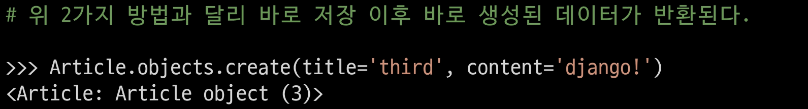
        
- `save()`
    - 객체를 데이터베이스에 저장하는 인스턴스 메서드
    
    - 인스턴스가 호출하므로 인스턴스 메서드

### Read

- 대표적인 조회 메서드
    - Return new QuerySets
        - `all()`
        
        - `filter()` - 조건
    
    - Do not return QuerySets
        - 단일 데이터 조회
        
        - `get()`

- `all()`
    - 전체 데이터 조회
        
        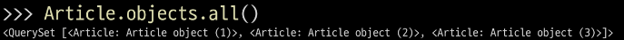
        
- `filter()`
    - 주어진 매개변수와 일치하는 객체를 포함하는 QuerySet 반환
    
    - 없는 조건을 요구하면 빈 QuerySet을 반환
    
    - 포함관계가 아닌 정확하게 일치하여야 함
    
    - `article[pk].content` 이런식으로 내부 데이터를 조회
    
    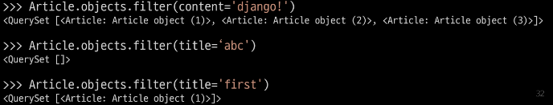
    
- `get()`
    - 주어진 매개변수와 일치하는 객체를 반환
        
        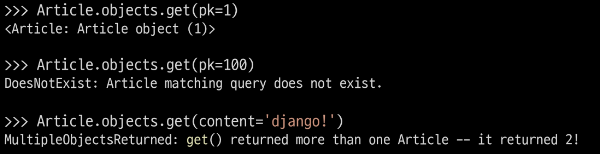
        
    - `get()`은 없는 조건을 요구하면 반환 X
    
    - `get()` 은 단일 데이터를 반환하기 때문에 여러개라면 반환 X
    
    - 객체를 찾을 수 없으면 DoesNotExist 예외를 발생시키고, 둘 이상의 객체를 찾으면 MultipleObjectsReturned 예외를 발생시킴
    
    - 위와 같은 특징을 가지고 있기 때문에 **Primary Key와 같이 고유성(uniqueness)을 보장하는 조회에서 사용해야**함

### Update

- 데이터 수정
    - 조회를 먼저 해야한다.
    
    - 인스턴스 변수를 변경 후 save 메서드 호출
        
        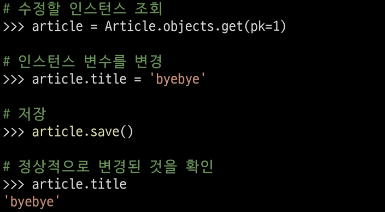
        

### Delete

- 데이터 삭제
    - 삭제하려는 데이터 조회 후 delete 메서드 호출
        
        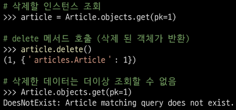
        
    - 지워진 번호(id, pk)는 재사용하지 않는다