# ORM with View

[전체 게시글 조회](#전체-게시글-조회)   
[단일 게시글 조회](#단일-게시글-조회)   

[create](#create)   
[HTTP Request Methods](#http-request-methods)   
[CSRF](#csrf)   
[Redirect](#redirect)   
[Delete](#delete)   
[Update](#update)   
[참고](#참고)   


---


## 전체 게시글 조회

### 2가지 Read(조회)

1. 전체 게시글 조회

2. 단일 게시글 조회

### 전체 게시글 조회

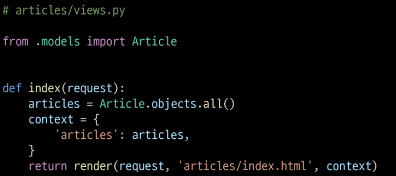

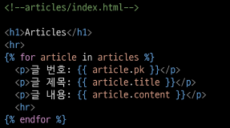

## 단일 게시글 조회

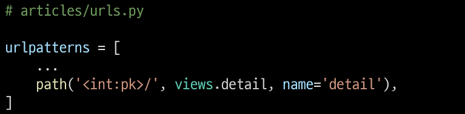

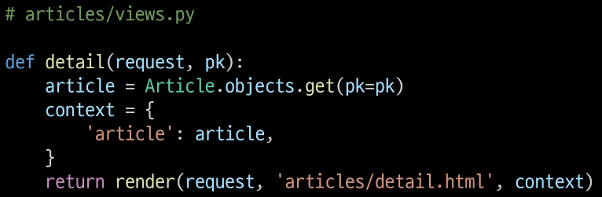

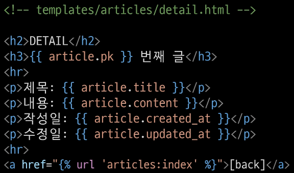

### 단일 게시글 페이지 링크 작성


## Create

### create 로직 구현에 필요한 view 함수

- 사용자 입력 데이터를 받을 페이지를 렌더링
    - **new**

- 사용자가 입력한 요청 데이터를 받아 DB에 저장
    - **create**

### new 기능 구현

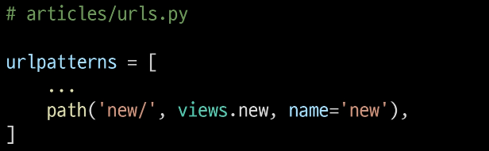

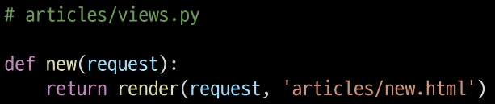

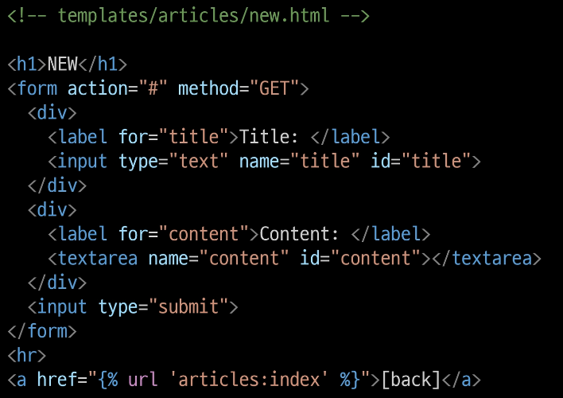

- 메인 페이지에 new 페이지로 이동할 수 있는 하이퍼링크 작성
    
    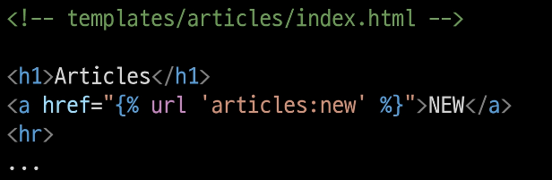
    

### Create 기능 구현


## HTTP Request Methods

### HTTP

- 네트워크 상에서 데이터(리소스)를 주고 받기위한 약속

### HTTP Request Methods

- 데이터에 대해 수행을 원하는 작업(행동)을 나타내는 것
    - 서버에게 원하는 작업의 종류를 알려주는 역할

- 클라이언트가 웹 서버에 특정 동작을 요청하기 위해 사용하는 표준 명령어

- 대표 메서드
    - GET, POST

### GET Method

- 서버로부터 데이터를 요청하고 받아오는데(**조회**) 사용

1. 데이터 전송
    - URL의 쿼리 문자열 (Query String)을 통해 데이터를 전송
    
    - http://127.0.0.1:8000/articles/create/?**title=제목&content=내용**

2. 데이터 제한
    - URL 길이에 제한이 있어 대량의 데이터 전송에는 적합하지 않음

3. 브라우저 히스토리
    - 요청 URL이 브라우저 히스토리에 남음

4. 캐싱
    - 브라우저는 GET 요청의 응답을 로컬에 저장할 수 있음
    
    - 동일한 URL로 다시 요청할 때, 서버에 접속하지 않고 저장된 결과를 사용
    
    - 페이지 로딩 시간을 크게 단축

- 검색 쿼리 전송

- 웹 페이지 요청

- API에서 데이터 조회

### POST Method

- 서버에 데이터를 제출하여 리소스를 **변경(생성, 수정, 삭제)**하는 데 사용

- DB 조작, 보안이 필요

- GET Method 쓸 때 빼고는 다 POST Method

1. 데이터 전송
    - HTTP Body를 통해 데이터를 전송
    
    - URL을 담지 않는다.
    
    - 개발자 도구를 통해서만 볼 수 있음

2. 데이터 제한 X
    - GET에 비해 더 많은 양의 데이터를 전송할 수 있음

3. 브라우저 히스토리 X
    - POST 요청은 브라우저 히스토리에 남지 않음

4. 캐싱
    - POST 요청은 기본적으로 캐시 할 수 없음
    
    - POST 요청이 일반적으로 서버의 상태를 변경하는 작업을 수행하기 때문

- 로그인 정보 제출

- 파일 업로드

- 새 데이터 생성 (예 : 새 게시글 작성)

- API에서 데이터 변경 요청

### GET & POST Method 정리

- GET과 POST는 각각의 특성에 맞게 적절히 사용해야 함

- GET
    - 데이터 조회

- POST
    - 데이터 생성이나 수정, 삭제에 주로 사용

### POST Method 변경

- POST Method 적용

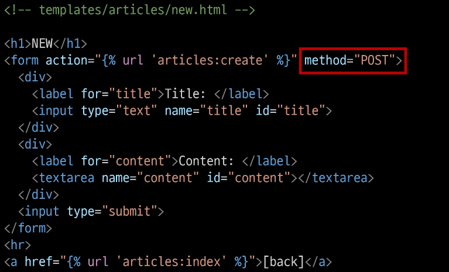


- 게시글 작성 후 403 응답 확인

### HTTP Response Status Code

- 서버가 클라이언트의 요청에 대한 처리 결과를 나타내는 3자리 숫자

- 클라이언트에게 요청 처리 결과를 명확히 전달

- 문제 발생 시 디버깅에 도움

- 웹 애플리케이션의 동작을 제어하는데 사용

### 403 Forbidden

- 서버에 요청이 전달되었지만, **권한** 때문에 거절되었다는 것을 의미

- 거절된 이유
    - CSRF token이 누락되었다는 응답
        
        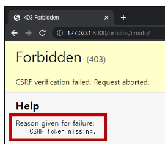
        

## CSRF

### CSRF Cross-Site-Request-Forgery

- 사이트 간 요청 위조

- 사용자가 자신의 의지와 무관하게 공격자가 의도한 행동을 하여 특정 웹 페이지를 보안에 취약하게 하거나 수정, 삭제 등의 작업을 하게 만드는 공격 방법

### CSRF Token 적용

- DTL의 csrf_token 태그를 사용해 손쉽게 사용자에게 토큰 값을 부여

- 요청시 토큰 값도 함께 서버로 전송될 수 있도록 하는 것

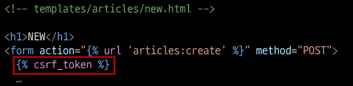

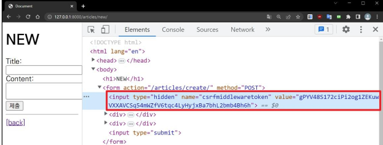

### 요청 시 CSRF Token을 함께 보내야 하는 이유

- Django 서버는 해당 요청이 DB에 데이터를 하나 생성하는 (DB에 영향을 주는) 요청에 대해 **“Django가 직접 제공한 페이지에서 데이터를 작성하고 있는 것인지”**에 대한 확인 수단이 필요한 것

- 겉모습이 똑같은 위조 사이트나 정상적이지 않은 요청에 대한 방어 수단

- 기존
    - 요청 데이터 → 게시글 작성

- 변경
    - 요청 데이터 + **인증 토큰** → 게시글 작성

### POST일 때만 Token을 확인하는 이유

- POST는 단순 조회를 위한 GET과 달리 특정 리소스에 변경(생성, 수정, 삭제)을 요구하는 의미와 기술적인 부분을 가지고 있기 때문

- DB에 조작을 가하는 요청은 반드시 인증 수단이 필요

- 데이터베이스에 대한 변경사항을 만드는 요청이기 때문에 토큰을 사용해 최소한의 신원 확인을 하는 것

### 게시글 작성 결과

- 게시글 생성 후 개발자 도구를 사용해 Form Data가 전송되는 것을 확인

- 더 이상 URL에 Query String 형태로 보냈던 데이터가 표기되지 않음

## Redirect

### 게시글 작성 후 완료를 알리는 페이지 응답

- ‘게시글을 작성해줘’ 라는 요청이기 때문에 게시글 저장 후 페이지를 응답하는 것은 POST 요청에 대한 적절한 응답이 아님

- **서버는 데이터 저장 후 페이지를 응답하는 것이 아닌 사용자를 적절한 기존 페이지로 보내야한다.**

- ‘사용자를 보낸다’ → ‘사용자가 GET 요청을 한번 더 보내도록 해야한다.’

- **실제로 서버가 클라이언트를 직접 다른 페이지로 보내는 것이 아닌 클라이언트가 GET 요청을 한번 더 보내도록 응답하는 것**

### `redirect()`

- 클라이언트가 인자에 작성된 주소로 다시 요청을 보내도록 하는 함수

### `redirect()` 함수 적용

- create view 함수 변경
    
    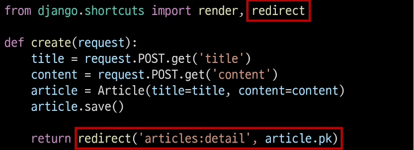
    

### redirect 동작 원리

1. redirect 응답을 받은 클라이언트는 detail url로 다시 요청을 보내게 됨

2. 결과적으로 detail view 함수가 호출되어 detail view 함수의 반환 결과인 detail 페이지를 응답받게 되는 것

- 결국 사용자는 게시글 작성 후 작성된 게시글의 detail 페이지로 이동하는 것으로 느끼게 됨
    
    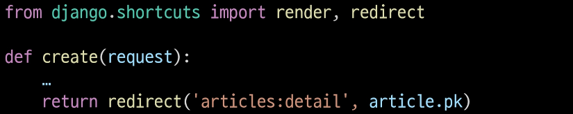
    

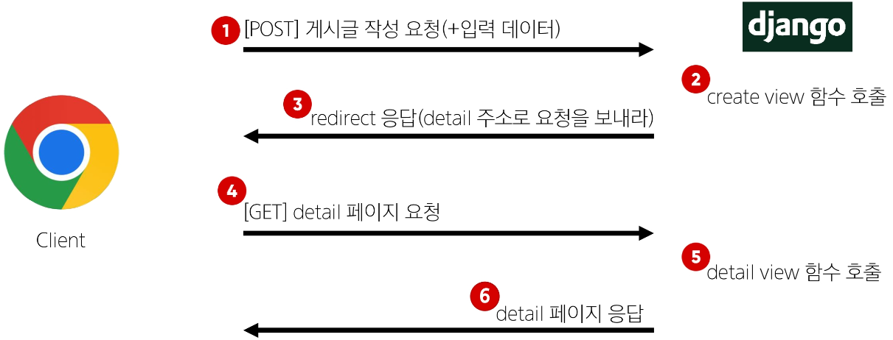

### 게시글 작성 결과

- 게시글 작성 후 생성된 게시글의 detail 페이지로 redirect 되었는지 확인

- create 요청 이후에 detail로 다시 요청을 보냈다는 것을 알 수 있음

## Delete

### Delete 기능 구현

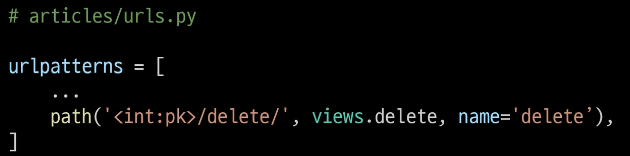

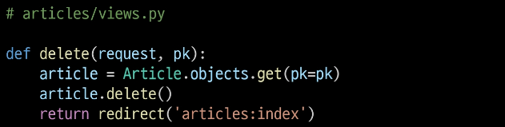

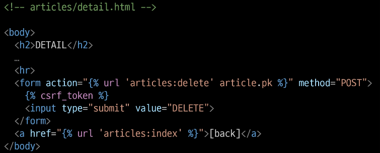

## Update

### Update 로직 구현을 위한 view 함수

- 사용자 입력 데이터를 받을 페이지를 렌더링
    - edit

- 사용자가 입력한 데이터를 받아 DB에 저장
    - update

### edit 기능 구현

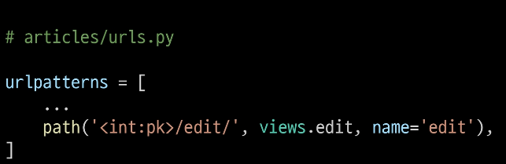

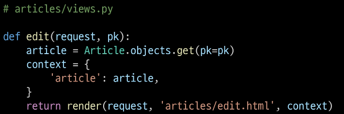

- 수정 시 이전 데이터가 출력될 수 있도록 작성하기
    
    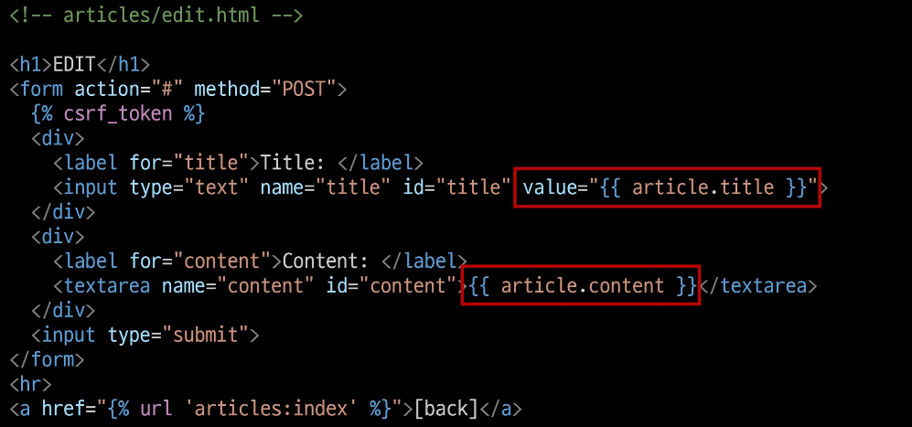
    
- edit 페이지로 이동하기 위한 하이퍼링크 작성
    
    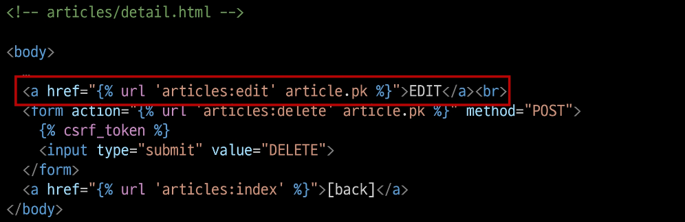
    

### Update 기능 구현

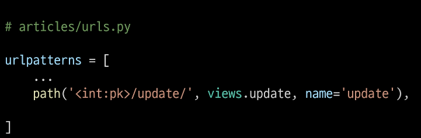

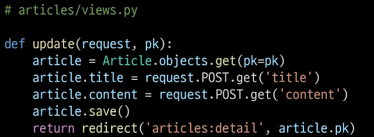

- 작성 후 게시글 수정 리스트
    
    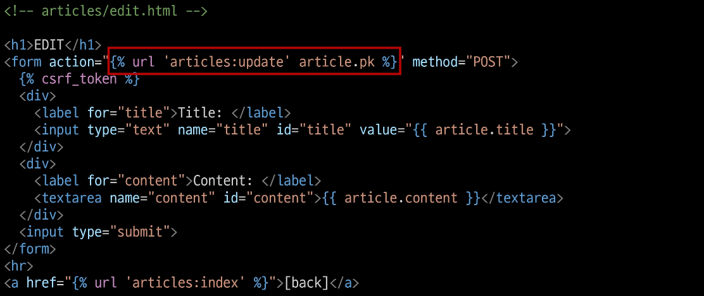
    

## 참고

### Field lookups

- Query에서 조건을 구성하는 방법

- QuerySet 메서드 `filter()`, `exclude()` 및 `get()`에 대한 키워드 인자로 지정됨

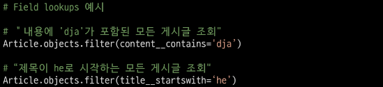

### ORM, QuerySet API를 사용하는 이유

1. 데이터베이스 추상화
    - 개발자는 특정 데이터베이스 시스템에 종속되지 않고 일관된 방식으로 데이터를 다룰 수 있음

2. 생산성 향상
    - 복잡한 SQL 쿼리를 직접 작성하는 대신 Python 코드로 데이터베이스 작업을 수행할 수 있음

3. 객체 지향적 접근
    - 데이터베이스 테이블을 Python 객체로 다룰 수 있어 객체 지향 프로그래밍의 이점을 활용할 수 있음

### GET 과 POST

|  | GET | POST |
| --- | --- | --- |
| 데이터 전송 방식 | URL의 Query String Parameter | HTTP body |
| 데이터 크기 제한 | 브라우저 제공 URL의 최대 길이 | 제한 없음 |
| 사용 목적 | 데이터 검색 및 조회 | 데이터 제출 및 변경 |

### GET 요청이 필요한 경우

- 캐싱 및 성능
    - GET 요청은 캐시(Cache)될 수 있고, 이전에 요청한 정보를 새로 요청하지 않고 사용할 수 있음
    
    - 특히, 동일한 검색 결과를 여러 번 요청하는 경우 GET 요청은 캐시를 활용하여 더 빠르게 응답할 수 있음

- 가시성 및 공유
    - GET 요청은 URL에 데이터가 노출되어 있기 때문에 사용자가 해당 URL을 북마크하거나 다른 사람과 공유하기 용이

- RESTful API 설계
    - HTTP 메서드의 의미에 따라 동작하도록 디자인된 API의 일관성을 유지할 수 있음

### HTTP Request Methods를 활용한 효율적인 URL 구성

- 동일한 URL 한 개로 Method에 따라 서버에 요구하는 행동을 다르게 요구

```html
(GET) articles/1/  # 1번 게시글 조회 요청

(POST) articles/1/ # 1번 게시글 조작 요청
```

### 캐시 Cache

- 데이터나 정보를 임시로 저장해두는 메모리나 디스크 공간

- 이전에 접근한 데이터를 빠르게 검색하고 접근할 수 있도록 함