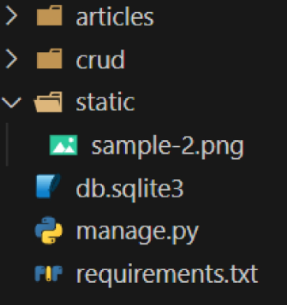

# Static Files

[Static Files](#static-files-1)   
[Media Files](#media-files)   
[참고](#참고)   

---

## Static Files

### Static Files

- 정적 파일

- 서버 측에서 변경되지 않고 고정적으로 제공되는 파일

- 이미지, JS, CSS 파일 등

### 웹 서버와 정적 파일

- 웹 서버의 기본 동작은 **특정 위치(URL)에 있는  자원**을 요청(HTTP request)받아서 응답(HTTP response)을 처리하고 제공하는 것

- 이는 “자원에 접근 가능한 주소가 있다”는 의미

- 웹 서버는 요청 받은 URL로 서버에 존재하는 정적 자원을 제공함

- **정적 파일을 제공하기 위한 경로(URL)**가 있어야 함

### Static Files 기본 경로

- app폴더/static/

### 기본 경로 static file 제공하기

- articles/static/articles/ 경로에 이미지 파일 배치
    
    
    
- static files 경로는 DTL의 static tag를 사용해야 함

- built-in tag가 아니기 때문에 load tag를 사용해 import 후 사용 가능
    
    
    
- STATIC_URL 확인 (http://127.0.0.1:8000/static/articles/sample-1.png)

### STATIC_URL

- 기본 경로 및 추가 경로에 위치한 정적 파일을 참조하기 위한 URL

- 실제 파일이나 디렉토리 경로가 아니며, URL로만 존재
    
    
    
- URL + STATIC_URL + 정적파일 경로

- http://127.0.0.1:8000/static/articles/sample-1.png

- 앞쪽에 셀 

### Static files 추가 경로

- STATICFILES_DIRS에 문자열 값으로 추가 경로 설정

### STATICFILES_DIRS

- 정적 파일의 기본 경로 외에 추가적인 경로 목록을 정의하는 리스트

- 문자 형태로 input

### 추가 경로 static file 제공

- 임의의 추가 경로 설정
    
    
    
- 추가 경로에 이미지 파일 배치
    
    
    
- static tag를 사용해 이미지 파일에 대한 경로 제공
    
    
    
- 이미지를 제공받기 위해 요청하는 Request URL 확인
    
    
    
- 정적 파일을 제공하려면 요청에 응답하기 위한 URL이 필요

## Media files

### Media Files

- 사용자가 웹에서 업로드하는 정적 파일

- user-uploaded

### ImageField()

- 이미지 업로드에 사용하는 모델 필드

- 이미지 객체가 직접 DB에 저장되는 것이 아닌 **‘이미지 파일의 경로’** 문자열이 저장됨

- 근본적으로는 문자열 필드

### 미디어 파일을 제공하기 전 준비사항

1. `settings.py`에 **MEDIA_ROOT**, **MEDIA_URL** 설정

2. 작성한 **MEDIA_ROOT**와 **MEDIA_URL**에 대한 URL 지정

### MEDIA_ROOT

- 미디어 파일들이 위치하는 디렉토리의 절대 경로
    
    
    

### MEDIA_URL

- MEDIA_ROOT에서 제공되는 미디어 파일에 대한 주소를 생성

- STATIC_URL과 동일한 역할

### MEDIA_ROOT와 MEDIA_URL에 대한 URL 지정

- 업로드 된 파일의 URL == settings.MEDIA_URL

- MEDIA_URL을 통해 참조하는 파일의 실제 위치 == settings.MEDIA_ROOT

### 이미지 업로드

- blank =True 속성을 작성해 빈 문자열이 저장될 수 있도록 제약 조건 설정

- 게시글 작성 시 이미지 업로드 없이도 작성할 수 있도록 하기 위함
    - 기존 필드 사이에 작성해도 실제 테이블 생성 시에는 가장 우측(뒤)에 추가됨
    
    - 모든 Model Field는 공백이 불가능 설정이 default 값이므로 빈 값을 허용하는 인스턴스 추가
        
        
        
- migration 진행
    - ImageField를 사용하려면 반드시 Pillow 라이브러리가 필요
        
        
        
- form 요소의 enctype 속성 추가
    - enctype은 데이터 전송 방식을 결정하는 속성
        
        
        
- ModelForm의 2번째 인자로 요청 받은 파일 데이터 작성
    - ModelForm의 상위 클래스 BaseModelForm의 생성자 함수의 2번째 위치 인자로 파일을 받도록 설정되어 있음
        
        
        
- 이미지 업로드 input 확인
    
    
    
- 이미지 업로드 결과 확인
    
    
    
- **DB에는 파일 자체가 아닌 파일 경로가 저장**

### 업로드 이미지 제공하기

- ‘url’ 속성을 통해 업로드 파일의 경로 값을 얻을 수 있음

- article.image.url
    - 업로드 파일의 경로

- article.image
    - 업로드 파일의 파일 이름

- 업로드 이미지 출력 확인 및 MEDIA_URL 확인
    
    
    
- 이미지를 업로드하지 않은 게시물은 detail 템플릿을 렌더링 할 수 없음

- 이미지 데이터가 있는 경우만 이미지를 출력할 수 있도록 처리

### 업로드 이미지 수정

- 수정 페이지 form 요소에 enctype 속성 추가
    
    
    
- update view 함수에서 업로드 파일에 대한 추가 코드 작성
    
    
    

## 참고

### 미디어 파일 추가 경로

- ‘upload_to’ argument

- `ImageField()` 의 upload_to 속성을 사용해 다양한 추가 경로 설정
    
    
    

### BaseModelForm

- request.FILES가 두번째 위치 인자인 이유
    - ModelForm의 상위 클래스 BaseModelForm의 생성자 함수 키워드 인자 참고
        
        