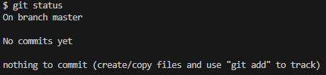

# git 기초 명령어

[git status](#git-status)   
[git log](#git-log)   
[git config](#git-config)   

---
## `git status`
- 현재 git의 상태를 확인

- 현재 로컬 저장소의 파일 상태 보기   
 

   
    

- On branch master : Git의 영역에 있다.   

- No commits yet : 아직 commit한 것이 없다.

- nothing to commit : commit할 것도 없다.

## `git log`
- commit의 history를 확인

- 메세지, 저자, 일자 확인 가능
  - `git log --oneline`
    - commit 목록을 한 줄로 보기

## `git config`
- git의 설정을 읽고 쓰기

- `git config --global -l`
  - git global 설정(이용자의 이름, 이메일) 보기