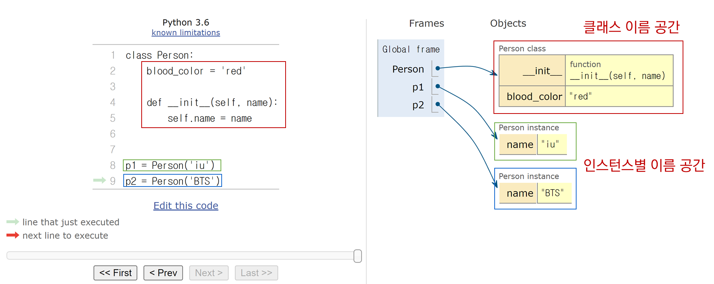

# Class and Object 객체

[Class](#class-클래스)   
[Object](#object-객체)   
[클래스와 객체](#클래스와-객체)   
[인스턴스와 메서드](#인스턴스와-메서드)   
[Object의 특징](#object-객체의-특징)   

[클래스 정의](#클래스-정의)   
[클래스 구성 요소](#클래스-구성-요소)   
[클래스 변수와 인스턴스 변수](#클래스-변수와-인스턴스-변수)   

[인스턴스와 클래스 간의 이름 공간](#인스턴스와-클래스-간의-이름-공간)   
[독립적인 이름 공간을 가지는 이점](#독립적인-이름-공간을-가지는-이점)   

---

## Class 클래스
- 파이썬에서 **타입**을 표현하는 방법

- 객체를 생성하기 위한 설계도

- 데이터와 기능을 함께 묶는 방법을 제공

- Blue Print (청사진)이라고 비유를 함

## Object 객체
- 클래서에서 정의한 것을 토대로 메모리에 할당된 것

- **'속성'**과 **'행동'**으로 구성된 모든 것

## 클래스와 객체
- 클래스로 만든 객체를 **인스턴스**라고 부름

- 변수 name의 타입은 str 클래스다.

- 변수 name은 객체이다. (O)

- 변수 name은 인스턴스다. (X)

- 변수 name은 **str 클래스의 인스턴스**다. (O)

- 우리가 사용하는 **데이터 타입은 사실 모두 클래스**이다.

```py
name = 'Alice'
print(type(name)) # <class 'str'>
```

- 결국 문자열 타입의 변수는 str 클래스로 만든 인스턴스다.

```py
print(help(str))
"""
class str(object)
 |  str(object='') -> str
 |  str(bytes_or_buffer[, encoding[, errors]]) -> str
 |
 |  Create a new string object from the given object. If encoding or
 |  errors is specified, then the object must expose a data buffer
 |  that will be decoded using the given encoding and error handler.
 |  Otherwise, …
"""
```

## 인스턴스와 메서드

```py
“hello”.upper()

"""
문자열.대문자로바꿔()

객체.행동()

인스턴스.메서드()
"""
```

```py
[1, 2, 3].sort()

"""
리스트.정렬해()

객체.행동()

인스턴스.메서드()
"""
```

> 하나의 객체(object)는 특정 타입의 인스턴스(instance)이다.

- 123, 900, 5는 모두 int의 인스턴스

- 'hello', 'bye'는 모두 string의 인스턴스

- [232, 89, 1], []은 모두 list의 인스턴스

## Object 객체의 특징
- 타입(type) : 어떤 연산자(operator)와 조작(method)이 가능한가?

- 속성 (attribute) :  어떤 상태(데이터)를 가지는가?

- 조작법(method) : 어떤 행위(함수)를 할 수 있는가?

## 클래스 정의
- class 키워드

- 클래스 이름은 파스칼 케이스 Pascal Case(= 카멜 케이스 Camel Case) 방식으로 작성
  - 스네이크 케이스는 '_' 를 이용하여 이름 작성
  
  - 파스칼 케이스(카멜 케이스)는 '_' 없이 첫 글자를 대문자로 해서 단어 구별

### 클래스 정의 예시

```py
# 클래스 정의
class Person:
    pass

# 인스턴스 생성
iu = Person()

# 메서드 호출
iu.메서드()

# 속성(변수) 접근
	iu.attribute
```

```py
# 클래스 정의
class Person:
    blood_color = 'red'

    def __init__(self, name):
        self.name = name

    def singing(self):
        return f'{self.name}가 노래합니다.'
# 행동은 클래스로 인해 만들어진 인스턴스가 주도적으로 행동

# 인스턴스 생성
singer1 = Person('iu')

# 메서드 호출
print(singer1.singing())  # iu가 노래합니다.
print(singer1.blood_color) # red
# iu의 속성이 아닌 person과 singer의 속성

# 속성(변수) 접근
print(singer1.name)  # iu
# iu만의 속성
```

## 클래스 구성 요소
1. 생성자 함수 `__init__`
    - 객체를 생성할 때 자동으로 호출되는 특별한 메서드
    
    - `__init__`이라는 이름의 메서드로 정의됨
    
    - **객체의 초기화** 담당
    
    - 생성자 함수를 통해 인스턴스를 생성하고 필요한 **초기값**을 설정
    
    ```py
    # 인스턴스 생성
    singer1 = Person('iu') # 이 순간 생성자 함수 호출
    ```

2. 인스턴스 변수
   - 인스턴스(객체)마다 별도로 유지되는 변수
   
   - 인스턴스마다 독립적인 값을 가지며, 인스턴스가 생성될 때마다 초기화됨

3. 클래스 변수
   - 클래스 내부에 선언된 변수
   
   - 클래스로 생성된 모든 인스턴스들이 공유하는 변수

4. 인스턴스 메서드
   - 각각의 인스턴스에서 호출할 수 있는 메서드
   
   - 인스턴스 변수에 접근하고 수정하는 등의 작업을 수행
   
   ```py
   def singing(self):
        return f'{self.name}가 노래합니다.'
    
    # 인스턴스 메서드 호출
    print(singer1.singing()) # iu가 노래합니다.
    ```

### 클래스 변수 활용
- 가수가 몇 명인지 확인하고 싶다면?
  - 인스턴스가 생성될 때마다 클래스 변수가 늘어나도록 설정할 수 있음
  
  ```py
  class Person:
    count = 0
       
    def __init__(self, name):
        self.name = name
        Person.count += 1
        
        
    person1 = Person('iu')
    person2 = Person('BTS')
        
    print(Person.count)  # 2
    ```

## 클래스 변수와 인스턴스 변수
- 클래스 변수를 변경할 때는 항상 **클래스**, 
**클래스 변수 형식**으로 변경

```py
# 예제 1
class Circle:
pi = 3.14

def __init__(self, r):
    self.r = r


c1 = Circle(5)
c2 = Circle(10)
print(Circle.pi)  # 3.14
print(c1.pi)  # 3.14
print(c2.pi)  # 3.14
```

```py
# 예제 2
class Circle:
    pi = 3.14

    def __init__(self, r):
        self.r = r 


c1 = Circle(5)
c2 = Circle(10)

Circle.pi = 5  # 클래스 변수 변경
print(Circle.pi)  # 5 (바뀐 클래스 변수)
print(c1.pi)  # 5 (바뀐 클래스 변수)
print(c2.pi)  # 5 (바뀐 클래스 변수)
```

```py
# 예제 3
class Circle:
    pi = 3.14
    def __init__(self, r):
        self.r = r 


c1 = Circle(5)
c2 = Circle(10)
c2.pi = 5  # 인스턴스 변수 변경
 
print(Circle.pi)  # 3.14 (클래스 변수)
print(c1.pi)  # 3.14 (클래스 변수)
print(c2.pi)  # 5 (위의 새로운 인스턴스 변수가 생성됨)
```

## 인스턴스와 클래스 간의 이름 공간
- 클래스를 정의하면, 클래스와 해당하는 이름 공간 생성

- 인스턴스를 만들면, 인스턴스 객체가 생성되고 **독립적인** 이름 공간 생성

- 인스턴스에서 특정 속성에 접근하면, 인스턴스 → 클래스 순으로 탐색

<div align='center'>

   

</div>

## 독립적인 이름 공간을 가지는 이점
- 각 인스턴스는 독립적인 메모리 공간을 가지며, 클래스와 다른 인스턴스 간에는 서로의 데이터나 상태에 직접적인 접근이 불가능

- 객체 지향 프로그래밍의 중요한 특성 중 하나로, 클래스와 인스턴스를 모듈화하고 각각의 객체가 독립적으로 동작하도록 보장

- 이를 통해 클래스와 인스턴스는 다른 객체들과의 상호작용에서 서로 충돌이나 영향을 주지 않으면서 독립적으로 동작할 수 있음

- 코드의 가독성, 유지보수성, 재사용성을 높이는데 도움을 줌