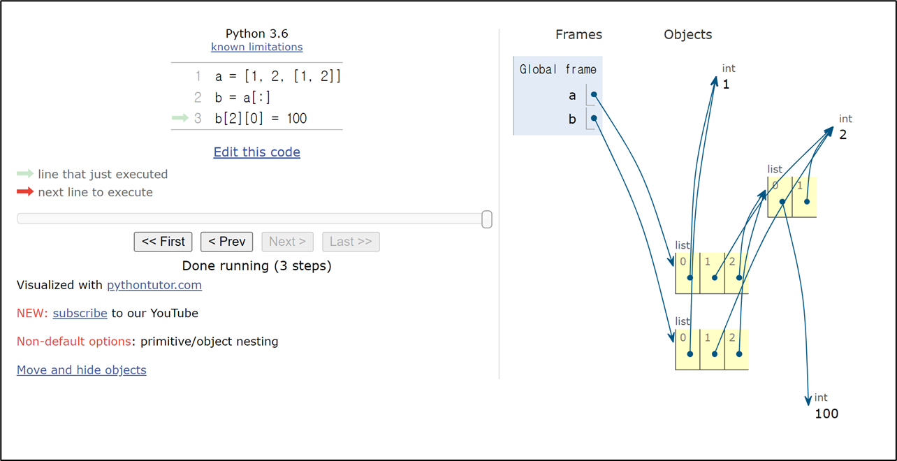

# Copy

[Copy](#copy-복사)   
[변경 가능한 데이터 타입의 복사](#변경-가능한-데이터-타입의-복사)   
[변경 불가능한 데이터 타입의 복사](#변경-불가능한-데이터-타입의-복사)   
[복사 유형](#복사-유형)   
[할당](#할당-assignment)   
[얕은 복사](#얕은-복사-shallow-copy)   
[깊은 복사](#깊은-복사-deep-copy)   

---

## Copy 복사
- 파이썬에서는 데이터 분류에 따라 복사가 달라짐

- '변경 가능한 데이터 타입'과 '변경 불가능한 데이터 타입'을 다르게 다룸

## 변경 가능한 데이터 타입의 복사

```python
a = [1, 2, 3, 4]
b = a
b[0] = 100

print(a)  # [100, 2, 3, 4]
print(b)  # [100, 2, 3, 4]
```


## 변경 불가능한 데이터 타입의 복사

```python
a = 20
b = a
b = 10

print(a)  # 20
print(b)  # 10
## b가 20으로 재할당 받은 것
```


## 복사 유형
1. 할당 (Assignment)

2. 얕은 복사 (Shallow Copy)

3. 깊은 복사 (Deep Copy)

## 할당 Assignment
- 리스트 복사 예시
  - 할당 연산자(=)를 통한 복사는 해당 객체에 대한 객체 참조를 복사

```python
original_list = [1, 2, 3]
copy_list = original_list
print(original_list, copy_list)  # [1, 2, 3] [1, 2, 3]

copy_list[0] = 'hi'
print(original_list, copy_list)  # ['hi', 2, 3] ['hi', 2, 3]
```


## 얕은 복사 Shallow Copy
- 리스트 얕은 복사 예시
  - 슬라이싱을 통해 생성된 객체는 원본 객체와 독립적으로 존재

```python
a = [1, 2, 3]
b = a[:] # 재할당이 아닌 새로운 리스트에 b를 복사
print(a, b)  # [1, 2, 3] [1, 2, 3]

b[0] = 100
print(a, b)  # [1, 2, 3] [100, 2, 3]
```


<br />
<br />


```python
a = [1, 2, 3]
b= a[:]
c = a.copy()

b[0] = 100
b[0] = 99

# a = [1, 2, 3]
# b = [100, 2, 3]
# c = [99, 2, 3]
```
<br />
<br />

- 얕은 복사의 한계

```python
a = [1, 2, [3, 4, 5]]
b = a[:]
b[0] = 99
b[2][1] = 100 # 4의 값을 100으로

print(a) # [1, 2, [3, 100, 5]
print(b) # [99 2, [3, 100, 5]
```

<br />
<br />

- 2차원 리스트와 같이 변경 가능한 객체 안에 변경 가능한 객체가 있는 경우
  - a와 b의 주소는 다르지만 내부 객체의 주소는 같기 때문에 함께 변경됨

```python
a = [1, 2, [1, 2]]
b = a[:]
print(a, b)  # [1, 2, [1, 2]] [1, 2, [1, 2]]

b[2][0] = 100
print(a, b)  # [1, 2, [100, 2]] [1, 2, [100, 2]]
```



## 깊은 복사 Deep Copy
- 리스트 깊은 복사 예시
  - 내부에 중첩된 모든 객체까지 새로운 객체 주소를 참조 하도록 함

```python
import copy


original_list = [1, 2, [1, 2]]
deep_copied_list = copy.deepcopy(original_list)

deep_copied_list[2][0] = 100

print(original_list)  # [1, 2, [1, 2]]
print(deep_copied_list)  # [1, 2, [100, 2]]
```

