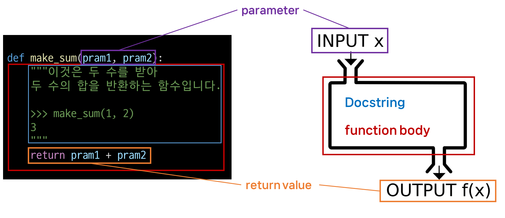

# functions

[Functions](#functions-함수)   
[함수의 이름](#함수의-이름)   
[함수의 역할](#함수의-역할)   
[함수를 사용하는 이유](#함수를-사용하는-이유)   
[함수의 구조](#함수의-구조)   
[함수의 정의와 호출](#함수의-정의와-호출)   

---

## Functions 함수
- 특정 작업을 수행하기 위한 재사용 가능한 코드 묶음

## 함수의 이름
- 이 함수가 어떤 일을 하는지 알 수 있도록 작명

- 동사를 이용

## 함수의 역할
- 함수는 한 가지 역할만 할 수 있도록 구성
  
- 여러 가리 일을 하게 되면 나중에 보수가 힘들어짐

## 함수를 사용하는 이유
- 두 수의 합을 구하는 함수를 정의하고 사용함으로써 코드의 중복을 방지

- **재사용성**이 높아지고, 코드의 **가독성**과 **유지보수성** 향상

```python
# 두 수의 합을 구하는 코드
num1 = 5
num2 = 3

sum_result = num1 + num2
print(sum_result)
```

```python
# 두 수의 합을 구하는 함수
def get_sum(num1, num2):
		return num1 + num2

# 함수 사용하여 결과 출력
num1 = 5
num2 = 3
sum_result = get_sum(num1, num2)
print(sum_result)
```

## 함수의 구조



## 함수의 정의와 호출

- 함수 정의
  - 함수 정의는 `def` 키워드로 시작
  - `def` 키워드 이후 함수 이름 작성
  - 괄호 안에 매개변수를 정의할 수 있음
  - 매개변수(parameter)는 함수에 전달되는 값을 나타냄

- 함수의 body
  - 콜론 `:` 다음에 들여쓰기 된 코드 블록
  - 함수가 실행될 때 수행되는 코드를 정의
  - Docstring은 함수 body 앞에 선택적으로 작성 가능한 함수 설명서

- 함수 반환 값
  - 함수는 필요한 경우 결과를 반환할 수 있음
  - `return` 키워드 이후에 반환할 값을 명시
  - `return`문은 함수의 실행을 종료하고, 결과를 호출 부분으로 반환

- 함수 호출
  - 함수를 사용하기 위해서는 호출이 필요
  - 함수의 이름과 소괄호를 활용해 호출
  - 필요한 경우 인자(argument)를 전달해야 함
  - 호출 부분에서 전달된 인자는 함수 정의 시 작성한 매개변수에 대입됨

```python
def greet(name): # 함수 정의
		"""입력된 이름(name) 값에
		인사를 하는 메세지('Hello, ')를 만드는 함수
		"""
		message = 'Hello, ' + name # 함수 body
		return message # 함수 반환 값

result = greet('Alice') # 함수 호출
print(result)
```

### 예시

```python
def make_sum(pram1, pram2):
    """이것은 두 수를 받아
    두 수의 합을 반환하는 함수입니다.
    >>> make_sum(1, 2)
    3
    """
    return pram1 + pram2

result = make_sum(100, 30)
return_value = print(result) # 130
print(return_value) # None 
#print 함수는 return 값이 없는 함수이다.
#출력한다고 그 값이 아니다.
```

```python
def my_func():
    print('hello, world')

result = my_func() # hello, world  #함수 호출되면서 print 작동
print(result) # None # 위의 예시와 같은 이유
```