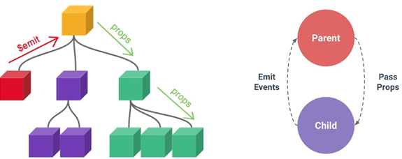
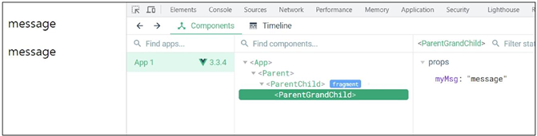
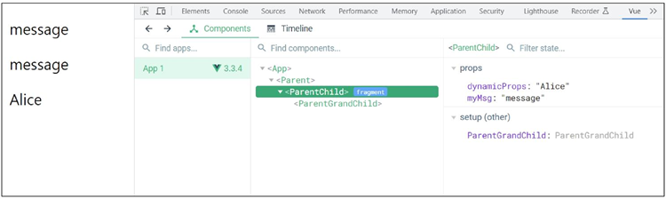
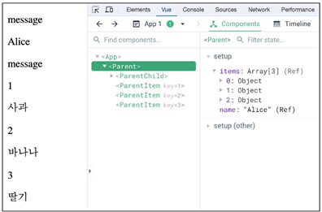
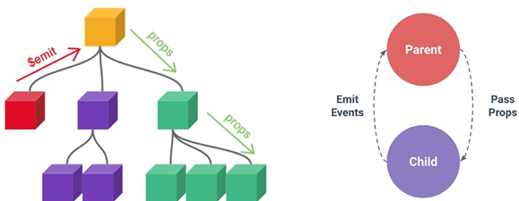
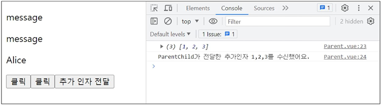
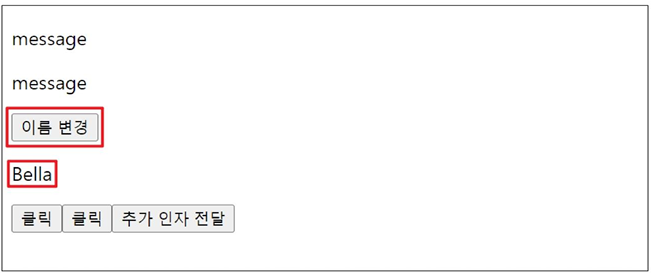

# Component State Flow

[Passing Props](#passing-props)   
[Component Event](#component-events)   
[참고](#참고)   

---

## Passing Props

### 동일한 데이터, 하지만 다른 컴포넌트

- 동일한 사진 데이터가 한 화면에 다양한 위치에서 여러 번 출력되고 있음

- 하지만 해당 페이지를 구성하는 컴포넌트가 여러 개라면 각 컴포넌트가 개별적으로 동일한 데이터를 관리해야 할까?

- 그렇다면 사진을 변경 해야 할 때 모든 컴포넌트에 대해 변경 요청을 해야 함

- 공통된 부모 컴포넌트에서 관리하자
    
    
    

- 부모는 자식에게 데이터를 전달(Pass Props)하며, 자식은 자신에게 일어난 일을 부모에게 알림(Emit event)

### Props

- 부모 컴포넌트로부터 자식 컴포넌트로 데이터를 전달하는데 사용되는 속성

### Props 특징

- 부모 속성이 업데이트되면 자식으로 전달되지만 그 반대는 안됨

- 즉, 자식 컴포넌트 내부에서 `props`를 변경하려고 시도해서는 안되며 불가능
    
    > 내려받는 것만 가능하며, 내려 받은 것은 수정 불가
    >

- 또한 부모 컴포넌트가 업데이트될 때마다 이를 사용하는 자식 컴포넌트의 모든 props가 최신 값으로 업데이트 됨

- 부모 컴포넌트에서만 변경하고 이를 내려받는 자식 컴포넌트는 자연스럽게 갱신

### One-Way Data Flow

- 모든 props는 자식 속성과 부모 속성 사이에 하향식 단방향 바인딩을 형성(one-way-down binding)

### 단방향인 이유

- 하위 컴포넌트가 실수로 상위 컴포넌트의 상태를 변경하여 앱에서의 데이터 흐름을 이해하기 어렵게 만드는 것을 방지하기 위함

- 데이터 흐름의 일관성 및 단순화

> 양방향이라면 어느 부분에서 수정이 되서 오류가 발생했는지 알 수 없다.
> 단방향이라면 한 부분에만 데이터가 존재하므로 오류가 발생한 부분을 쉽게 찾을 수 있다.
>

### 사전 준비

- vue 프로젝트 생성

- 초기 생성된 컴포넌트 모두 삭제 (App.vue 제외)

- src/assets 내부 파일 모두 삭제

- main.js 해당 코드 삭제
    
    ```jsx
    // main.js
    
    import './assets/main.css'
    ```
    
- App > Parent > ParentChild 컴포넌트 관계 작성

- App 컴포넌트 작성
    
    > App.vue
    > 
    
    ```jsx
    <template>
      <div>
        <Parent />
      </div>
    </template>
    
    <script setup>
    import Parent from '@/components/Parent.vue'
    </script>
    ```
    
- Parent 컴포넌트 작성
    
    > Parent.vue
    > 
    
    ```jsx
    <template>
      <div>
        <ParentChild />
      </div>
    </template>
    
    <script setup>
    import ParentChild from '@/components/ParentChild.vue';
    </script>
    ```
    
- ParentChild 컴포넌트 작성
    
    > ParentChild.vue
    > 
    
    ```jsx
    <template>
        <div></div>
    </template>
    
    <script setup>
    </script>
    ```
    

### Props 선언

- 부모 컴포넌트에서 내려 보낸 props를 사용하기 위해서는 자식 컴포넌트에서 명시적인 props 선언이 필요

### Props 작성

- 부모 컴포넌트 Parent에서 자식 컴포넌트 ParentChild에 보낼 props 작성
    
    
    
    > Parent.vue
    > 
    
    ```jsx
    <template>
      <div>
        <ParentChild my-msg="message"/>
      </div>
    </template>
    ```
    

### Props 선언

- defineProps()를 사용하여 props를 선언

- defineProps()에 작성하는 인자의 데이터 타입에 따라 선언 방식이 나뉨
    
    ```jsx
    <script setup>
    defineProps()
    </script>
    ```
    

### Props 선언 2가지 방식

- 문자열 배열을 사용한 선언

- 객체를 사용한 선언

### 문자열 배열을 사용한 선언

- 배열의 문자열 요소로 props 선언

- 문자열 요소의 이름은 전달된 props의 이름
    
    > ParentChild.vue
    > 
    
    ```jsx
    <script setup>
    defineProps(['myMsg'])
    </script>
    ```
    

### 객체를 사용한 선언

- 각 객체 속성의 키가 전달받은 props 이름이 되며, 객체 속성의 값은 값이 될 데이터의 타입에 해당하는 생성자 함수(Number, String, …)여야 함

- 객체 선언 문법 사용 권장
    
    > ParentChild.vue
    > 
    
    ```jsx
    <script setup>
    defineProps({
        myMsg: String
    })
    </script>
    ```
    

### Props 데이터 사용

- props 선언 후 템플릿에서 반응형 변수와 같은 방식으로 활용
    
    > ParentChild.vue
    > 
    
    ```jsx
    <div>
      <p>{{ myMsg }}</p>
    </div>
    ```
    
- props를 객체로 반환하므로 필요한 경우 JavaScript에서 접근 가능
    
    ```jsx
    <script setup>
    const props = defineProps({ myMsg: String })
    console.log(props) // {myMsg: 'message'}
    console.log(props.myMsg) // 'message'
    </script>
    ```
    
- props 출력 결과 확인
    
    
    

### 한 단계 더 props 내려 보내기

- ParentChild 컴포넌트를 부모로 갖는 ParentGrandChild 컴포넌트 생성 및 등록
    
    > ParentGrandChild.vue
    > 
    
    ```jsx
    <template>
      <div></div>
    </template>
    
    <script setup>
    </script>
    ```
    
    > ParentChild.vue
    > 
    
    ```jsx
    <template>
    	<div>
    		<p>{{ myMsg }}</p>
    		<ParentGrandChild />
    	</div>
    </template>
    
    <script setup>
    import ParentGrandChild from '@components/ParentGrandChild.vue';
    
    defineProps({
    	 myMsg: String,
    	})
    </script>
    ```
    
- ParentChild 컴포넌트에서 Parent로부터 받은 props인 myMsg를 ParentGrandChild에게 전달
    
    > ParentChild.vue
    > 
    
    ```jsx
    <template>
    	<div>
    		<p>{{ myMsg }}</p>
    		<ParentGrandChild :my-msg="myMsg"/>
    	</div>
    </template>
    ```
    
    - v-bind를 사용한 동적 props
    
    > ParentGrandChild.vue
    > 
    
    ```jsx
    <template>
      <div>
        <p>{{ myMsg }}</p>
      </div>
    </template>
    
    <script setup>
    defineProps({
      myMsg: String,
    })
    </script>
    ```
    
- 출력 결과 확인

- ParentGrandChild가 받아서 출력하는 props은 Parent에 정의되어 있는 props이며 Parent가 props을 변경할 경우 이를 전달받고 있는 ParentChild, ParentGrandChild에서도 모두 업데이트됨
    
    
    

### Props 세부사항

- Props Name Casing (Props 이름 컨벤션)

- Static Props와 Dynamic Props

### Props Name Casing

- 자식 컴포넌트로 전달 시 (→ kebab-case)
    
    ```jsx
    <ParentChild my-msg="message"/>
    ```
    
    - 기술적으로 camelCase도 가능하나 HTML 속성 표기법과 동일하게 kebab-case로 표기할 것을 권장

- 선언 및 템플릿 참조 시 (→ camelCase)
    
    ```jsx
    <p>{{ myMsg }}</p>
    
    defineProps({
    	 myMsg: String,
    	})
    ```

> 자식 컴포넌트는 HTML에서 사용되기때문에 `kebab-case`, 선언 및 템플릿 참조 시에는 JavaScript에서 사용되기 때문에 `camelCase`로 작성
> 
> `kebab-case`에서 `-m` 과 같이 `-`가 붙으면, `camelCase`에서는 다음 문자를 대문자로 변경
>    

### Static props & Dynamic props

- 지금까지 작성한 것은 Static(정적) props

- v-bind를 사용하여 동적으로 할당된 props를 사용할 수 있음

- Dynamic props 정의
    
    > Parent.vue
    > 
    
    ```jsx
    import { ref } from 'vue'
    
    const name = ref('Alice')
    ```
    
    ```jsx
    <ParentChild my-msg="message" :dynamic-props="name" />
    ```
    
- Dynamic props 선언 및 출력
    
    > ParentChild.vue
    > 
    
    ```jsx
    defineProps({
    	myMsg: String,
    	dynamicProps: String,
    })
    ```
    
    ```jsx
    <p>{{ dynamicProps }}</p>
    ```
    
- Dynamic props 출력 확인
    
    
    

### 다른 디렉티브와 함께 사용

- v-for와 함께 사용하여 반복되는 요소를 props로 전달하기

- ParentItem 컴포넌트 생성 및 Parent의 하위 컴포넌트로 등록
    
    > ParentItem.vue
    > 
    
    ```jsx
    <template>
     <div>
     </div>
    </template>
    
    <script setup>
    </script>
    ```
    
    > Parent.vue
    > 
    
    ```jsx
    <template>
      <div>
        <ParentItem />
      </div>
    </template>
    
    <script setup>
    import ParentItem from '@/components/ParentItem.vue';
    </script>
    ```
    
- 데이터 정의 및 v-for 디렉티브의 반복 요소로 활용

- 각 반복 요소를 props로 내려 보내기
    
    > Parent.vue
    > 
    
    ```jsx
    const items = ref([
      { id: 1, name: '사과' },
      { id: 2, name: '바나나' },
      { id: 3, name: '딸기' },
    ])
    ```
    
    ```jsx
    <ParentItem 
        v-for="item in items"
        :key="item.id"
        :my-prop="item"
    />
    ```
    
- props 선언 및 출력 결과 확인
    
    > ParentItem.vue
    > 
    
    ```jsx
    <template>
     <div>
        <p>{{ myProp.id }}</p>
        <p>{{ myProp.name }}</p>
     </div>
    </template>
    
    <script setup>
    defineProps({
      myProp: Object
    })
    </script>
    ```
    
    
    

## Component Events

### Emit



- 부모는 자식에게 데이터를 전달(Pass Props)하며, 자식은 자신에게 일어난 일을 부모에게 알림(Emit event)

- 부모가 props 데이터를 변경하도록 소리쳐야 한다.

### `$emit()`

- 자식 컴포넌트가 이벤트를 발생시켜 부모 컴포넌트로 데이터를 전달하는 역할의 메서드

- `$` 표기는 Vue 인스턴스의 내부 변수들을 가리킴

- Life cycle hooks, 인스턴스 메서드 등 내부 특정 속성에 접근할 때 사용

### emit 메서드 구조

```jsx
$emit(event, ...args)
```

- event
    - 커스텀 이벤트 이름

- args
    - 추가 인자

### 이벤트 발신 및 수신 (Emitting and Listening to Events)

- `$emit`을 사용하여 템플릿 표현식에서 직접 사용자 정의 이벤트를 발신
    
    ```jsx
    <button @click="$emit('someEvent')">클릭</button>
    ```
    
- 그런 다음 부모는 v-on을 사용하여 수신할 수 있음
    
    ```jsx
    <ParentComp @some-event="somoeCallback" />
    ```
    

### 이벤트 발신 및 수신하기

- ParentChild에서 someEvent라는 이름의 사용자 정의 이벤트를 발신
    
    > ParentChild.vue
    > 
    
    ```jsx
    <button @click="$emit('someEvent')">클릭</button>
    ```
    
- ParentChild의 부모 Parent는 v-on을 사용하여 발신된 이벤트를 수신

- 수신 후 처리할 로직 및 콜백함수 호출
    
    > Parent.vue
    > 
    
    ```jsx
    <ParentChild @some-event="someCallback" my-msg="message" :dynamic-props="name"/>
    ```
    
    ```jsx
    const someCallback = function () {
      console.log('ParentChild가 발신한 이벤트를 수신했어요.')
    }
    ```
    
- 이벤트 수신 결과
    
    
    

### emit 이벤트 선언

- defineEmits()를 사용하여 발신한 이벤트를 선언

- props와 마찬가지로 defineEmits()에 작성하는 인자의 데이터 타입에 따라 선언 방식이 나뉨 (배열, 객체)

- defineEmits()는 $emit 대신 사용할 수 있는 동등한 함수를 반환

- script에서는 $emit 메서드를 접근할 수 없기 때문
    
    ```jsx
    <script setup>
    const emit = defineEmits(['someEvent', 'myFocus'])
    
    const buttonClick = function () {
      emit('someEvent')
    }
    </script>
    ```
    

### 이벤트 선언 활용

- 이벤트 선언 방식으로 추가 버튼 작성 및 결과 확인
    
    > ParentChild.vue
    > 
    
    ```jsx
    <script setup>
    const emit = defineEmits(['someEvent'])
    
    const buttonClick = function () {
      emit('someEvent')
    }
    </script>
    ```
    
    ```jsx
    <button @click="buttonClick">클릭</button>
    ```
    

### 이벤트 인자 Event Arguments

- 이벤트 발신 시 추가 인자를 전달하여 값을 제공할 수 있음

### 이벤트 인자 전달 활용

- ParentChild에서 이벤트를 발신하여 Parent로 추가 인자 전달하기
    
    > ParentChild.vue
    > 
    
    ```jsx
    const emit = defineEmits(['someEvent', 'emitArgs'])
    
    const buttonClick = function () {
      emit('emitArgs', 1, 2, 3)
    }
    ```
    
    ```jsx
    <button @click="emitArgs">추가 인자 전달</button>
    ```
    
- ParentChild에서 발신한 이벤트를 Parent에서 수신
    
    > Parent.vue
    > 
    
    ```jsx
    <ParentChild 
      @some-event="someCallback"
      @emit-args="getNumbers"
      my-msg="message"
      :dynamic-props="name"
    />
    ```
    
    ```jsx
    const getNumbers = function (...args) {
      console.log(args)
      console.log(`ParentChild가 전달한 추가인자 ${args}를 수신했어요.`)
    }
    ```
    
- 추가 인자 전달 확인
    
    
    

### Event Name Casing

- 선언 및 발신 시 (→ camelCase)
    
    ```jsx
    <button @click="$emit('someEvent')">클릭</button>
    ```
    
    ```jsx
    const emit = defineEmits(['someEvent'])
    
    emit('someEvent')
    ```
    
- 부모 컴포넌트에서 수신 시 (→ kebab-case)
    
    ```jsx
    <ParentChild @some-Event="..." />
    ```
    

### emit 이벤트 실습

- 최하단 컴포넌트 ParentGrandChild에서 Parent 컴포넌트의 name 변수 변경 요청하기
    
    
    
- ParentGrandChild에서 이름 변경을 요청하는 이벤트 발신
    
    > ParentGrandChild.vue
    > 
    
    ```jsx
    const emit = defineEmits(['updateName'])
    
    const updateName = function () {
      emit('updateName')
    }
    ```
    
    ```jsx
    <button @click="updateName">이름 변경</button>
    ```
    
- 이벤트 수신 후 이름 변경을 요청하는 이벤트 발신
    
    > ParentChild.vue
    > 
    
    ```jsx
    const emit = defineEmits(['someEvent', 'emitArgs', 'updateName'])
    
    const updateName = function () {
      emit('updateName')
    }
    ```
    
    ```jsx
    <ParentGrandChild :my-msg="myMsg" @update-name="updateName"/>
    ```
    
- 이벤트 수신 후 이름 변수 변경 메서드 호출

- 해당 변수를 props으로 받는 모든 곳에서 자동 업데이트
    
    > Parent.vue
    > 
    
    ```jsx
    <ParentChild @update-name="updateName" />
    ```
    
    ```jsx
    const updateName = function () {
      name.value = 'Bella'
    }
    ```
    
- 버튼 클릭 후 결과 확인
    
    
    

## 참고

### 정적 & 동적 props 주의사항

- 첫 번째는 정적 props로 문자열 “1”을 전달

- 두 번째는 동적 props로 숫자 1을 전달
    
    ```jsx
    <!-- 1 -->
    <SomeComponent num-props="1" />
    
    <!-- 2 -->
    <someComponent :num-props="1" />
    ```
    

### Props 선언 시 “객체 선언 문법”을 권장하는 이유

- 컴포넌트를 가독성이 좋게 문서화하는 데 도움이 되며, 다른 개발자가 잘못된 유형을 전달할 때에 브라우저 콘솔에 경고를 출력하도록 함

- 추가로 props에 대한 유효성 검사로써 활용 가능
    
    ```jsx
    defineProps({
      // 여러 타입 허용
      propB: [String, Number],
      // 문자열 필수
      propC: {
        type: String,
        required: true,
      },
      // 기본 값을 가지는 숫자형
      propD: {
        type: Number,
        default: 10,
      },
    ...
    ```
    

### emit 이벤트도 “객체 선언 문법”으로 작성 가능

- emit 이벤트 또한 객체 구문으로 선언된 경우 유효성을 검사할 수 있음
    
    ```jsx
    const emit = defineEmits({
      // 유효성 검사 없음
      click: null,
      // submit 이벤트 유효성 검사
      submit: ({ email, password }) => {
        if (email && password) {
          return true
        } else {
          console.warn('submit 이벤트가 옳지 않음')
        }
      }
    })
    const submitForm = function (email, password) {
      emit('submit', { email, password })
    }
    ```

### 주의사항

- 메서드와 `emit` 이벤트의 이벤트 이름과 이름은 달라도 된다.
    
    > ParentChild.vue
    > 
    
    ```jsx
    <template>
      <div>
        <button @click="함수">이름 변경</button>
      </div>
    </template>
    
    <script setup>
    
    const emit = defineEmits([
      '이벤트',
    ]
    
    const '함수' = function () {
      emit('이벤트', ('바꿀 인자'))
    }
    </script>
    
    <style scoped>
    
    </style>
    ```
    
    > Parent.vue
    > 
    
    ```jsx
    <template>
      <div>
        <ParentChild
          @'이벤트'="함수"
        />
      </div>
    </template>
    
    <script setup>
    import ParentChild from '@/components/ParentChild.vue
    
    const '함수' = function () {
      '함수 내용'
    }
    </script>
    
    <style scoped>
    
    </style>
    ```
    
    > 위 두개의 코드에서 함수와 이벤트를 구분할 수 있도록 함
    > 
    > 중앙 저장소를 만들어서 트리 구조 모두에게 접근 가능할 수 있게 할 수 있다.
    > 하지만 이게 무조건 옳은 방법은 아님
    >