# Vue Router

[Routing](#routing)   
[Vue Router](#vue-router)   
[Navigation Guard](#navigation-guard)   
[참고](#참고)   

---

## Routing

### Routing

- 네트워크에서 경로를 선택하는 프로세스

- 웹 애플리케이션에서 다른 페이지 간의 전환과 경로를 관리하는 기술

### SSR에서의 Routing

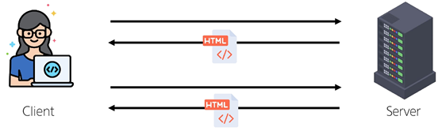

- SSR에서 routing은 서버 측해서 수행

- 서버가 사용자가 방문한 URL 경로를 기반으로 응답을 전송

- 링크를 클릭하면 브라우저는 서버로부터 HTML 응답을 수신하고 새 HTML로 전체 페이지를 다시 로드

### CSR에서의 Routing


- CSR에서 routing은 **클라이언트 측**에서 수행

- 클라이언트 측 JavaScript가 새 데이터를 동적으로 가져와 전체 페이지를 다시 로드하지 않음

### SPA에서 Routing이 없다면

- 유저가 URL을 통한 페이지의 변화를 감지할 수 없음

- 페이지가 무엇을 렌더링 중인지에 대한 상태를 알 수 없음
    - URL이 1개이기 때문에 새로 고침 시 처음 페이지로 되돌아감

    - 링크를 공유할 시 첫 페이지만 공유 가능

- 브라우저의 뒤로 가기 기능을 사용할 수 없음

- 페이지는 1개이지만, 주소에 따라 여러 컴포넌트를 새로 렌더링하여 마치 여러 페이지를 사용하는 것처럼 보이도록 해야 함

## Vue Router

### Vue Router

- Vue 공식 라우터

- The Official Router for Vue.js

### 사전 준비

- Vite로 프로젝트 생성 시 Router 추가
    
    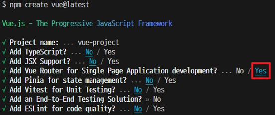
    
- 서버 실행 후 Router로 인한 프로젝트 변화 확인

- `Home`, `About` 링크에 따라 변경되는 URL과 새로 렌더링 되는 화면
    
    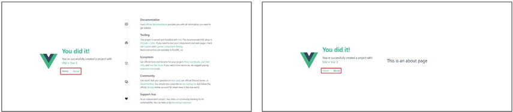
    

### Vue 프로젝트 구조 변화

- `App.vue` 코드 변화

- `router` 폴더 신규 생성

- `views` 폴더 신규 생성
    
    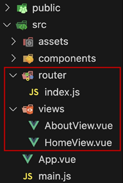
    

### RouterLink

- 페이지를 다시 로드하지 않고 URL을 변경하여 URL 생성 및 관련 로직을 처리

- HTML의 `<a>` 태그를 렌더링
    
    > App.vue
    > 
    
    ```jsx
    <RouterLink to="/">Home</RouterLink>
    <RouterLink to="/about">About</RouterLink>
    ```
    

### RouterView

- `RouterLink` URL에 해당하는 컴포넌트를 표시

- 원하는 곳에 배치하여 컴포넌트를 레이아웃에 표시할 수 있음
    
    > App.vue
    > 
    
    ```jsx
    <RouterView />
    ```
    

### RouterLink와 RouterView

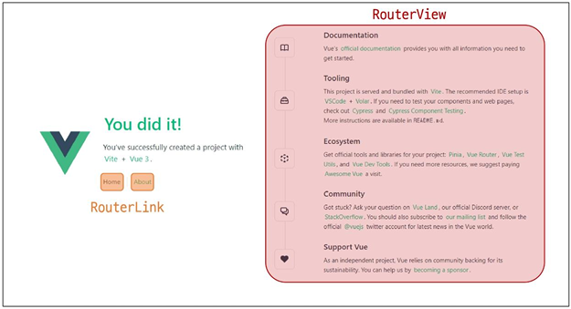

### router/index.js

- 라우팅에 관련된 정보 및 설정이 작성되는 곳

- `router`에 URL과 컴포넌트를 매핑
    
    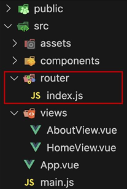
    

### views

- `RouterView` 위치에 렌더링할 컴포넌트를 배치

- 기존 `components` 폴더와 기능적으로 다른 것은 없으며 단순 분류의 의미로 구성됨

- **일반 컴포넌트와 구분하기 위해 컴포넌트 이름을 `View`로 끝나도록 작성하는 것을 권장**
    
    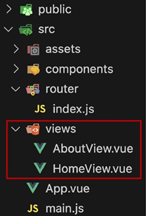
    

### 라우팅 기본

- `index.js`에 라우터 관련 설정 작성(주소, 이름, 컴포넌트)
    
    > index.js
    > 
    
    ```jsx
    const router = createRouter({
      routes: [
        {
          path: '/',
          name: 'home',
          component: HomeView,
        },
        ...
      ],
    })
    ```
    
- `RouterLink`의 `to` 속성으로 `index.js`에서 정의한 주소 값(`path`)을 사용
    
    > App.vue
    > 
    
    ```jsx
    <RouterLink to="/">Home</RouterLink>
    <RouterLink to="/about">About</RouterLink>
    ```
    
- `RouterLink` 클릭 시 경로와 일치하는 컴포넌트가 `RouterView`에서 렌더링 됨
    
    > App.vue
    > 
    
    ```jsx
    <RouterView />
    ```
    

### Named Routes

- 경로에 이름을 지정하는 라우팅

### Named Routes 예시

- `name` 속성 값에 경로에 대한 이름을 지정

- 경로에 연결하려면 `RouterLink`에 `v-bind`를 사용해 `to` props 객체로 전달
    
    > index.js
    > 
    
    ```jsx
    const router = createRouter({
      routes: [
        {
          path: '/',
          name: 'home',
          component: HomeView,
        },
        ...
      ],
    })
    ```
    
    > App.vue
    > 
    
    ```jsx
    <RouterLink :to="{ name: 'home' }">Home</RouterLink>
    <RouterLink :to="{ name: 'about' }">About</RouterLink>
    ```
    

### Named Routes 장점

- 하드 코딩된 URL을 사용하지 않아도 됨

- URL 입력 시 오타 방지

### Dynamic Route Matching

- URL의 일부를 변수로 사용하여 경로를 동적으로 매칭

### 매개변수를 사용한 동적 경로 매칭

- 주어진 패턴 경로를 동일한 컴포넌트에 매핑해야 하는 경우 활용

- 예를 들어 모든 사용자의 ID를 활용하여 프로필 페이지 URL을 설계한다면?
    - `user/1`

    - `user/2`

    - `user/3`

- 일정한 패턴의 URL 작성을 반복해야 함

### 매개변수를 사용한 동적 경로 매칭 활용

- `views` 폴더 내 `UserView` 컴포넌트 작성
    
    > UserView.vue
    > 
    
    ```jsx
    <template>
      <div>
        <h1>UserView</h1>
      </div>
    </template>
    ```
    
- 매개변수는 콜론( `:` )으로 표기

- `UserView` 컴포넌트 라우트 등록
    
    > index.js
    > 
    
    ```jsx
    import Userview from '../views/UserView.vue'
    
    const router = createRouter({
      routes: [
        {
          path: '/user/:id',
          name: 'user',
          component: Userview
        },
      ]
    })
    
    export default router
    ```
    
- 매개변수는 객체의 `params` 속성의 객체 타입으로 전달

- 단, 객체의 `key` 이름과 `index.js`에서 지정한 매개변수 이름이 같아야 함

- `UserView` 컴포넌트로 이동하기 위한 `RouterLink` 작성
    
    > App.vue
    > 
    
    ```jsx
    import { ref } from 'vue'
    
    const userId = ref(1)
    ```
    
    ```jsx
    <RouterLink :to="{ name: 'user', params: {'id' : userId} }">User</RouterLink>
    ```
    
- 경로가 일치하면 라우트의 매개변수는 컴포넌트에서 **`$route.params`**로 참조 가능

- 현재 사용자의 id를 출력하기
    
    > UserView.vue
    > 
    
    ```jsx
    <template>
      <div>
        <h1>UserView</h1>
        <h2>{{ $route.params.id }}번 User 페이지</h2>
      </div>
    </template>
    ```
    
    
    
- `userRoute()` 함수를 사용해 스크립트 내에서 반응형 변수에 할당 후 템플릿에 출력하는 것을 권장

- 템플릿에서 `$route`를 사용하는 것과 동일
    
    > UserView.vue
    > 
    
    ```jsx
    import { ref } from 'vue'
    import { useRoute } from 'vue-router'
    
    const route = useRoute()
    const userId = ref(route.params.id)
    ```
    
    ```jsx
    <template>
      <div>
        <h1>UserView</h1>
        <h2>{{ userId }}번 User 페이지</h2>
      </div>
    </template>
    ```
    

### Nested Routes

- 중첩된 라우팅

- 애플리케이션의 UI는 여러 레벨 깊이로 중첩된 컴포넌트로 구성되기도 함
    
    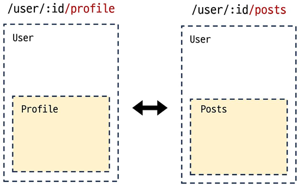
    

- 이 경우 URL을 중첩된 컴포넌트의 구조에 따라 변경되도록 이 관계를 표현할 수 있음

### children 옵션

- `children` 옵션은 배열 형태로 필요한 만큼 중첩 관계를 표현할 수 있음

### 중첩된 라우팅 활용

- 컴포넌트 생성

- `components` 폴더에 `UserProfile`, `UserPosts` 컴포넌트 작성
    
    > UserProfile.vue
    > 
    
    ```jsx
    <template>
      <div>
        <h1>UserProfile</h1>
      </div>
    </template>
    ```
    
    > UserPosts.vue
    > 
    
    ```jsx
    <template>
      <div>
        <h1>UserPosts</h1>
      </div>
    </template>
    ```
    
- 라우터 등록

- `index.js`에 두 컴포넌트를 `import`
    
    > index.js
    > 
    
    ```jsx
    import UserProfile from '@/components/UserProfile.vue'
    import UserPosts from '@/components/UserPosts.vue'
    ```
    
- `children` 옵션은 사용해 중첩된 라우터에 컴포넌트를 등록
    
    > index.js
    > 
    
    ```jsx
    {
      path: '/user/:id',
      name: 'user',
      component: Userview,
      children: [
        // UserProfile은 UserView의 <RouterView> 내부에 렌더링
        { path: 'profile', name: 'user-profile', component: UserProfile },
    
        // UserPosts는 UserView의 <RouterView> 내부에 렌더링
        { path: 'posts', name: 'user-posts', component: UserPosts }
      ]
    },
    ```
    
- 두 컴포넌트에 대한 `RouterLink` 및 `RouterView` 작성
    
    > UserView.vue
    > 
    
    ```jsx
    <template>
      <div>
        <RouterLink :to="{ name: 'user-profile' }">Profile</RouterLink>
        <RouterLink :to="{ name: 'user-posts' }">Posts</RouterLink>
        <h1>UserView</h1>
        <h2>{{ userId }}번 User 페이지</h2>
        <hr>
        <RouterView />
      </div>
    </template>
    ```
    
- `Profile`과 `Posts` 링크를 클릭해서 렌더링 결과 확인
    
    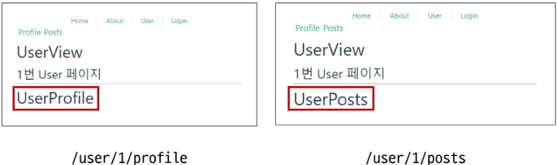
    
- 중첩된 Named Routes를 다룰 때는 일반적으로 “하위 경로에만 이름을 지정”

- 이렇게 하면 `/user/:id`로 이동했을 때 항상 중첩된 경로가 표시됨
    
    > index.js
    > 
    
    ```jsx
    import UserHome from '@/components/UserHome.vue'
    
    {
      path: '/user/:id',
      // name: 'user',
      component: Userview,
      children: [
        { path: '', name: 'user', component: UserHome },
        { path: 'profile', name: 'user-profile', component: UserProfile },
        { path: 'posts', name: 'user-posts', component: UserPosts }
      ]
    },
    ```
    
- `UserHome` 컴포넌트 생성
    
    > components/UserHome.vue
    > 
    
    ```jsx
    <template>
      <div>
        <h1>UserHome</h1>
      </div>
    </template>
    
    <script setup>
    </script>
    ```
    
- 이제 `/user/:id` 접속 시 중첩된 경로가 표시

- 단, 이전처럼 상위 경로의 이름을 유지하는 구조로 작성해도 무관
    
    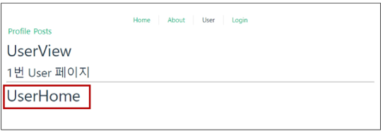
    

### ※주의※ 중첩된 라우팅

- 컴포넌트 간 부모 - 자식 관계 관점이 아닌 URL에서의 중첩된 관계를 표현하는 관점으로 바라보기

### Programmatic Navigation

- `RouterLink` 대신 JavaScript를 사용해 페이지를 이동하는 것

### 프로그래밍 방식 네비게이션

- 프로그래밍으로 URL 이동하기

- `router`의 인스턴스 메서드를 사용해 `RouterLink`로 `<a>` 태그를 만드는 것처럼 프로그래밍으로 네비게이션 관련 작업을 수행할 수 있음

### router의 메서드

- 다른 위치로 이동하기
    - `router.push()`

- 현재 위치 바꾸기
    - `router.replace()`

### `router.push()`

- 다른 위치로 이동하기 (Navigate to a different location)

- 다른 URL로 이동하는 메서드

- 새 항목을 history stack에 push하므로 사용자가 브라우저 뒤로 가기 버튼을 클릭하면 이전 URL로 이동할 수 있음

- `RouterLink`를 클릭했을 때 내부적으로 호출되는 메서드이므로 `RouterLink`를 클릭하는 것은 `router.push()`를 호출하는 것과 같음
    
    
    | 선언적 표현 | 프로그래밍적 표현 |
    | --- | --- |
    | `<RouterLink :to=”…”>` | `router.push(…)` |

### router.push 활용

- `UserView` 컴포넌트에서 `HomeView` 컴포넌트로 이동하는 버튼 만들기
    
    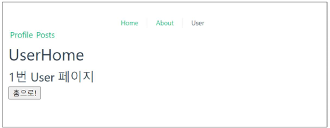
    
    > UserView.vue
    > 
    
    ```jsx
    import { useRoute, useRouter } from 'vue-router'
    
    const router = useRouter()
    
    const goHome = function() {
      router.push({ name: 'home'})
    }
    ```
    
    ```jsx
    <button @click="goHome">홈으로!</button>
    ```
    

### `router.replace()`

- 현재 위치 바꾸기(Replace current location)

- `push` 메서드와 달리 history stack에 새로운 항목을 push하지 않고 다른 URL로 이동
    - 이동 전 URL로 뒤로 가기 불가
    
    | 선언적 표현 | 프로그래밍적 표현 |
    | --- | --- |
    | `<RouterLink :to=”…” replace>` | `router.replace(…)` |

### router.replace 활용

- `UserView` 컴포넌트에서 `HomeView` 컴포넌트로 이동하는 버튼 만들기
    
    > UserView.vue
    > 
    
    ```jsx
    const goHome = function() {
      // router.push({ name: 'home'})
      router.replace({ name: 'home' })
    }
    ```
    

### [참고] router.push의 인자 활용

- https://router.vuejs.org/guide/essentials/navigation.html
    
    ```jsx
    // literal string path
    router.push('/users/alice')
    
    // object with path
    router.push({ path: '/users/alice' })
    
    // named route with params to let the router build the url
    router.push({ name: 'user', params: { username: 'alice' } })
    
    // with query, resulting in /register?plan=private
    router.push({ path: '/register', query: { plan: 'private' } })
    ```
    

## Navigation Guard

### Navigation Guard

- Vue router를 통해 특정 URL에 접근할 때 다른 URL로 redirect를 하거나 취소하여 네비게이션을 보호

- 라우트 전환 전/후 자동으로 실행되는 Hook

### Navigation Guard 종류

- `Globally` (전역 가드)
    - 애플리케이션 전역에서 모든 라우터 전환에 적용되는 가드

- `Per-route` (라우터 가드)
    - 특정 라우트에만 적용되는 가드

- `In-component` (컴포넌트 가드)
    - 컴포넌트 내에서만 적용되는 가드

### Globally Guard

- 애플리케이션 전역에서 동작하는 가드

- 작성위치 : `index.js`

### Globally Guard 종류

- `beforeEach()`

- `beforeResolve()`

- `afterEach()`

### `router.beforeEach()`

- 다른 URL로 이동하기 직전에 실행되는 함수 (Global Before Guards)

### router.beforeEach 구조

```jsx
router.beforeEach((to, from) => {
	...
	return false 또는 return { name: 'About' }
})
```

- 모든 가드는 2개의 인자를 받음
    - `to` : 이동할 URL 정보가 담긴 Route 객체

    - `from` : 현재 URL 정보가 담긴 Route 객체

- 선택적으로 다음 값 중 하나를 반환
    - `false`
        - 현재 내비게이션을 취소

        - 브라우저 URL이 변경된 경우(사용자가 수동으로 또는 뒤로가기 버튼을 통해) `from` 경로의 URL로 재설정

    - `Route Location`
        - `router.push()`를 호출하는 것처럼 경로 위치를 전달하여 다른 위치로 redirect

        - return이 없다면 자동으로 `to` URL Route 객체로 이동

### router.beforeEach 예시

- 전역 가드 `beforeEach` 작성

- `HomeView`에서 `UserView`로 이동했을 때 각 인자 값 출력 확인하기
    
    > index.js
    > 
    
    ```jsx
    router.beforeEach((to, from) => {
      console.log(to)
      consolo.log(from)
    })
    
    export default router
    ```
    
- `Home`에서 `User`로 이동해보기

- `to`에는 이동할 URL인 `user` 라우트에 대한 정보가, `from`에는 현재 URL인 `home` 라우트에 대한 정보가 들어있음
    
    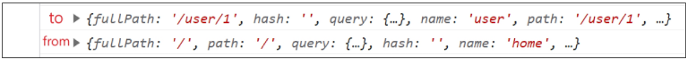
    

### router.beforeEach 활용

- “Login이 되어있지 않다면 페이지 진입을 막고 Login 페이지로 이동시키기”

- `LoginView` 컴포넌트 작성 및 라우트 등록
    
    > LoginView.vue
    > 
    
    ```jsx
    <template>
      <div>
        <h1>Login View</h1>
      </div>
    </template>
    ```
    
    > index.js
    > 
    
    ```jsx
    import LoginView from '@/components/LoginView.vue'
    
    {
      path: '/login',
      name: 'login',
      component: LoginView,
    }
    ```
    
    > App.vue
    > 
    
    ```jsx
    <RouterLink :to="{ name: 'login' }">Login</RouterLink>
    ```
    
- 어떤 `RouterLink`를 클릭해도 `LoginView` 컴포넌트만 볼 수 있음

- 만약 로그인이 되어있지 않고(1), 이동하는 주소 이름이 `login`이 아니라면(2) login 페이지로 redirect
    
    > index.js
    > 
    
    ```jsx
    router.beforeEach((to, from) => {
      const isAuthenticated = false
      
      if (!isAuthenticated && to.name !== 'login') {
        console.log('로그인이 필요합니다.')
        return { name: 'login' }
      }
    })
    ```
    

### Per-route Guard

- 특정 라우터에서만 동작하는 가드

- 작성 위치 : `index.js`의 각 `routes`

### Per-route Guard 종류

- `beforeEnter()`

### `router.beforeEnter()`

- 특정 route에 진입했을 때만 실행되는 함수

- 단순히 URL의 매개변수나 쿼리 값이 변경될 때는 실행되지 않고 다른 URL에서 탐색해 올 때만 실행됨

### router.beforeEnter 구조

- `routes` 객체에서 구조
    
    ```jsx
    {
      path: '/user/:id',
      name: 'user',
      component: UserView,
      beforeEnter: (to, from) => {
        ...,
        return false
      }
    },
    ```
    

### router.beforeEnter 예시

- 라우터 가드 `beforeEnter` 작성

- `HomeView`에서 `UserView`로 이동 후 각 인자 값 출력 확인하기
    
    > index.js
    > 
    
    ```jsx
    {
      path: '/user/:id',
      name: 'user',
      component: UserView,
      beforeEnter: (to, from) => {
        console.log(to)
        console.log(from)
      }
    },
    ```
    
- `to`에는 이동할 URL인 `user` 라우트에 대한 정보가, `from`에는 현재 URL인 `home` 라우트에 대한 정보가 들어있음

- 다른 경로에서 `user` 라우트를 탐색했을 때 실행된 것
    
    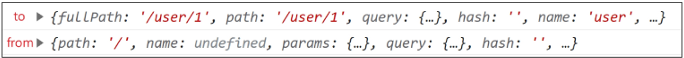
    

### router.beforeEnter 활용

- “이미 로그인한 상태라면 `LoginView` 진입을 막고 `HomeView`로 이동시키기”

- 전역 가드 `beforeEach` 관련 코드는 주석 처리 후 진행

- 로그인 상태라면 `HomeView`로 이동

- 로그인 상태가 아니라면 `LoginView`로 이동
    
    > index.js
    > 
    
    ```jsx
    const isAuthenticated = true
    
    const router = createRouter({
      routes: [
        {
          path: '/login',
          name: 'login',
          component: LoginView,
          beforeEnter: (to, from) => {
            if (isAuthenticated === true) {
              console.log('이미 로그인 상태입니다.')
              return { name: 'home'}
            }
          }
        },
        ...
    ```
    
    
    

### In-component Guard

- 특정 컴포넌트 내에서만 동작하는 가드

- 작성 위치 : 각 컴포넌트의 `<script>` 내부

### In-component Guard 종류

- `onBeforeRouteLeave()`
    - 현재 라우트에서 다른 라우트로 이동하기 전에 실행

    - 사용자가 현재 페이지를 떠나는 동작에 대한 로직을 처리

- `onBeforeRouteUpdate()`
    - 이미 렌더링된 컴포넌트가 같은 라우트 내에서 업데이트되기 전에 실행

    - 라우트 업데이트 시 추가적인 로직을 처리

### onBeforeRouteLeave() 활용

- 사용자가 `UserView`를 떠날 시 팝업 창 출력하기
    
    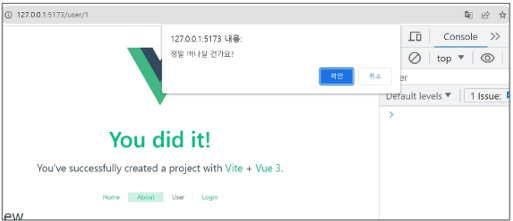
    
    > UserView.vue
    > 
    
    ```jsx
    import { onBeforeRouteLeave } from 'vue-router';
    
    onBeforeRouteLeave((to, from) => {
      const answer = window.comfirm('정말 떠나실 건가요?')
      if (answer === false) {
        return false
      }
    })
    ```
    

### onBeforeRouteUpdate 활용

- `UserView` 페이지에서 다른 `id`를 가진 `User`의 `UserView` 페이지로 이동하기

- 같은 라우트 내에서 업데이트 되는 경우 (`/user/1` → `/user/100`)
    
    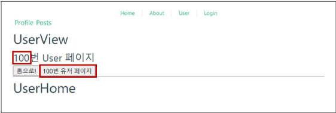
    
    > UserView.vue
    > 
    
    ```jsx
    <button @click="routeUpdate">100번 유저 페이지</button>
    ```
    
    ```jsx
    import { onBeforeRouteLeave, onBeforeRouteUpdate } from 'vue-router';
    
    const routeUpdate = function () {
      router.push({ name: 'user', params: { id: 100 } })
    }
    
    onBeforeRouteUpdate((to, from) => {
      userId.value = to.params.id
    })
    ```
    

### 만약 onBeforeRouteUpdate를 사용하지 않았다면?

- `onBeforeRouteUpdate`에서 `userId`를 변경하지 않으면 `userId`는 갱신되지 않음

- 컴포넌트가 재사용되었기 때문
    
    > UserView.vue
    > 
    
    ```jsx
    // onBeforeRouteUpdate((to, from) => {
    //   userId.value = to.params.id
    // })
    ```
    
    
    

### Navigation Guard 정리

- `Globally` (전역 가드)
    - 애플리케이션 전역에서 동작

    - 작성 위치 : **`index.js`**

- `Per-route` (라우터 가드)
    - 특정 route에서만 동작

    - 작성 위치 : **`index.js`의 각 `routes`**

- `In-component` (컴포넌트 가드)
    - 특정 컴포넌트 내에서만 동작

    - 작성 위치 : **각 컴포넌트의 `script`**

## 참고

### Lazy Loading Routes

- Vue 애플리케이션 첫 빌드 시 해당 컴포넌트를 로드하지 않고, 해당 경로를 처음 방문할 때 컴포넌트를 로드하는 것
    - 앱을 빌드할 때 처음부터 모든 컴포넌트를 준비하면 컴포넌트의 크기에 따라 페이지 로드 시간이 길어질 수 있기 때문
    
    > index.js
    > 
    
    ```jsx
    {
      path: '/about',
      name: 'about',
      // route level code-splitting
      // this generates a separate chunk (About.[hash].js) for this route
      // which is lazy-loaded when the route is visited.
      component: () => import('../views/AboutView.vue'),
    },
    ```