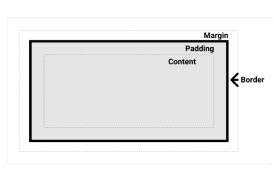
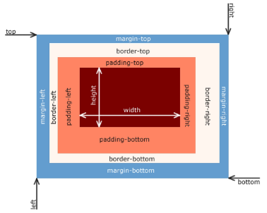

# CSS Box Model

[CSS Box Model](#css-box-model-1)   
[박스 타입](#박스-타입)   
[HTML 스타일 가이드](#html-스타일-가이드)   
[CSS 스타일 가이드](#css-스타일-가이드)   
[개발자 도구](#개발자-도구)   
[box 구성 요소](#box-구성-요소)   
[shorthand 속성](#shorthand-속성)   
[box-sizing 속성](#box-sizing-속성)   
[기타 display 속성](#기타-display-속성)   

---

## CSS Box Model

### CSS Box Model

- 웹 페이지의 모든 HTML 요소를 감싸는 사각형 상자 모델

- 원은 네모 박스를 깎은 것

## 박스 타입

### 박스 타입

1. Block box
    - 아래쪽으로 출력
    
    - 대부분이 Block box

2. Inline box
    - 오른쪽으로 출력
    
    - 대표적으로 a 태그(앵커 태그), 이미지 태그

- 박스 타입에 따라 페이지에서의 배치 흐름 및 다른 박스와 관련하여 박스가 동작하는 방식이 달라짐

- 표기는 오른쪽 아니면 아래쪽으로 출력

- 항상 시작점은 좌측 상단

### 박스 표시(Display) 타입

- Outer Display Type
    - 박스가 문서 흐름에서 어떻게 동작할지를 결정
    
    - 속성
        - block, inline

- Inner Display Type

### Outer Display Type - block 특징

- 항상 새로운 행으로 나뉨

- width와 height 속성 사용 가능

- padding, margin, border로 인해 다른 요소를 상자로부터 밀어냄

- width 속성을 지정하지 않으면 박스는 inline 방향으로 사용 가능한 공간을 모두 차지함
    - 상위 컨테이너 너비 100%로 채우는 것

- 대표적인 block 타입 태그
    - h1 ~ h6, p, div

### Outer Display Type - inline 특징

- 새로운 행으로 넘어가지 않음

- width와 height 속성을 사용할 수 없음

- 수직 방향
    - padding, margin, border가 적용되지만 다른 요소를 밀어낼 수는 없음

- 수평 방향
    - padding, margin, border가 적용되어 다른 요소를 밀어낼 수 있음

- 대표적인 inline 타입 태그
    - a, img, span, strong, em

### Normal Flow

- 일반적인 흐름 또는 레이아웃을 변경하지 않은 경우 웹 페이지 요소가 배치되는 방식

### Inner Display Type

- 박스 내부의 요소들이 어떻게 배치될지를 결정

- 속성
    - flex

## HTML 스타일 가이드

- 대소문자 구분
    - HTML은 대소문자를 구분하지 않지만, 소문자 사용을 강력히 권장
    
    - 태그명과 속성명 모두 소문자로 작성

- 속성 따옴표
    - 속성 값에는 큰 따옴표(”)를 사용하는 것이 일반적

- 공백 처리
    - HTML은 연속된 공백을 하나로 처리
    
    - Enter 키로 줄 바꿈을 해도 브라우저에서 인식하지 않음
    
    - 줄 바꿈 태그를 사용해야 함

- 에러 출력 없음
    - HTML은 문법 오류가 있어도 별도의 에러 메세지를 출력하지 않음
    
    - 프로그래밍 언어가 아니기 때문에 어느 부분이 틀렸는지 알아서 찾아야 함

- 코드 구조와 포맷팅
    - 일관된 들여쓰기를 사용 (보통 2칸 공백)
    
    - 각 요소는 한 줄에 하나씩 작성
    
    - 중첩된 요소는 한 단계 더 들여쓰기

## CSS 스타일 가이드

- 코드 구조와 포맷팅
    - 일관된 들여쓰기를 사용 (보통 2칸 공백)
    
    - 선택자와 속성은 각각 새 줄에 작성
    
    - 중괄호 앞에 공백 넣기
    
    - 속성 뒤에는 콜론(:)과 공백 넣기
    
    - 마지막 속성 뒤에는 세미콜론(;) 넣기

- 선택자 사용
    - class 선택자를 우선적으로 사용
    
    - id, 요소 선택자 등은 가능한 피할 것
    
    - 여러 선택자들과 함께 사용할 경우 우선순위 규칙에 따라 예기치 못한 스타일 규칙이 적용되어 전반적인 유지보수가 어려워지기 때문

- 속성과 값
    - 속성과 값은 소문자로 작성
   
    - 0 값에는 단위를 붙이지 않음

- 명명 규칙
    - 클래스 이름은 의미 있고 목적을 나타내는 이름을 사용
    
    - 케밥 케이스(kebab-case)를 사용
    
    - 약어보다는 전체 단어를 사용

- CSS 적용 스타일
    - 인라인(inline) 스타일은 되도록 사용하지 말 것
    
    - CSS와 HTML 구조 정보가 혼합되어 작성되기 때문에 코드를 이해하기 어렵게 만듦

## 개발자 도구

- 개발자 도구 안에서 바꿀수도 있지만

- 박스를 선택하고 아랫쪽 style 에서도 확인할 수 있다.

- 디버깅을 할 때, 코드에서도 할 수 있지만 일시적으로는 개발자도구에서 바꿀 수 있다.

## Box 구성 요소

### Box 구성 요소

- Content
    - 콘텐츠가 표시되는 영역

- Padding
    - 콘텐츠 주위에 위치하는 공백 영역

- Border
    - 콘텐츠와 패딩을 감싸는 테두리 영역

- Margin
    - 이 박스와 다른 요소 사이의 공백
    
    - 가장 바깥쪽 영역   

    

- Content Box
    - 실제 콘텐츠가 표시되는 영역 크기
    
    - width 및 height 속성을 사용하여 크기 조정

- Padding Box
    - 콘텐츠 주위에 공백
    
    - padding 관련 속성을 사용하여 크기 조정

- Border Box
    - 콘텐츠와 패딩을 래핑
 
    - border 관련 속성을 사용하여 크기 조정

- Margin Box
    - 콘텐츠, 패딩 및 테두리를 래핑
 
    - 박스와 다른 요소 사이의 공백
 
    - margin 관련 속성을 사용하여 크기 조정

### Box 구성의 방향 별 속성 값

## shorthand 속성

### shorthand 속성

- ‘border’
    - border-width, border-style, border-color를 한 번에 설정하기 위한 속성

- ‘margin’ & ‘padding’
    - 4방향의 속성을 각각 지정하지 않고 한 번에 지정할 수 있는 속성

    - 속성의 갯수에 따라 방향 설정

        - 4개 - 상 우 하 좌

        - 3개 - 상 좌우 하

        - 2개 - 상하 좌우

        - 1개 - 공통

## box-sizing 속성

### The Standard CSS box model

- 표준 상자 모델에서 width와 height 속성 값을 설정하면 이 값은 content box의 크기를 조정하게 됨

- CSS는 border box가 아닌 content box의 크기를 width 값으로 지정

- 대체 상자 모델에서 모든 width와 height는 실제 상자의 너비

- 실제 박스 크기를 정하기 위해 테두리와 패딩을 조정할 필요 없음

## 기타 display 속성

### 기타 display 속성

- inline - block

- none

### inline-block

- inline과 block 요소 사이의 중간 지점을 제공하는 display 값

- width 및 height 속성 사용 가능

- padding, margin 및 border로 인해 다른 요소가 상자에서 밀려남

- 새로운 행으로 넘어가지 않음

- 요소가 줄 바꿈되는 것을 원하지 않으면서 너비와 높이를 적용하고 싶은 경우에 사용

### none

- 요소를 화면에 표시하지 않고, 공간조차 부여되지 않음

- 버튼을 누르거나 화면이 축소되었을 때 사라지는 것을 표현할 때 사용