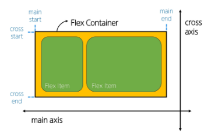
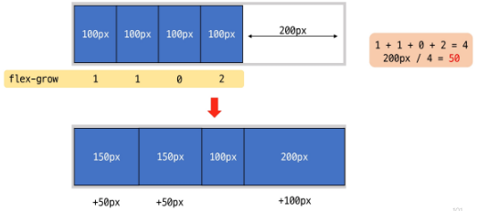

# CSS Flexbox

[CSS flexbox](#css-flexbox-1)   
[flexbox 속성](#flexbox-속성)   
[flex-wrap 응용](#flex-wrap-응용)   

---

## CSS Flexbox

### CSS Flexbox

- 요소를 행과 열 형태로 배치하는 1차원 레이아웃 방식

- 공간 배열과 정렬

## Flexbox 구성 요소

### main axis (주 축)

- flex item들이 배치되는 기본 축

- main start에서 시작하여 main end 방향으로 배치 (기본 값)

### cross axis (교차 축)

- main axis에 수직인 축

- cross start에서 시작하여 cross end 방향으로 배치 (기본 값)

### Flex Container

- `display : flex;` 혹은 `display: inline-flex;` 가 설정된 부모 요소

- 이 컨테이너의 1차 지식 요소들이 Flex Item이 됨

- flexbox 속성 값들을 사용하여 자식 요소 Flex Item들을 배치하는 주체

### Flex Item

- Flex Container 내부에 레이아웃 되는 항목

## Flexbox 속성

### Flexbox 속성 목록

- Flex Container 관련 속성
    - display, flex-direction, flex-wrap, justify-content, align-items, align-content

- Flex Item 관련 속성
    - align-self, flex-grow, flex-basis, order

### Flex Container 지정

- flex item은 기본적으로 행(주 축의 기본 값인 가로 방향)으로 나열

- flex item은 주 축의 시작 선에서 시작

- flex item은 교차 축의 크기를 채우기 위해 늘어남

### flex-direction

- flex item이 나열되는 방향을 지정

- column으로 지정할 경우 주 축이 변경됨

- `-reverse`로 지정하면 flex item 배치의 시작 선과 끝 선이 서로 바뀜

### flex-wrap

- flex item 목록이 flex container의 한 행에 들어가지 않을 경우 다른 행에 배치할지 여부 설정

- `nowrap` 이 기본 값

### justify-content

- 주 축을 따라 flex item과 주위에 공간을 분배

### align-content

- 교차 축을 따라 flex item과 주위에 공간을 분배

- flex-wrap이 wrap 또는 wrap-reverse로 설정된 여러 행에만 적용됨

- 한 줄 짜리 행에는 효과 없음 (flex-wrap이 nowrap으로 설정된 경우)

### align-items

- 교차 축을 따라 flex item 행을 정렬

### align-self

- 교차 축을 따라 개별 flex item을 정렬

### 목적에 따른 속성 분류

- 배치

  - flex-direction
  
  - flex-wrap

- 공간 분배

  - justify-content
  
  - align-content

- 정렬

  - align-items
  
  - align-self

### 속성명 Tip

- justify

  - 주 축
  
  - content

- align

  - 교차 축
  
  - content
  
  - items
  
  - self

### flex-grow

- 남는 행 여백을 비율에 따라 각 flex item에 분배
    - 아이템이 컨테이너 내에서 확장하는 비율을 지정
    
    - 배율을 결정하는 것이 아님

- flex-grow의 반대는 flex-shrink
    - 남은 길이를 flex-grow 합만큼 등분해서 갯수대로 분배

### flex-basis

- flex item의 초기 크기 값을 지정

- flex-basis와 width 값을 동시에 적용한 경우 flex-basis가 우선

## flex-wrap 응용

### 반응형 레이아웃

- 다양한 디바이스와 화면 크기에 자동으로 적응하여 콘텐츠를 최적으로 표시하는 웹 레이아웃 방식

### 반응형 레이아웃 작성

- flex-wrap을 사용해 반응형 레이아웃 작성

- flex-grow & flex-basis 활용