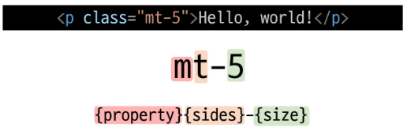
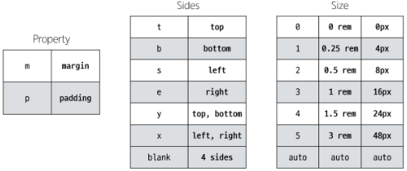
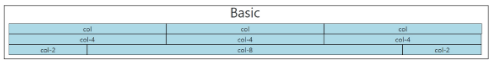
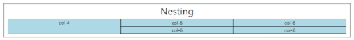
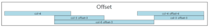

# Bootstrap

[Bootstrap](#bootstrap-1)   
[Reset CSS](#reset-css)   

[Bootstrap 활용](#bootstrap-활용)   
[Typography](#typography)   
[Colors](#colors)   
[Component](#component)   
[Semantic Web](#semantic-web)   

[Bootstrap을 사용하는 이유](#bootstrap을-사용하는-이유)   
[책임과 역할](#책임과-역할)   
[의미론적인 마크업이 필요한 이유](#의미론적인-마크업이-필요한-이유)   

[Bootstrap Grid System](#bootstrap-grid-system)

---

## Bootstrap

### Bootstrap

- CSS 프론트엔드 프레임워크 (Toolkit)

- 미리 만들어진 다양한 디자인 요소들을 제공하여 웹사이트를 빠르고 쉽게 개발할 수 있도록 함

### CDN Content Delivery Network

- 지리적 제약 없이 빠르고 안전하게 콘텐츠를 전송할 수 있는 전송 기술

- 서버와 사용자 사이의 물리적인 거리를 줄여 콘텐츠 로딩에 소요되는 시간을 최소화

- 웹 페이지 로드 속도를 높임
    - 지리적으로 사용자와 가까운 CDN 서버에 콘텐츠를 저장해서 사용자에게 전달

### Bootstrap 기본 사용법

- {margin}{top}-5

- **Bootstrap에는 특정한 규칙이 있는 클래스 이름으로 스타일 및 레이아웃이 미리 작성되어 있음**

### Bootstrap에서 클래스 이름으로 Spacing을 표현하는 방법

## Reset CSS

### Reset CSS

- 모든 HTML 요소 스타일을 일관된 기준으로 재설정하는 간결하고 압축된 규칙 세트

- HTML Element, Table, List 등의 요소들에 일관성 있게 스타일을 적용시키는 기본 단계

### Reset CSS 사용 배경

- 모든 브라우저는 각자의 ‘user agent stylesheet’를 가지고 있음
    - 웹사이트를 보다 읽기 편하게 하기 위해

- 문제는 이 설정이 브라우저마다 상이하다는 것

- 모든 브라우저에서 웹 사이트를 동일하게 보이게 만들어야 하는 개발자에겐 매우 골치 아픈 일

- 모두 똑같은 스타일 상태로 만들고 스타일 개발을 시작하자

### User-agent Stylesheets

- 모든 문서에 기본 스타일을 제공하는 기본 스타일 시트

### Normalize CSS

- Reset CSS 방법 중 대표적인 방법

- 웹 표준 기준으로 브라우저 중 하나가 불일치한다면 차이가 있는 브라우저를 수정하는 방법
    - 경우에 따라 IE 또는 EDGE 브라우저는 표준에 따라 수정할 수 없는 경우도 있음
    
    - 이 경우 IE 또는 EDGE 스타일을 나머지 브라우저에 적용시킴

### Bootstrap에서의 Reset CSS

- bootstrap은 `bootstrap-reboot.css` 라는 파일명으로 `normalize.css`를 자체적으로 커스텀해서 사용하고 있음

# Bootstrap 활용

## Typography

### Typography

- 제목, 본문 텍스트, 목록 등

### Display Headings

- 기존 Heading보다 더 눈에 띄는 제목이 필요한 경우

- 더 크고 약간 다른 스타일

### Inline Text Elements

- HTML inline 요소에 대한 스타일

### Lists

- HTML list 요소에 대한 스타일

## Colors

### Bootstrap Color System

- Bootstrap이 지정하고 제공하는 색상 시스템

### Colors

- Text, Border, Background 및 다양한 요소에 사용하는 Bootstrap의 색상 키워드

### Text Colors

### Background Colors

## Component

### Bootstrap Component

- Bootstrap에서 제공하는 **UI 관련 요소**

- **버튼, 네비게이션 바, 카드, 폼, 드롭다운** 등

### 대표 Component

- Alerts

- Badges

- Buttons

- Cards

- Navbar

### Component 이점

- 일관된 디자인을 제공하여 웹 사이트의 구성 요소를 구축하는 데 유용하게 활용

## Semantic Web

- 웹 데이터를 의미론적으로 구조화된 형태로 표현하는 방식

### HTML 요소가 의미를 가진다는 것

- 단순히 제목처럼 보이게 큰 글자로 만드는 것

- 페이지 내 최상위 제목 이라는 의미를 제공하는 요소 h1

- 브라우저의 의해 스타일이 지정됨

### HTML Semantic Element

- 기본적인 모양과 기능 이외에 의미를 가지는 HTML 요소

- 검색 엔진 및 개발자가 웹 페이지 콘텐츠를 이해하기 쉽도록

### 대표적인 Semantic Element

- header

- nav

- main

- article

- section

- aside

- footer

### CSS 방법론

- CSS를 효율적이고 유지 보수가 용이하게 작성하기 위한 일련의 가이드라인

### OOCSS Object Oriented CSS

- 객체 지향적 접근법을 적용하여 CSS를 구성하는 방법론

### OOCSS 기본 원칙

- 구조와 스킨을 분리
    - 구조와 스킨을 분리함으로써 재사용 가능성을 높임
    
    - 모든 버튼의 **공통** 구조를 정의
    
    - **각각**의 스킨(배경색과 폰트 색상)을 정의

- 컨테이너와 콘텐츠를 분리
    - 객체의 직접 적용하는 대신 객체를 둘러싸는 컨테이너에 스타일을 적용
    
    - 스타일을 정의할 때 위치에 의존적인 스타일을 사용하지 않도록 함
    
    - 콘텐츠를 다른 컨테이너로 이동시키거나 재배치할 때 스타일이 깨지는 것을 방지

## Bootstrap을 사용하는 이유

- 가장 많이 사용되는 CSS 프레임워크

- 사전에 디자인된 다양한 컴포넌트 및 기능
    - 빠른 개발과 유지 보수

- 손쉬운 반응형 웹 디자인 구현

- 커스터마이징(customizing)이 용이

- 크로스 브라우징(Cross browsing) 지원
    - 모든 주요 브라우저에서 작동하도록 설계되어 있음

## 책임과 역할

### HTML

- 콘텐츠의 구조와 의미

### CSS

- 레이아웃과 디자인

## 의미론적인 마크업이 필요한 이유

### 검색엔진 최적화(SEO)

- 검색 엔진이 해당 웹 사이트를 분석하기 쉽게 만들어 검색 순위에 영향을 줌

### 웹 접근성 (Web Accessibility)

- 웹 사이트, 도구, 기술이 고령자나 장애를 가진 사용자들이 사용할 수 있도록 설계 및 개발

- ex) 스크린 리더를 통해 전맹 시각장애 사용자에게 웹의 글씨를 읽어줌

## Bootstrap Grid System

### Bootstrap Grid System

- 웹 페이지의 레이아웃을 조정하는 데 사용되는 12개의 컬럼으로 구성된 시스템

### Grid System 목적

- 반응형 디자인을 지원해 웹 페이지를 모바일, 태블릿, 데스크탑 등 다양한 기기에서 적절하게 표시할 수 있도록 도움

### 반응형 웹 디자인 Responsive Web Design

- 디바이스 종류나 화면 크기에 상관없이, 어디서든 일관된 레이아웃 및 사용자 경험을 제공하는 디자인 기술

## Grid System 구조

### Grid System 기본 요소

- Container
    - Column들을 담고 있는 공간

- Column
    - 실제 컨텐츠를 포함하는 부분

- Gutter
    - 컬럼과 컬럼 사이의 여백 영역

- 1개의 row 안에 12개의 column 영역이 구성
    - 각 요소는 12개 중 몇개를 차지할 것인지 지정됨

### Grid System 실습

- container
    - 기본적인 구조
    
    - 전체를 몇 줄로 나눌건지 결정
    
    
    
- Nesting (중첩)
    - 행을 합쳐서  표시
    
    
    
- Offset (상쇄)
    - 빈 공간을 생성(상쇄)
    
    - 상쇄 다음에 나오는 블럭한테 `offset-`
    
    
    

### Gutters

- Grid System에서 Column 사이에 여백 영역

- x축은 pading, y축은 margin으로 여백 생성

- x축을 margin으로 하면 정해놓은 row(좌우 길이)를 벗어나기 때문에 사용 X

## Grid System for Responsive Web

### Responsive Web Design

- 디바이스 종류나 화면 크기에 상관없이, 어디서든 일관된 레이아웃 및 사용자 경험을 제공하는 디자인 기술

- 12개의 column과 **6개의 breakpoints**를 사용하여 반응형 웹 디자인 구현

### Grid System Breakpoints

- 웹 페이지를 다양한 화면 크기에서 적절하게 배치하기 위한 분기점

- 화면 너비에 따라 6개의 분기점 제공 (xs, sm, md, lg, xl, xxl)

- 각 breakpoints마다 설정된 최대 너비 값 **이상으로** 화면이 커지면 Grid System 동작이 변경됨

### CSS Layout 종합 정리

- CSS Layout 기술들은 각각 고유한 특성과 장단점을 가지고있음

- 상호 보완적이며, 특정 상황에 따라 적합한 도구가 달라짐

- 최적의 기술을 선택하고 효과적으로 활용하기 위해서는 다양한 실제 개발 경험이 필수적

## UX & UI

### UX User Experience

- 제품이나 서비스를 사용하는 사람들이 느끼는 전체적인 경험과 만족도를 개선하고 최적화하기 위한 디자인과 개발 분야

### UX 설계

- 사람들의 마음과 생각을 이해하고 정리해서 제품에 녹여내는 과정

- 유저 리서치, 데이터 설계 및 정제, 유저 시나리오, 프로토타입 설계

### UI User Interface

- 서비스와 사용자 간의 상호작용을 가능하게 하는 디자인 요소들을 개발하고 구현하는 분야

### UI 설계

- 예쁜 디자인보다는 사용자가 더 쉽고 편리하게 사용할 수 있도록 고려

- 이를 위해서는 디자인 시스템, 중간 산출물, 프로토타입 등이 필요

## 자주 쓰는 단축키

### alt + 커서 좌클릭

- 여러 커서 만들기

### ctrl + L

- 해당 줄 전체 선택

### alt + shift + 방향키

- 해당 방향으로 복사 붙여넣기

### alt + 방향키

- 해당 줄 이동

## The Grid System

- CSS가 아닌 편집 디자인에서 나온 개념으로 구성요소를 잘 배치해서 시각적으로 좋은 결과물을 만들기 위함

- 기본적으로 안쪽에 있는 요소들의 오와 열을 맞추는 것에서 기인

- 정보 구조와 배열을 체계적으로 작성하여 정보의 질서를 부여하는 시스템

## Grid Cards

- `row-cols`  클래스를 사용하여 행당 표시할 열(카드) 수를 손쉽게 제어할 수 있음