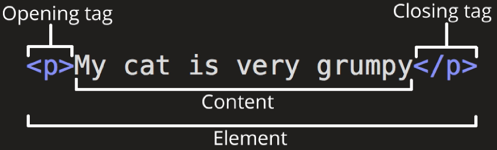
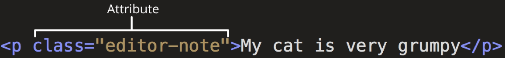

# 웹 구조화

[HTML](#html)   
[Structure of HTML](#structure-of-html)   
[Text Structure](#text-structure)   

---

## HTML
### HTML
- HyperText Markup Language

- 웹 페이지의 의미와 **구조**를 정의하는 언어

### Hypertext
- 웹 페이지를 다른 페이지로 연결하는 링크

- 참조를 통해 사용자가 한 문서에서 다른 문서로 즉시 접근할 수 있는 텍스트

### Hypertext 특징
- 비선형성

- 상호연결성

- 사용자 주도적 탐색

### Markup Language
- 태그 등을 이용하여 문서나 데이터의 구조를 명시하는 언어

- ex) HTML, Markdown

## Structure of HTML
### HTML 구조
- `<!DOCTYPE html>`
    - 해당 문서가 html로 문서라는 것을 나타냄

- `<html></html>`
    - 전체 페이지의 콘텐츠를 포함

- `<title></title>`
    - 브라우저 탭 및 즐겨찾기 시 표시되는 제목으로 사용

- `<head></head>`
    - HTML 문서에 관련된 설명, 설정 등 컴퓨터가 식별하는 메타데이터를 작성
    
    - 사용자에게 보이지 않음

- `<body></body>`
    - HTML 문서의 내용을 나타냄
    
    - 페이지에 보이는 모든 컨텐츠가 여기에 작성됨
    
    - 한 문서에 하나의 body 요소만 존재

- `

`
    - 문단을 표시

> 들여쓰기는 동작에 큰 영향은 없다. 단지 보기 쉽게 표시

### HTML Element(요소)
- 하나의 요소는 **여는 태그**와 **닫는 태그** 그리고 그 안의 **내용**으로 구성됨

- 닫는 태그는 태그 이름 앞에 슬래시( / )가 포함됨
    - 닫는 태그는 없는 태그도 존재

### HTML Attributes(속성)

- 사용자가 원하는 기준에 맞도록 요소를 설정하거나 다양한 방식으로 요소의 동작을 조절하기 위한 값

- 목적
    - 나타내고 싶지 않지만 추가적인 기능, 내용을 담고 싶을 때 사용
    
    - CSS에서 스타일 적용을 위해 해당 요소를 선택하기 위한 값으로 활용됨

### HTML Attributes(속성) 작성 규칙

- 속성은 요소 이름과 속성 사이에 공백이 있어야 함

- 하나 이상의 속성들이 있는 경우엔 속성 사이에 공백을 구분함

- 속성 값은 열고 닫는 따옴표로 감싸야 함

- ',' 가 지원하지 않는다. 대부분 공백(스페이스바)로 구분

## Text Structure
### HTML Text Structure
- HTML의 주요 목적 중 하나는 **텍스트 구조와 의미**를 제공하는 것

### HTML HyperText Markup Language
- 웹 페이지의 **의미**와 구조를 정의하는 언어

- 구조뿐만 아니라 의미를 부여해야 한다.

### HTML 구조
- 아무것도 없는 상태에서 <! + tab> 누르면 기본 구조 나옴

- `<h1> </h1>`
    - h1 요소는 단순히 텍스트를 크게만 만드는 것이 아닌 현재 **문서의 최상위 제목**이라는 의미를 부여하는 것
    
    - h1 태그를 여러개 써도 기능상의 문제는 없지만 1개만 쓰자는 암묵적 약속

- `<a>` (앵커 태그, 에이 태그)를 누르면 href가 자동으로 나오는데, 이렇게 자동으로 나오는 것은 필수 속성

- ``
    - src : 이미지의 위치, 주소
    
    - alt : 이미지가 없을 때 대체 택스트
        - 시각장애인들이 스크린 리더로 읽을 때 필요

### 대표적인 HTML Text Structure

- Heading & Paragraphs
    - h1~h6 & p

- Lists
    - ol, ul, li
    
    - ol (ordered list) : 순서 있는 리스트
    
    - ul (unordered list) : 순서 없는 리스트 (목록)

- Emphasis & Importance
    - em, strong